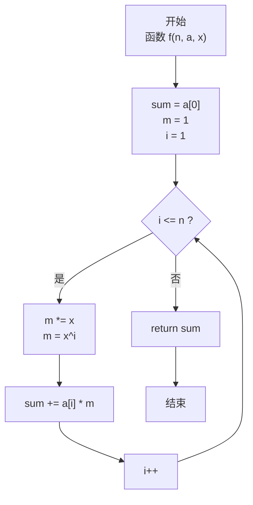
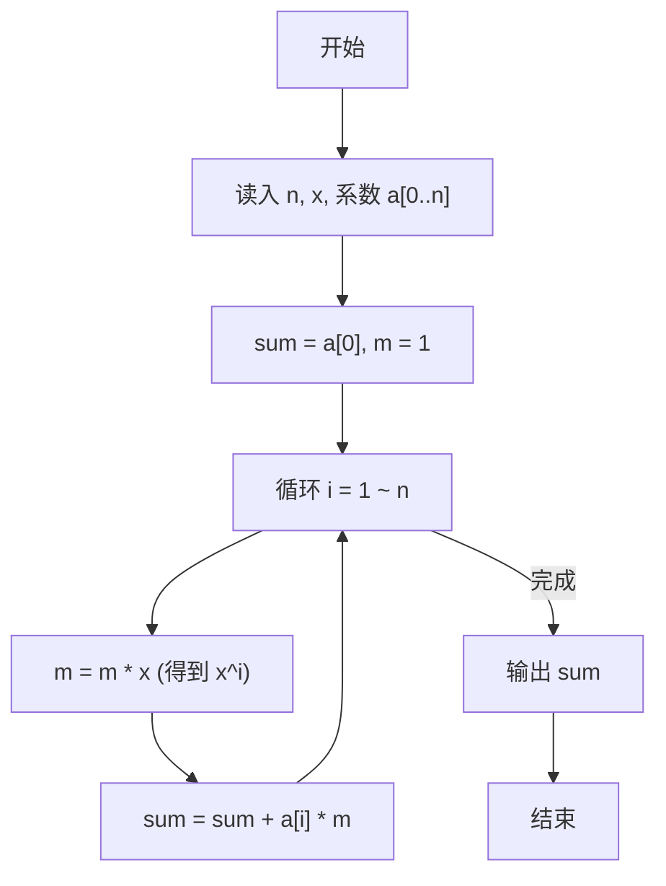

> **摘要**：本文是 PTA 函数题“6-2 多项式求值”的题解，涵盖题目描述、函数接口定义及 C 语言实现，展示多项式逐项累加求值的实现思路与复杂度分析。

## 题目描述

本题要求实现一个函数，计算阶数为`n`，系数为`a[0]` ... `a[n]`的多项式*f*(*x*)=∑^n^~i=0~*(*a*[*i*]*×x^i^) 在`x`点的值。

### 函数接口定义：

```c++
double f( int n, double a[], double x );
```

其中`n`是多项式的阶数，`a[]`中存储系数，`x`是给定点。函数须返回多项式`f(x)`的值。

### 裁判测试程序样例：

```c++
#include <stdio.h>

#define MAXN 10

double f( int n, double a[], double x );

int main()
{
    int n, i;
    double a[MAXN], x;

    scanf("%d %lf", &n, &x);
    for ( i=0; i<=n; i++ )
        scanf("%lf", &a[i]);
    printf("%.1f\n", f(n, a, x));
    return 0;
}

/* 你的代码将被嵌在这里 */
```

### 输入样例：

```in
2 1.1
1 2.5 -38.7
```

### 输出样例：

```out
-43.1
```

## 解题思路

这道题的核心是**多项式求值算法**。给定 n 阶多项式 f(x) = a₀ + a₁x + a₂x² + ... + aₙxⁿ，在给定点 x 处计算函数值。

### 核心问题分析

多项式中每一项都是 a[i] × x^i，需要把所有项加起来。关键在于如何高效计算 x 的各次幂而不重复计算：若每轮都单独算 pow(x, i) 会造成 O(n²) 的冗余乘法，而用一个变量 m 保存上一次的 x^(i-1)，本轮只需要 m *= x 即可得到 x^i，这样整体是 O(n) 的时间。

### 算法原理说明

采用逐项累加法（增量维护 x 的幂次：
- 初始化 sum = a[0]（常数项，x⁰=1）
- 引入变量 m 保存 x 的当前幂次，初始 m=1（对应 x⁰）
- 循环 i 从 1 到 n：
  1. m *= x → 得到 x^i
  2. sum += a[i] * m → 累加当前项
- 最终返回 sum

### 具体计算步骤

1. 初始化 `sum = a[0]`，`m = 1`（x⁰）
2. 循环 `i = 1` 到 `n`：
   - `m *= x`（得到 x^i）
   - `sum += a[i] * m`
3. 循环结束，返回 `sum`

## 函数部分实现

```c
/* 6-2 多项式求值
 * 函数：f
 * 功能：计算多项式 f(x) = a[0] + a[1]x + ... + a[n]x^n 在 x 处的值
 * 参数：
 *   n     — 多项式阶数
 *   a[]   — 系数数组，a[i] 对应 x^i 的系数
 *   x     — 求值点
 * 返回值：多项式在 x 处的函数值（double）
 * 实现原理：逐项累加法，增量维护 x 的幂次。
 *   - m 初始为 1（x^0），每轮 m *= x 得到 x^i
 *   - sum 初始为 a[0]，每轮加上 a[i] * m
 * 时间复杂度 O(n)，空间复杂度 O(1)
 */
double f( int n, double a[], double x)
{
    double sum = a[0];    // 常数项 a0 * x^0
    int i;
    double m = 1;         // 保存 x 的 i 次幂

    for(i = 1; i <= n; i++){
        m *= x;           // m 从 x^0 累乘得到 x^i
        sum += a[i] * m;  // 依次累加 a[i] * x^i
    }
    return sum;
}
```

## 完整代码实现

```c
/* 6-2 多项式求值
 * 题目：计算多项式 f(x)=a0 + a1*x + a2*x^2 + ... + an*x^n 在给定 x 处的值。
 * 实现原理：逐项累加法（非 Horner 法）。
 *           令 m 保存 x 的 i 次幂：m 初始为 1（即 x^0），
 *           每轮循环 m *= x 得到 x^i，再把 a[i]*x^i 累加到 sum。
 *           时间复杂度 O(n)，空间复杂度 O(1)。
 */
#include <stdio.h>

#define MAXN 10

double f( int n, double a[], double x );

int main()
{
    int n, i;
    double a[MAXN], x;

    scanf("%d %lf", &n, &x);
    for ( i = 0; i <= n; i++ )
        scanf("%lf", &a[i]);
    printf("%.1f\n", f(n, a, x));
    return 0;
}

/* 逐项累加计算多项式值 */
double f( int n, double a[], double x)
{
    double sum = a[0];   /* 常数项 a0 */
    int i;
    double m = 1;        /* m 用来保存 x^i */

    for(i = 1; i <= n; i++){
        m *= x;          /* 更新为 x^i */
        sum += a[i] * m;   /* 累加 a[i]*x^i */
    }
    return sum;
}
```

## 代码流程说明

### 1. 变量初始化（函数 f 内）
- `sum = a[0]`：直接把常数项（x⁰系数）作为累加初值
- `m = 1`：保存当前 x 的幂次，初值对应 x⁰
- `i`：循环控制变量

### 2. 逐项累加循环（i = 1 ~ n）
- 每轮先 `m *= x`：m 从 x^(i-1) → x^i
- 再 `sum += a[i] * m`：把 a[i]·x^i 累加到总和

### 3. 返回结果
- 循环结束后 sum 就是完整的 f(x)，return sum

## 代码流程图



## 解题流程图


