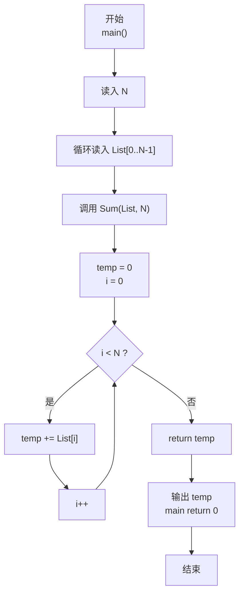
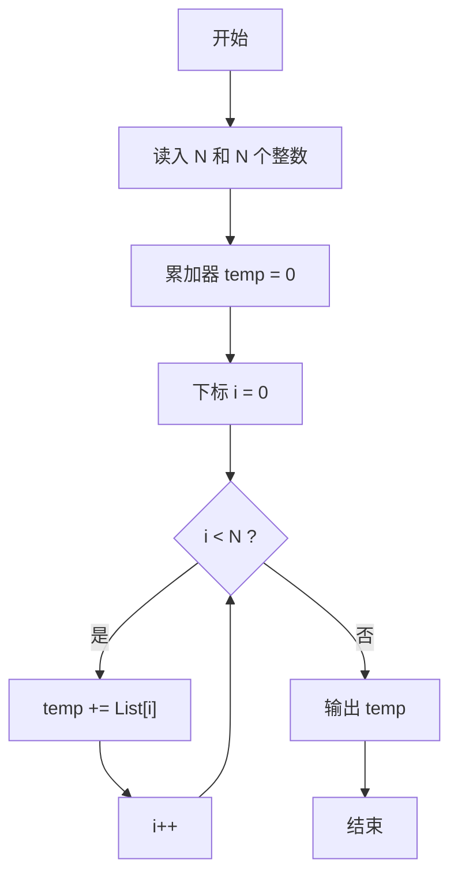

> **摘要**：本文是 PTA 函数题“6-3 简单求和”的题解，涵盖题目描述、函数接口定义及 C 语言实现，展示线性遍历数组进行累加求和的基础算法。

## 题目描述

本题要求实现一个函数，求给定的`N`个整数的和。

### 函数接口定义：

```c++
int Sum ( int List[], int N );
```

其中给定整数存放在数组`List[]`中，正整数`N`是数组元素个数。该函数须返回`N`个`List[]`元素的和。

### 裁判测试程序样例：

```c++
#include <stdio.h>

#define MAXN 10

int Sum ( int List[], int N );

int main ()
{
    int List[MAXN], N, i;

    scanf("%d", &N);
    for ( i=0; i<N; i++ )
        scanf("%d", &List[i]);
    printf("%d\n", Sum(List, N));

    return 0;
}

/* 你的代码将被嵌在这里 */
```

### 输入样例：

```in
3
12 34 -5
```

### 输出样例：

```out
41
```

## 解题思路

这道题的核心是**数组线性累加求和**。给定 N 个整数组成的数组，求其所有元素之和。

### 核心问题分析

这是最经典的遍历+累加问题。由于没有任何结构性质可以利用（如前缀和预处理），只能逐个元素读取并加入累加器。必须访问所有 N 个元素各一次，因此时间复杂度下限即为 Ω(N)。

### 算法原理说明

设置累加器 temp 初始为 0，用 for 循环按数组下标从 0 到 N-1 依次访问每个元素 List[i]，执行 temp += List[i]。整个过程只需要常数级别的辅助空间（仅 temp 和循环变量 i）。

### 具体计算步骤

1. 声明累加器 `temp = 0`，循环变量 `i`
2. 循环 `i = 0` 到 `N-1`：`temp = temp + List[i]`（或 `temp += List[i]`）
3. 循环结束后 return `temp`

## 函数部分实现

```c
/* 6-3 简单求和
 * 函数：Sum
 * 功能：遍历数组，求所有 N 个元素之和
 * 参数：
 *   List[] — 整数数组（输入）
 *   N      — 数组元素个数（正整数）
 * 返回值：所有元素的累加和（int）
 * 实现原理：线性遍历累加。
 *   - temp 作为累加器，初始化为 0
 *   - for 循环 i 从 0 到 N-1，temp += List[i]
 * 时间复杂度 O(N)，空间复杂度 O(1)
 */
int Sum (int List[], int N )
{
    int i;
    int temp = 0;         /* 累加器，初始化为 0 */

    /* 遍历数组，逐个累加 */
    for(i = 0; i < N; i++)
        temp = temp + List[i];

    return temp;          /* 返回累加结果 */
}
```

## 完整代码实现

```c
/*
 * 6-3 简单求和
 *
 * 题目描述：
 *   实现函数 Sum(List[], N)，返回 N 个整数的累加和。
 *
 * 实现原理：
 *   线性累加。用 temp 作为累加器，for 循环遍历数组，
 *   每次把当前元素累加到 temp 上，最后返回 temp。
 *
 * 参数说明：
 *   List[] — 待求和的整数数组
 *   N      — 数组中元素的个数
 *
 * 时间复杂度：O(N) — 需遍历 N 个元素各一次
 * 空间复杂度：O(1) — 只使用了常数个辅助变量
 */

#include <stdio.h>

#define MAXN 10

/* 函数原型声明 */
int Sum ( int List[], int N );

int main ()
{
    int List[MAXN], N, i;

    /* 读入数组长度 N */
    scanf("%d", &N);
    /* 依次读入 N 个整数到数组 List 中 */
    for ( i = 0; i < N; i++ )
        scanf("%d", &List[i]);

    /* 调用 Sum 函数求和并输出结果 */
    printf("%d\n", Sum(List, N));

    return 0;
}

/*
 * 函数：Sum
 * 功能：遍历数组，求所有元素之和
 * 参数：
 *   List[] — 整数数组（输入）
 *   N      — 数组元素个数
 * 返回值：所有元素的总和
 */
int Sum (int List[], int N )
{
    int i;
    int temp = 0;         /* 累加器，初始化为 0 */

    /* 遍历数组，逐个累加 */
    for(i = 0; i < N; i++)
        temp = temp + List[i];

    return temp;          /* 返回累加结果 */
}
```

## 代码流程说明

### 1. 主函数：输入准备
- 读入数组长度 N
- 依次读入 N 个整数存入 List[0] ~ List[N-1]

### 2. 调用 Sum 函数
- printf 输出返回值

### 3. Sum 函数内部
- `int temp = 0`：初始化累加器为 0
- for 循环 i 从 0 到 N-1：
  - `temp += List[i]`：把当前元素加入累加器
- 循环结束返回 temp

## 代码流程图



## 解题流程图


