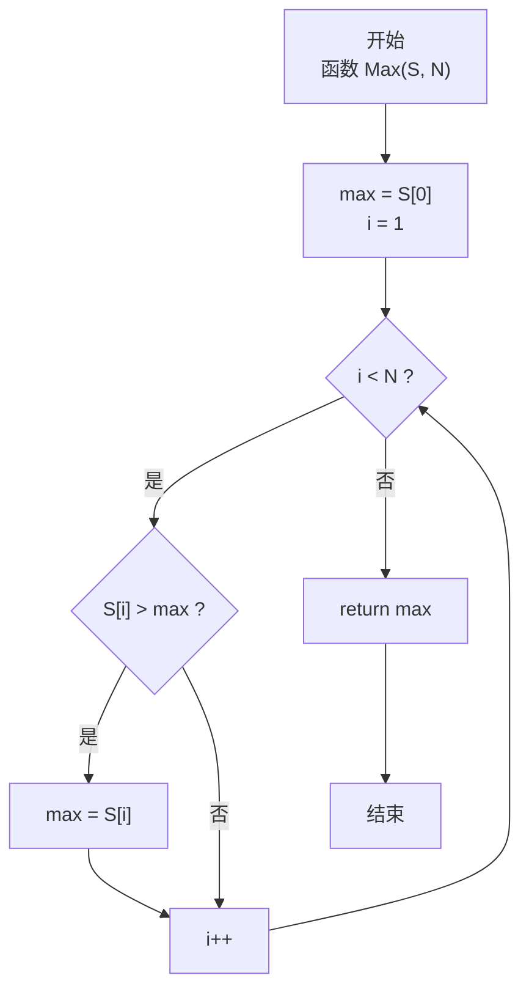
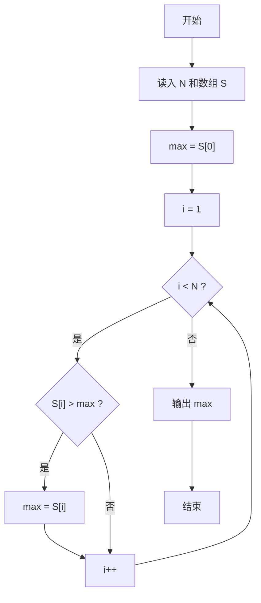

> **摘要**：本文是 PTA 函数题“6-5 求自定类型元素的最大值”的题解，涵盖题目描述、函数接口定义及 C 语言实现，展示一次遍历数组打擂台求最大值的经典算法。

## 题目描述

本题要求实现一个函数，求`N`个集合元素`S[]`中的最大值，其中集合元素的类型为自定义的`ElementType`。

### 函数接口定义：

```c++
ElementType Max( ElementType S[], int N );
```

其中给定集合元素存放在数组`S[]`中，正整数`N`是数组元素个数。该函数须返回`N`个`S[]`元素中的最大值，其值也必须是`ElementType`类型。

### 裁判测试程序样例：

```c++
#include <stdio.h>

#define MAXN 10
typedef float ElementType;

ElementType Max( ElementType S[], int N );

int main ()
{
    ElementType S[MAXN];
    int N, i;

    scanf("%d", &N);
    for ( i=0; i<N; i++ )
        scanf("%f", &S[i]);
    printf("%.2f\n", Max(S, N));

    return 0;
}

/* 你的代码将被嵌在这里 */
```

### 输入样例：

```in
3
12.3 34 -5
```

### 输出样例：

```out
34.00
```

## 解题思路

这道题的核心是**一次遍历数组求最大值**，即打擂台算法。

### 核心问题分析

找最大值需要把数组中所有元素进行两两比较，但不需要真的做 O(N²) 全对比——只需要维护一个"当前最大值"max，然后逐个和新元素比较，遇到更大的就更新max，这样 O(N) 一次遍历即可。

### 算法原理说明

打擂台法（线性扫描）：
1. 令 max 初始为第一个元素 S[0]（题目保证 N≥1）
2. 从下标 1 开始遍历到 N-1：
   - 如果 S[i] > max，则 max = S[i]（更新冠军）
3. 遍历完成后 max 即全局最大值

### 具体计算步骤

1. `max = S[0]`
2. 循环 `i = 1` 到 `N-1`：
   - 若 `S[i] > max` 则 `max = S[i]`
3. 返回 `max`

## 函数部分实现

```c
/* 6-5 求自定类型元素的最大值
 * 函数：Max
 * 功能：返回 N 个 ElementType 元素中的最大值
 * 参数：
 *   S[] — 自定类型数组（输入）
 *   N   — 数组元素个数
 * 返回值：数组中的最大值（ElementType）
 * 实现原理：线性扫描（打擂台法）。
 *   - max 初始化为 S[0]（基准值）
 *   - 从 i=1 开始遍历，若 S[i] > max 则更新 max
 * 时间复杂度 O(N)，空间复杂度 O(1)
 */
ElementType Max(ElementType S[], int N )
{
    int i;
    ElementType max;
    max = S[0];                 /* 以第一个元素作为初值 */
    for(i = 1; i < N; i++)
    {
        if(max < S[i])
            max = S[i];         /* 遇到更大的就更新 */
    }
    return max;
}
```

## 完整代码实现

```c
/* 6-5 求自定类型元素的最大值
 * 题目：实现函数 Max(S[], N)，返回 N 个元素中的最大值。
 * 实现原理：线性扫描求最大值。
 *           先令 max = S[0]，再从第 1 个元素开始遍历，
 *           若遇到比 max 更大的元素就更新 max，最后返回 max。
 * 时间复杂度 O(N)，空间复杂度 O(1)。
 */
#include <stdio.h>

#define MAXN 10
typedef float ElementType;

ElementType Max( ElementType S[], int N );

int main ()
{
    ElementType S[MAXN];
    int N, i;

    scanf("%d", &N);
    for ( i = 0; i < N; i++ )
        scanf("%f", &S[i]);
    printf("%.2f\n", Max(S, N));

    return 0;
}

/* 一次遍历找出最大值 */
ElementType Max(ElementType S[], int N )
{
    int i;
    ElementType max;
    max = S[0];                 /* 以第一个元素作为初值 */
    for(i = 1; i < N; i++)
    {
        if(max < S[i])
            max = S[i];         /* 遇到更大的就更新 */
    }
    return max;
}
```

## 代码流程说明

### 1. 主函数
- 读入 N 与数组 S
- 调用 Max 函数并输出（%.2f 两位小数）

### 2. Max 函数初始化
- `max = S[0]：把第一个元素当成"临时冠军"
- i 从 1 开始（第 0 号已考察过了）

### 3. 打擂台循环
- 对每个 S[i]：
  - 若 S[i] > max → max = S[i]（替换冠军）
- 直到 i == N 结束

### 4. 返回 max

## 代码流程图



## 解题流程图


