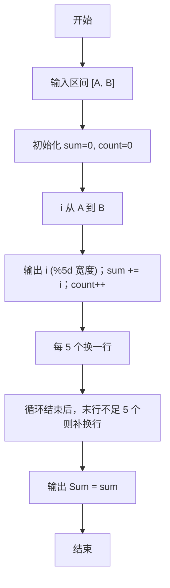

> **摘要**：本文是 PTA 编程题“7-14 求整数段和”的题解，涵盖题目描述、输入输出格式及 C 语言实现，展示整数段循环遍历、按 5 个一行右对齐格式化输出及累加求和的完整流程。

## 题目描述
给定两个整数A和B，输出从A到B的所有整数以及这些数的和。

### 输入格式：

输入在一行中给出2个整数A和B，其中−100≤A≤B≤100，其间以空格分隔。

### 输出格式：

首先顺序输出从A到B的所有整数，每5个数字占一行，每个数字占5个字符宽度，向右对齐。最后在一行中按Sum = X的格式输出全部数字的和X。

### 输入样例：

```in
-3 8
```

### 输出样例：

```out
   -3   -2   -1    0    1
    2    3    4    5    6
    7    8
Sum = 30
```

## 解题思路

这道题的核心是**区间整数输出 + 格式化 + 累加求和**三个任务在一个循环里同步完成。

### 核心问题分析

1. **区间边界**：A ≤ B，循环 i 从 A 到 B（含）。
2. **格式化**：%5d 固定 5 字符宽度右对齐。
3. **换行控制**：每 5 个换一行（count 计数自增后取模 5 == 0 时换行）。
4. **末行补换行**：如果最后一行不足 5 个（count%5 != 0），也要补一个换行，确保 Sum 行独立。
5. **求和**：每次打印后 sum += i，最后输出 "Sum = %d"。

### 算法原理说明

单 for 循环内并行处理三件事：
1. printf("%5d", i)：输出；
2. sum += i：求和；
3. count++，判断 count%5 是否为 0 决定换行。
循环结束后若 count%5 != 0 补换行，最后打印 Sum。

### 具体计算步骤

1. scanf("%d %d", &A, &B)
2. sum=0, count=0
3. for (i=A; i<=B; i++)：
   - printf("%5d", i)
   - sum += i
   - count++
   - if (count%5==0) printf("\n")
4. if (count%5 != 0) printf("\n")
5. printf("Sum = %d\n", sum)

## 代码部分实现
```c
#include <stdio.h>  // 引入标准输入输出头文件

int main(void)  // 主函数
{
    int A, B, i, sum = 0, count = 0;  // 定义起始整数、结束整数、循环变量、总和和计数
    
    scanf("%d %d", &A, &B);  // 读取两个整数A和B
    
    for (i = A; i <= B; i++) {  // 从A到B遍历每个整数
        printf("%5d", i);  // 以5个字符宽度输出当前整数
        sum += i;  // 累加到总和
        count++;  // 计数加1
        if (count % 5 == 0) {  // 每5个数换一行
            printf("\n");  // 输出换行
        }
    }
    
    if (count % 5 != 0) {  // 如果最后一行不足5个数
        printf("\n");  // 补一个换行
    }
    
    printf("Sum = %d\n", sum);  // 输出总和
    return 0;  // 返回0，表示程序正常结束
}
```

## 代码流程说明

### 1. 变量与输入
- int A, B：区间端点
- int sum = 0：累加器
- int count = 0：每行计数
- scanf 读 A, B

### 2. 单循环三重任务
- **输出**：printf("%5d", i)，%5d 表示 5 字符宽度右对齐（负数会自动显示负号并占一位）
- **累加**：sum += i
- **换行**：count++ 后如果 count % 5 == 0 → printf("\n")

### 3. 末行补换行
- 若 count % 5 != 0（最后一行不足 5 个）→ 补一个换行，确保 Sum 行独立

### 4. 输出 Sum
- printf("Sum = %d\n", sum)

## 代码流程图

```mermaid
flowchart TD
  A["开始\nmain()"] --> B["A,B\nsum=0,count=0"]
  B --> C["for i = A..B"]
  C --> D["printf(\"%5d\", i)"]
  D --> E["sum += i\ncount++"]
  E --> F{"count % 5 == 0?"}
  F -- "是" --> G["printf(\"\\n\")"]
  F -- "否" --> H["下一个 i"]
  G --> H
  H --> I{"循环结束?"}
  I -- "否" --> D
  I -- "是" --> J{"count%5 != 0?"}
  J -- "是" --> K["补 printf 换行"]
  J -- "否" --> L["printf(\"Sum = %d\", sum)"]
  K --> L
  L --> M["return 0"]
  M --> N["结束"]
```

## 解题流程图


