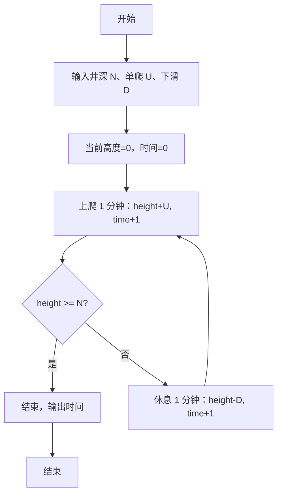

> **摘要**：本文是 PTA 编程题“7-17 爬动的蠕虫”的题解，涵盖题目描述、输入输出格式及 C 语言实现，展示模拟"上爬 U 寸 → 未出则休息下滑 D 寸 → 时间累加"循环直到蠕虫爬出井口的过程。

## 题目描述
一条蠕虫长1寸，在一口深为N寸的井的底部。已知蠕虫每1分钟可以向上爬U寸，但必须休息1分钟才能接着往上爬。在休息的过程中，蠕虫又下滑了D寸。就这样，上爬和下滑重复进行。请问，蠕虫需要多长时间才能爬出井？

这里要求不足1分钟按1分钟计，并且假定只要在某次上爬过程中蠕虫的头部到达了井的顶部，那么蠕虫就完成任务了。初始时，蠕虫是趴在井底的（即高度为0）。

### 输入格式：

输入在一行中顺序给出3个正整数N、U、D，其中D<U，N不超过100。

### 输出格式：

在一行中输出蠕虫爬出井的时间，以分钟为单位。

### 输入样例：

```
12 3 1
```

### 输出样例：

```
11
```

## 解题思路

这道题的核心是**模拟 2 分钟一个周期（爬 1 分钟 + 若未出井则休息 1 分钟下滑）**，直到某次上爬后高度 ≥ N（上爬这 1 分钟已经计入）。

### 核心问题分析

1. **爬 1 分钟**：height += U，time++。
2. **判定是否到顶**：如果 height ≥ N，立刻 break（不需要再休息）。
3. **否则**：休息 1 分钟 → time++，height -= D。
4. **循环条件**：用 while(1) 无限循环，每次爬完都可能跳出。

### 算法原理说明

直接按题意模拟：
- time=0, height=0
- 循环：
  - time++; height += U → 若 height ≥ N，break
  - time++; height -= D
- 最后 printf("%d\n", time)

### 具体计算步骤

1. scanf("%d %d %d", &N, &U, &D)
2. time = 0, height = 0
3. while(1):
   - time++; height += U
   - if (height >= N) break
   - time++; height -= D
4. printf("%d", time)

## 代码部分实现
```c
#include <stdio.h>

int main(void)
{
    int N, U, D, time = 0, height = 0; // N为井深，U为上爬距离，D为下滑距离，time为时间，height为当前高度
    scanf("%d %d %d", &N, &U, &D); // 读取井深N、上爬距离U、下滑距离D
    
    while (1) { // 无限循环，直到蠕虫爬出井
        time++; // 时间加1分钟
        height += U; // 蠕虫上爬U寸
        if (height >= N) { // 判断是否到达或超过井口
            break; // 爬出井，退出循环
        }
        
        time++; // 休息1分钟，时间加1
        height -= D; // 休息期间下滑D寸
    }
    
    printf("%d\n", time); // 输出爬出井的总时间
    return 0;
}
```

## 代码流程说明

### 1. 变量与输入
- int N, U, D：井深、一次上爬距离、休息下滑距离
- int time = 0, height = 0：累计分钟数、当前高度（从 0 起）

### 2. while(1) 模拟
1. **上爬阶段**：time++；height += U；
   - 若此时 height ≥ N → 已爬出，立刻 break（不经历休息）
2. **休息阶段**（仅在未出井时执行）：time++；height -= D

### 3. 输出 time

## 代码流程图

```mermaid
flowchart TD
  A["开始\nmain()"] --> B["读入 N, U, D\ntime=0, height=0"]
  B --> C["进入 while(1)"]
  C --> D["time++\nheight += U"]
  D --> E{"height >= N?"}
  E -- "是" --> F["break 退出循环"]
  E -- "否" --> G["time++\nheight -= D  休息"]
  G --> C
  F --> H["printf(\"%d\", time)"]
  H --> I["return 0"]
  I --> J["结束"]
```

## 解题流程图


