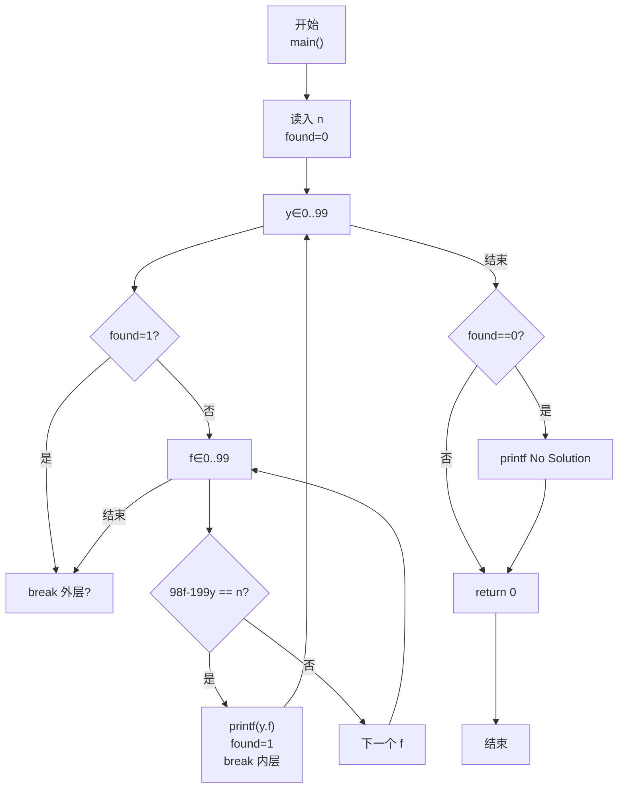
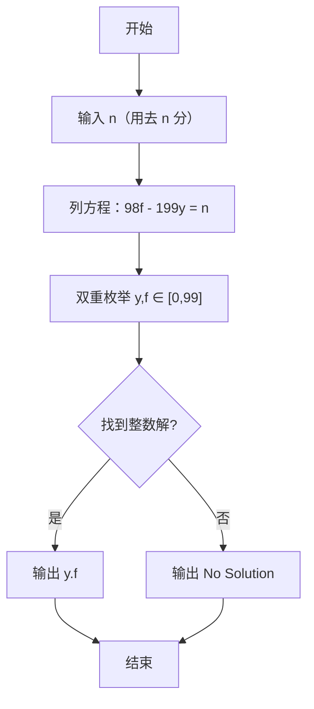

> **摘要**：本文是 PTA 编程题“7-19 支票面额”的题解，涵盖题目描述、输入输出格式及 C 语言实现，展示根据题意列不定方程 98f − 199y = n 并通过枚举 y,f ∈ [0,99] 求整数解的穷举法。

## 题目描述
一个采购员去银行兑换一张y元f分的支票，结果出纳员错给了f元y分。采购员用去了n分之后才发觉有错，于是清点了余额尚有2y元2f分，问该支票面额是多少？

### 输入格式：

输入在一行中给出小于100的正整数n。

### 输出格式：

在一行中按格式y.f输出该支票的原始面额。如果无解，则输出No Solution。

### 输入样例：

```
23
```

```
22
```

### 输出样例：

```
25.51
```

```
No Solution
```

## 解题思路

这道题的核心是**建立数学方程后枚举求解**：原始面额 y 元 f 分 = 100y+f 分；错兑为 f 元 y 分 = 100f+y 分；用去 n 分后剩余 = 2y 元 2f 分 = 100·2y + 2f = 200y+2f。列方程后化简为线性丢番图方程：98·f − 199·y = n。

### 核心问题分析

1. **建模**：
   - 支票面额（分）：100y + f
   - 实际收到（分）：100f + y
   - 用去 n 分后余（分）：(100f + y) − n = 200y + 2f
   - 移项：98f − 199y = n
2. **范围**：
   - 题目未直接给 y 范围，但 f 是分，因此 0 ≤ f ≤ 99；同样，输出时 0 ≤ y ≤ 99 是合理猜测（方程 98f=199y+n，而 n<100，f≤99 → 199y ≤ 98·99+99 ≈ 9801 → y≤49）。代码直接把 y,f 都枚举 0 到 99 即可。
3. **判无解**：双层循环都跑完 found=0 → No Solution。

### 算法原理说明

两重 for 枚举 (y, f) ∈ [0,99]×[0,99]，一旦 98f-199y==n，立即按 y.f 格式打印，置 found 并退出循环；全没找到输出 No Solution。

### 具体计算步骤

1. scanf("%d", &n); found=0
2. for (y=0..99):
   - for (f=0..99):
     - if (98*f - 199*y == n):
       - printf("%d.%d\n", y, f); found=1; break;
   - if (found) break;
3. if (!found) printf("No Solution\n")

## 代码部分实现
```c
#include <stdio.h>

int main(void)
{
    int n, y, f, found = 0; // n为用去的分数，y为元数，f为分数，found标记是否找到解
    scanf("%d", &n); // 读取用去的分数
    
    // 枚举所有可能的元数y和分数f
    for (y = 0; y < 100; y++) { // 枚举元数y（0-99）
        for (f = 0; f < 100; f++) { // 枚举分数f（0-99）
            // 根据题意列方程：98*f - 199*y = n
            // 原始支票为y元f分，错兑为f元y分，用去n分后剩余2y元2f分
            if (98 * f - 199 * y == n) {
                printf("%d.%d\n", y, f); // 输出支票面额
                found = 1; // 标记已找到解
                break; // 跳出内层循环
            }
        }
        if (found) break; // 找到解后跳出外层循环
    }
    
    if (!found) { // 未找到解
        printf("No Solution\n"); // 输出无解提示
    }
    
    return 0;
}
```

## 代码流程说明

### 1. 变量与输入
- int n：用去的 n 分；int y, f：支票面额的元和分
- int found = 0：是否找到解的标志
- scanf("%d", &n)

### 2. 双重穷举
- 外层 y 从 0 到 99
- 内层 f 从 0 到 99
- 若 98·f - 199·y == n：
  - 立即 printf("%d.%d", y, f)
  - found = 1，break 内层
- 外层每轮结束若 found=1，break 外层

### 3. 判无解
- 若 found 仍为 0 → printf("No Solution")

## 代码流程图



## 解题流程图


