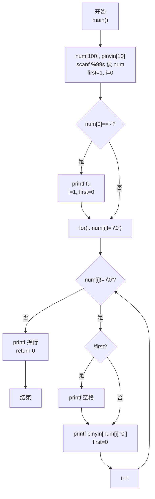
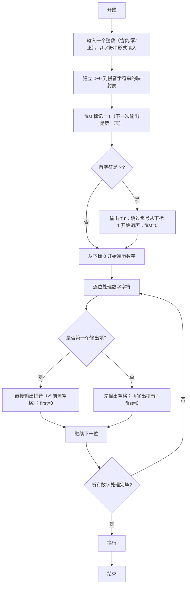

> **摘要**：本文是 PTA 编程题"7-25 念数字"的深度题解（C 语言），涵盖题目描述、输入输出格式及 C 语言实现，讲解如何将整数以字符串读入、利用字符数组编码特性建立数字到拼音的映射表 `pinyin[10]`，并通过 `first` 标志统一处理正/负/零以及"行末不出多余空格"的格式控制；文末附复杂度分析、常见易错点与多组测试用例。

# PTA 7-25 念数字（C语言）——字符串遍历与映射表

## 前言

这道题要求把一个整数逐位转换成对应的拼音。例如，`123` 要输出为 `yi er san`；如果输入的是负数，还需要先输出 `fu`。

题目看似简单，但有两个细节很容易出错：

1. 负号不能按照普通数字处理；
2. 相邻拼音之间需要有空格，行末却不能多出空格。

使用字符串读取整数，可以直接逐个处理字符，不必进行除法取位，也能自然地处理负号。

## 题目描述

输入一个整数，输出组成这个整数的每个数字所对应的拼音。若整数为负数，先输出负号对应的拼音 `fu`。

数字与拼音的对应关系如下：

| 数字 | 拼音 |
| --- | --- |
| 0 | ling |
| 1 | yi |
| 2 | er |
| 3 | san |
| 4 | si |
| 5 | wu |
| 6 | liu |
| 7 | qi |
| 8 | ba |
| 9 | jiu |

### 输入格式

在一行中输入一个整数。该整数可能是负数、零或正数。

### 输出格式

在一行中输出该整数对应的拼音，各拼音之间用一个空格分隔，行末不能有多余空格。

### 输入样例

```text
-600
```

### 输出样例

```text
fu liu ling ling
```

## 解题思路

### 1. 将整数当作字符串读取

如果使用整数类型读取，还需要通过取模、除法等操作分离每一位，并额外处理数字顺序。直接使用字符数组读取会更方便：字符串中的每个字符本身就是一位数字。

例如，输入 `-600` 后，字符数组中的内容依次为：

```text
'-'  '6'  '0'  '0'  '\0'
```

其中 `\0` 是 C 字符串末尾的结束标志。

### 2. 使用数组建立数字与拼音的映射

按照 `0` 到 `9` 的顺序保存所有拼音：

```c
const char *pinyin[] = {
    "ling", "yi", "er", "san", "si",
    "wu", "liu", "qi", "ba", "jiu"
};
```

数字字符减去字符 `'0'`，就能得到对应的整数下标。例如：

```c
'6' - '0' == 6
```

因此，`pinyin[num[i] - '0']` 就是当前数字对应的拼音。

### 3. 单独处理负号

如果第一个字符是 `-`，先输出 `fu`，然后从下标 `1` 开始遍历数字部分；否则从下标 `0` 开始遍历。

### 4. 控制输出空格

用变量 `first` 标记是否还没有输出任何内容：

- 输出第一项时不加空格；
- 从第二项开始，先输出一个空格，再输出当前拼音。

这种写法可以统一处理正数、负数和零，避免在行末输出多余空格。

## 完整代码

```c
#include <stdio.h>

int main(void) {
    char num[100];
    const char *pinyin[] = {
        "ling", "yi", "er", "san", "si",
        "wu", "liu", "qi", "ba", "jiu"
    };

    scanf("%99s", num);

    int i = 0;
    int first = 1;

    if (num[0] == '-') {
        printf("fu");
        i = 1;
        first = 0;
    }

    for (; num[i] != '\0'; i++) {
        if (!first) {
            printf(" ");
        }
        printf("%s", pinyin[num[i] - '0']);
        first = 0;
    }

    printf("\n");
    return 0;
}
```

## 代码解析

### 限制输入长度

```c
scanf("%99s", num);
```

字符数组最多容纳 99 个输入字符，最后一个位置留给字符串结束标志 `\0`。相比直接使用 `%s`，这种写法可以避免输入过长导致数组越界。

### 处理负数

```c
if (num[0] == '-') {
    printf("fu");
    i = 1;
    first = 0;
}
```

输出 `fu` 后，将遍历起点改为 `1`，跳过负号。此时已经输出过一项，因此把 `first` 设为 `0`，后续数字拼音前会自动补上空格。

### 查表输出拼音

```c
printf("%s", pinyin[num[i] - '0']);
```

这里利用数字字符在字符编码中连续排列的特点，将字符转换为 `0` 到 `9` 的数组下标，再访问对应的拼音字符串。

## 复杂度分析

设输入整数包含 `n` 个字符：

- 时间复杂度：`O(n)`，每个字符只处理一次；
- 空间复杂度：`O(n)`，字符数组用于保存输入内容。拼音映射表的大小固定，可视为常量空间。

## 常见易错点

### 1. `fu` 后忘记输出空格

错误结果可能变成：

```text
fuliu ling ling
```

负号同样属于一个输出项，后面的第一个数字拼音与它之间也必须有空格。

### 2. 行末多输出一个空格

不要在每个拼音后都无条件输出空格。可以像本文一样，在除第一项以外的每一项之前输出空格。

### 3. 将负号拿去查表

表达式 `num[i] - '0'` 只适用于数字字符。遍历前必须判断并跳过 `-`。

### 4. 忽略输入为零的情况

输入 `0` 时也需要输出：

```text
ling
```

字符串遍历法无需增加特殊分支，就能正确处理零。

## 更多测试

### 测试一：正数

输入：

```text
1234
```

输出：

```text
yi er san si
```

### 测试二：零

输入：

```text
0
```

输出：

```text
ling
```

### 测试三：负数中含有多个零

输入：

```text
-1002
```

输出：

```text
fu yi ling ling er
```

## 代码流程说明

### 1. 变量声明与输入
- `char num[100]`：保存输入字符串（含负号和数字）
- `const char *pinyin[10]`：数字 0~9 → 拼音字符串的映射表
- `int i = 0`：当前遍历下标
- `int first = 1`：是否还未输出任何内容（1 表示下一次输出是第一项）
- `scanf("%99s", num)`：读字符串，最多 99 字符（防止越界）

### 2. 负号处理
- 若 `num[0] == '-'` → `printf("fu"); i = 1; first = 0;`

### 3. 遍历数字字符输出拼音
- `for (; num[i] != '\0'; i++)`
  - `!first` → 先 `printf(" ")`（除第一项外，各项前加空格）
  - `printf("%s", pinyin[num[i]-'0'])` → 查表输出拼音
  - `first = 0` → 之后再有输出就不是第一项了

### 4. 换行返回
- `printf("\n"); return 0;`

## 代码流程图



## 解题流程图



## 总结

本题的核心是"字符到数组下标"的转换。把整数作为字符串读取后，只需处理负号、遍历数字字符并查表输出即可。`first` 标记则解决了空格分隔问题，使输出格式更稳定。这个思路也适用于字符分类、编码转换和简单词法处理等题目。
