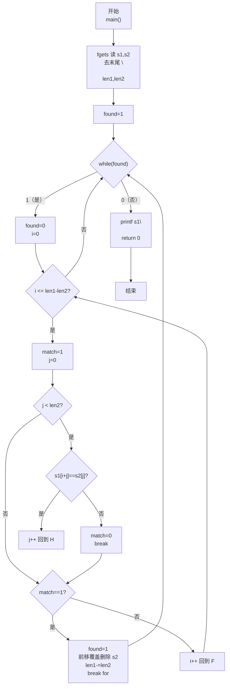
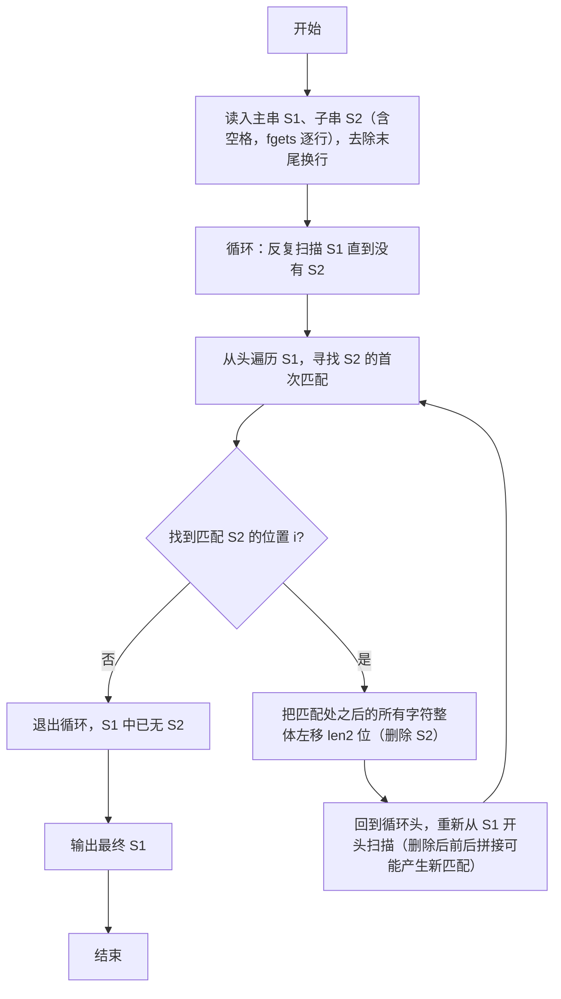

> **摘要**：本文是 PTA 编程题"7-29 删除字符串中的子串"的题解，涵盖题目描述、输入输出格式及 C 语言实现，展示用 `fgets` 读取含空格的两行字符串 S1/S2，通过外层循环反复查找+内层前移覆盖的方式，重复删除 S1 中所有出现的子串 S2，直到 S1 中再无 S2 为止的朴素删除算法。

## 题目描述
输入2个字符串S1和S2，要求删除字符串S1中出现的所有子串S2，即结果字符串中不能包含S2。

### 输入格式：

输入在2行中分别给出不超过80个字符长度的、以回车结束的2个非空字符串，对应S1和S2。

### 输出格式：

在一行中输出删除字符串S1中出现的所有子串S2后的结果字符串。

### 输入样例：

```in
Tomcat is a male ccatat
cat
```

### 输出样例：

```out
Tom is a male 
```

## 解题思路

这道题的核心是**循环查找 S2 在 S1 中的首次出现位置，通过字符前移覆盖删除该匹配子串，并重复整个过程直到不再有匹配**。朴素做法：用双层字符比较在 S1 中找 S2；找到后把匹配位置之后所有字符整体"前移 len2 位"来实现删除；设置 found 标志驱动外层 while 循环，因为一次删除后前后拼接可能产生新的匹配（如样例 `ccatat` 删除第一个 `cat` 后拼接出第二个 `cat`，需要再删一次）。

### 核心问题分析

1. **读取含空格字符串**：题目允许 S1、S2 中包含空格（样例 S1 就有空格），因此不能用 `%s`（会在空格处停止），必须用 `fgets(s, size, stdin)`。注意 `fgets` 会把输入末尾的换行符 `'\n'` 也读入，需要手动去除：若最后一个字符是 `'\n'`，把它改成 `'\0'` 并相应减小长度值。
2. **查找匹配子串（朴素匹配）**：
   - 设 len1 = strlen(S1), len2 = strlen(S2)
   - 外层 i 从 0 到 `len1 - len2`（剩余长度不足 len2 则不可能匹配）
   - 对每个 i，内层 j 从 0 到 len2-1 逐个比较 `S1[i+j]` 与 `S2[j]`；若全部相等则 i 处有匹配
3. **删除匹配子串（前移覆盖）**：
   - 找到匹配位置 i 后，从 j=i 开始，令 `S1[j] = S1[j + len2]`，循环到新结尾 `j <= len1 - len2`（因为 j+len2 要合法 ≤ len1，所以 j ≤ len1 - len2）
   - 等价于把 S1[i..end] 这段整体左移 len2 个字符，从而覆盖掉 S1[i..i+len2-1]（即要删除的 S2 匹配部分）
   - 然后 `len1 -= len2` 更新剩余长度
4. **删除后继续从头扫描**：删除后前后拼接可能产生新匹配。例如样例 S1 末尾部分 `ccatat`：
   - 第一次匹配在 `ccatat` 第 1 个 c 之后 `cat` 删除后 → `cat` 依然存在（由 `c` + `at` 拼接出）
   - 因此设置 `found` 驱动的 `while (found)` 大循环：每次删除后重新从 i=0 扫描 S1，直到一轮下来全无匹配
5. **样例推导**：
   - S1=`Tomcat is a male ccatat`，S2=`cat`
   - 第一次找：i=3 (`Tomcat…`) 匹配 `cat` → 删除后 S1 变为 `Tom is a male ccatat`
   - 再扫描：末尾 `ccatat` 中 i=2 处匹配 `cat` → 删除后变成 `Tom is a male cat`（注意 `c` 与后面 `at` 拼接）
   - 再扫描：`cat` 仍存在 → 删除得到 `Tom is a male `（末尾一空格）
   - 再扫描：无匹配，退出；输出 `Tom is a male ` ✓

### 算法原理说明

整体结构：
1. `fgets` 读两行，去换行，计算 len1、len2
2. `int found = 1;`
3. `while (found)`：
   - `found = 0`（假设本轮无匹配）
   - `for (i = 0; i <= len1 - len2; i++)`
     - 逐字符比较 j=0..len2-1 判断 S1[i..] 是否等于 S2
     - 若匹配：`found = 1`；执行前移删除（j 循环覆盖 + len1 -= len2）；`break` 回到外层 while 从头扫描
4. `printf("%s\n", s1)`

### 具体计算步骤

1. fgets 读 S1、S2；各自去掉末尾换行；求 len1、len2
2. found=1，进入 while：
   - 设 found=0，从 i=0 开始找 S2
   - 找到一处匹配 → found=1，前移覆盖删除，len1-=len2，break 重新开始
   - 未找到 → found=0，while 退出
3. 输出 S1

## 代码部分实现
```c
#include <stdio.h>   // 引入标准输入输出头文件，提供 fgets、printf
#include <string.h>  // 引入字符串处理头文件，提供 strlen

int main() {
    char s1[81], s2[81];  // s1：主串；s2：要删除的子串；最多 80 有效字符 + '\0'
    fgets(s1, 81, stdin);  // 读入第 1 行（含空格），最多读 80 字符 + 结尾 '\0'
    fgets(s2, 81, stdin);  // 读入第 2 行（含空格）
    
    int len1 = strlen(s1);  // 计算 s1 当前长度（包含 fgets 读入的换行符）
    int len2 = strlen(s2);  // 计算 s2 当前长度
    // fgets 会把行尾的回车 '\n' 也读入，要手动把它去掉
    if (s1[len1 - 1] == '\n') { s1[len1 - 1] = '\0'; len1--; }
    if (s2[len2 - 1] == '\n') { s2[len2 - 1] = '\0'; len2--; }
    
    int found = 1;  // found 标记本轮 while 是否找到并删除了至少一个子串；初值 1 保证首次进入循环
    // 外层大循环：反复扫描 s1，直到一轮下来找不到任何 s2 匹配为止（删除后拼接可能产生新匹配）
    while (found) {
        found = 0;  // 先假设本轮没有匹配，后面真找到再置 1
        int i, j;
        // 在 s1[0..len1-len2] 的每个可能起点尝试匹配 s2
        for (i = 0; i <= len1 - len2; i++) {
            int match = 1;  // match 标记当前 i 起点是否全部匹配成功，先假设匹配
            // 逐字符比较 s1[i..i+len2-1] 与 s2[0..len2-1]
            for (j = 0; j < len2; j++) {
                if (s1[i + j] != s2[j]) {
                    match = 0;  // 有一个字符不等 → i 处不匹配
                    break;
                }
            }
            if (match) {  // i 处完整匹配到 s2 → 删除该子串
                found = 1;  // 标记本轮有删除，下一轮 while 还要继续从头扫描（可能产生新匹配）
                // 通过"后续字符整体左移 len2 位"覆盖掉 s1[i..i+len2-1]，实现删除
                // 新结尾下标是 len1-len2（因为 len1 即将减去 len2）
                for (j = i; j <= len1 - len2; j++) {
                    s1[j] = s1[j + len2];
                }
                len1 -= len2;  // s1 的有效长度缩短 len2
                break;         // 找到第一个匹配并删除后，从头开始下一轮整体扫描
            }
        }
    }
    
    printf("%s\n", s1);  // 输出删除所有子串后剩余的 s1
    
    return 0;  // 程序正常退出，返回 0
}
```

## 代码流程说明

### 1. 读入两行字符串并清理换行
- `fgets(s1,81,stdin); fgets(s2,81,stdin);` 逐行读（含空格）
- `len1=strlen(s1); len2=strlen(s2);` 计算长度
- 若末尾是 `\n` 则改成 `\0`，对应 len--

### 2. 大循环 while (found) 删除所有子串
- `found=1` 先进入；每轮开头置 `found=0`
- 枚举 i ∈ [0, len1-len2] 作为 s1 中可能匹配起点：
  - 逐字符 j=0..len2-1 比较 `s1[i+j]` 与 `s2[j]`
  - 全部相等（match=1）→：
    - `found=1`（下一轮 while 继续从头扫描）
    - 前移覆盖：`for (j=i; j<=len1-len2; j++) s1[j]=s1[j+len2]`
    - `len1 -= len2`
    - `break` 跳出 for，从头再来
- 若 for 整轮没任何匹配 → `found=0`，退出 while

### 3. 输出结果
- `printf("%s\n", s1);`
- `return 0`

## 代码流程图



## 解题流程图


