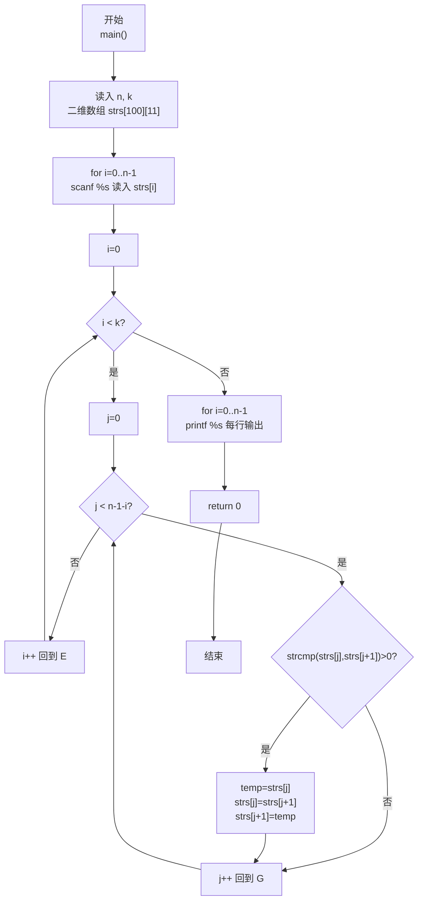
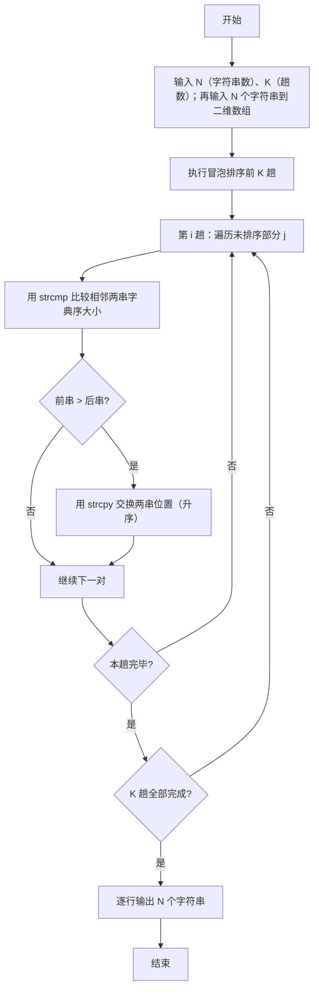

> **摘要**：本文是 PTA 编程题"7-30 字符串的冒泡排序"的题解，涵盖题目描述、输入输出格式及 C 语言实现，展示将冒泡排序从整数扩展到字符串：使用二维字符数组存储 N 个字符串，用 `strcmp` 比较相邻字符串大小、用 `strcpy` 完成字符串交换，并在执行 K 趟扫描后按行输出中间排序结果。

## 题目描述
我们已经知道了将N个整数按从小到大排序的冒泡排序法。本题要求将此方法用于字符串序列，并对任意给定的K（<N），输出扫描完第K遍后的中间结果序列。

### 输入格式：

输入在第1行中给出N和K（1≤K<N≤100），此后N行，每行包含一个长度不超过10的、仅由小写英文字母组成的非空字符串。

### 输出格式：

输出冒泡排序法扫描完第K遍后的中间结果序列，每行包含一个字符串。

### 输入样例：

```in
6 2
best
cat
east
a
free
day
```

### 输出样例：

```out
best
a
cat
day
east
free
```

## 解题思路

这道题的核心是**冒泡排序算法从整数推广到字符串 + 只做前 K 趟输出中间结果**：N 个字符串用二维字符数组 `strs[100][11]` 存储（最多 100 行，每行 10 个字母+结束符共 11 字节）；比较大小使用 `strcmp`（返回 >0 表示前一个字符串字典序更大，需要交换）；交换两串使用 `strcpy` 逐字符拷贝配合临时字符数组 `temp[11]`；外层跑 K 趟后逐行 `printf` 输出。

### 核心问题分析

1. **字符串的存储**：每个字符串长度 ≤10，用 `char strs[100][11]` 二维数组，行是第几个串、列是该串的字符。读入使用 `scanf("%s", strs[i])`（由于输入仅含小写字母，无空格，`%s` 即可）。
2. **字符串比较**：C 语言中不能直接用 `>` 比较两个字符串（比较的是地址），必须用头文件 `<string.h>` 中的 `strcmp(s1, s2)`：
   - 若返回值 < 0：s1 字典序小于 s2
   - 若返回值 = 0：两串相等
   - 若返回值 > 0：s1 字典序大于 s2（升序情况下就需要交换）
3. **字符串交换**：同样不能用 `=` 直接赋值给数组，要用 `strcpy(dest, src)` 把 src 的内容逐字符拷贝到 dest。交换形式：
   - `strcpy(temp, a); strcpy(a, b); strcpy(b, temp);`
4. **冒泡排序趟数**：外层 `i` 从 0 到 k-1（共 K 趟）；第 i 趟内层 j 从 0 到 `n-2-i`，比较 `strs[j]` 与 `strs[j+1]`，若 `strcmp>0` 则交换；每趟结束后下标 `n-1-i` 位置就位"当前未排序部分字典序最大"的字符串。
5. **样例推导（6 2）**：
   - 初始顺序：best cat east a free day
   - 第 1 趟后：best cat a east day free（free最大就位）
   - 第 2 趟后：best a cat day east free（east次大就位）
   - 逐行输出即为样例输出 ✓

### 算法原理说明

冒泡排序字符串版：
- 外层 `for (i=0; i<k; i++)` 共 K 趟
  - 内层 `for (j=0; j<n-1-i; j++)` 两两相邻比较
    - `if (strcmp(strs[j], strs[j+1]) > 0)` → 用 temp 通过 strcpy 交换
- 最终 `for (i=0; i<n; i++) printf("%s\n", strs[i]);`

### 具体计算步骤

1. 读 N、K
2. for i=0..N-1 读入 N 个字符串到 strs[i]
3. 外层 i 从 0 到 K-1：
   - 内层 j 从 0 到 (N-2-i)：
     - 若 `strcmp(strs[j], strs[j+1]) > 0` → 两串交换
4. 逐行打印 strs[0] 到 strs[N-1]，每行一个字符串
5. return 0

## 代码部分实现
```c
#include <stdio.h>   // 引入标准输入输出头文件，提供 scanf、printf
#include <string.h>  // 引入字符串处理头文件，提供 strcmp、strcpy

int main() {
    int n, k;       // n：字符串总数；k：要求输出的冒泡排序扫描遍数（k<n）
    scanf("%d %d", &n, &k);  // 第 1 行读入 n 和 k
    
    char strs[100][11];  // 二维字符数组：100 行（n≤100），每行 11 个 char（10字母+结束符）
    // 接下来 n 行，每行读入一个字符串（仅小写字母，无空格，%s 可行）
    for (int i = 0; i < n; i++) {
        scanf("%s", strs[i]);
    }
    
    // 冒泡排序：仅进行前 k 趟扫描，输出第 k 趟后的中间结果
    for (int i = 0; i < k; i++) {
        // 第 i 趟：把未排序部分字典序最大的字符串冒泡到下标 n-1-i 处
        // j 从 0 到 n-2-i，每次比较 j 与 j+1
        for (int j = 0; j < n - 1 - i; j++) {
            // strcmp 比较字典序，>0 表示 strs[j] > strs[j+1]，升序下需交换
            if (strcmp(strs[j], strs[j + 1]) > 0) {
                char temp[11];              // 临时字符数组，作为交换的第三变量
                strcpy(temp, strs[j]);      // temp = strs[j]
                strcpy(strs[j], strs[j + 1]); // strs[j] = strs[j+1]
                strcpy(strs[j + 1], temp);   // strs[j+1] = temp
            }
        }
    }
    
    // 逐行输出经过 k 趟排序后的字符串序列
    for (int i = 0; i < n; i++) {
        printf("%s\n", strs[i]);
    }
    
    return 0;  // 程序正常退出，返回 0
}
```

## 代码流程说明

### 1. 变量与输入
- `int n, k`：总数与趟数，`scanf("%d %d", &n, &k)`
- `char strs[100][11]`：二维数组，每行存一个字符串
- `for (i=0; i<n; i++) scanf("%s", strs[i]);` 依次读入 n 个字符串

### 2. 前 K 趟冒泡排序
- 外层 `i ∈ [0, k)`：共 K 趟
  - 内层 `j ∈ [0, n-1-i)`：两两相邻比较
    - `if (strcmp(strs[j], strs[j+1]) > 0)` → `strcpy` 交换
  - 每趟结束后位置 `n-1-i` 就位"当前最大字典序"串

### 3. 输出
- `for (i=0; i<n; i++) printf("%s\n", strs[i]);` 每行一个字符串

### 4. 返回
- `return 0`

## 代码流程图



## 解题流程图


