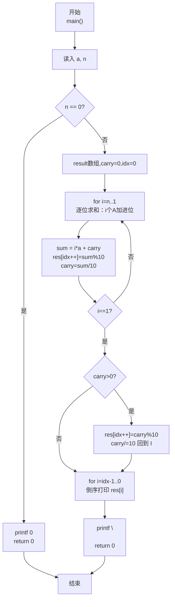
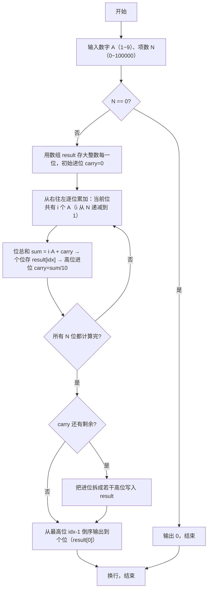

> **摘要**：本文是 PTA 编程题"7-38 数列求和-加强版"的题解，涵盖题目描述、输入输出格式及 C 语言实现，展示通过"竖式加法逐位统计进位"的大整数加法思路：共 N 项 A、AA、AAA…、AA…A（N 个 A），从右往左第 i 位上共有 i 个 A 相加，第 i 位值 = i·A + 上一步进位，模 10 记位、整除 10 作新进位；最后如果仍有进位则作为最高位，整体输出结果数组。

## 题目描述
给定某数字A（1≤A≤9）以及非负整数N（0≤N≤100000），求数列之和S=A+AA+AAA+⋯+AA⋯A（N个A）。例如A=1, N=3时，S=1+11+111=123。

### 输入格式：

输入数字A与非负整数N。

### 输出格式：

输出其N项数列之和S的值。

### 输入样例：

```in
1 3
```

### 输出样例：

```out
123
```

## 解题思路

这道题的核心是**竖式按位累加** + **高精度数组存结果**。因为 N 可以到 100000，总和最多是 10 万位数量级，远大于任何内置整数类型（unsigned long long 才 18~19 位），必须用数组存结果的每一位。观察 N 项相加：
- 第 1 项（个位）有 A，在第 0 位（个位）贡献 1 个 A
- 第 2 项 AA 在第 0 位贡献 1 个 A、第 1 位贡献 1 个 A
- …
- 第 k 项（k 个 A）对第 0 位~第 k-1 位各贡献 1 个 A
- 因此：**从右往左数第 i 位（0 表示个位，i 从 1 计到 N 表示有多少项包含这一位）共有 i 个 A 相加**（或者用 i 从 N 到 1，倒着来更方便存数组）
进位计算：第 i 位总和 = i·A + 上一步 carry，当前位数字 = 总和 % 10，新进位 = 总和 / 10。循环到 i=1 之后，如果 carry>0 就把它逐位拆成高位存入。最后如果 N=0，直接输出 0。

### 核心问题分析

1. **N=0 的特殊情况**：和是 0 项相加 = 0。开头直接 `if (n==0) { printf("0\n"); return 0; }`。
2. **按位求和公式**：把所有 N 项对齐右边（个位对个位），从右往左第 i 列（即 10ⁱ 这一位），共有多少个 A 落在这一列？
   - 长度 ≥ i+1 的项才在这一位上有值：即第 i+1 项到第 N 项，共 N − i 项？不对，换一种更直观的计数：
   - 对第 k 项（长度 k，由 k 个 A 组成），它贡献 A 到位 0、位 1、…、位 k-1。
   - 因此，位 i（0 表示个位）上 A 出现的次数 = 满足 k-1 ≥ i 的 k 的数量 = N − i（前提 i < N，否则 0）。
   - 题目 N 最大 10 万，S 最多 10 万多位，用数组 `result[100001]` 足够。
   - 代码实现更方便的做法：**从个位开始 i 从 1 到 N**（表示这一位共有 i 个 A 相加。i 从 1 到 N 对应从最低位到第 N-1 位，即正好位序 0 到 N-1）。即：位 0（个位）共 N 个？不对，重新看样例 A=1, N=3：
     - 个位：1 + 1 + 1 = 3，共 3 个 A → i=3
     - 十位：0 + 1 + 1 = 2，共 2 个 A → i=2
     - 百位：0 + 0 + 1 = 1，共 1 个 A → i=1
     - 对！应该是**从右往左，第 1 段循环 i 从 N 递减到 1，依次写入 result[0..N-1]**，每次 `sum = i*a + carry` 得到当前位总和。
3. **进位处理**：
   - `result[i位对应数组下标] = sum % 10; carry = sum / 10;`
   - i 循环到 1 之后，如果 carry > 0，必须不断拆分进位写入更高位：
     - 例如 N=100000、A=9，最后 carry 可能是 5 位数，要 while(carry>0) 依次 `result[idx++]=carry%10; carry/=10;`
4. **输出顺序**：`result[0]` 存的是个位，数组下标越小越低位。因此输出要**从最后一个有效下标（最高位）倒序输出到 0**。
5. **例 A=1, N=3**：
   - i=3：sum=3·1+0=3 → result[0]=3，carry=0
   - i=2：sum=2·1+0=2 → result[1]=2，carry=0
   - i=1：sum=1·1+0=1 → result[2]=1，carry=0
   - 无进位，最高位是下标 2
   - 倒序输出 result[2], result[1], result[0] → 1 2 3 → 123 ✓

### 算法原理说明

1. 读 a、n；若 n=0 直接打印 0 返回
2. 初始化 int result[100001] = {0}, idx=0, carry=0
3. `for (int i = n; i >= 1; i--)`：
   - sum = i*a + carry
   - result[idx++] = sum % 10
   - carry = sum / 10
4. `while (carry > 0)`：把最后剩余进位拆成若干位
   - result[idx++] = carry%10
   - carry /= 10
5. 从 idx-1 到 0 依次 `printf("%d", result[i])`
6. `printf("\n")`

### 具体计算步骤（样例 N=3, A=1）
1. n=3≠0
2. idx=0, carry=0
3. i=3：sum=3*1+0=3 → res[0]=3，carry=0，idx=1
   i=2：sum=2*1+0=2 → res[1]=2，carry=0，idx=2
   i=1：sum=1*1+0=1 → res[2]=1，carry=0，idx=3
4. carry=0，无需再拆
5. 倒序 i=2→1→0 → 1 2 3 → 输出 123

## 代码部分实现
```c
#include <stdio.h>       // 标准输入输出：scanf、printf

int main() {
    int a, n;            // a：数字 A（1~9）；n：项数 N（0≤N≤100000）
    scanf("%d %d", &a, &n);  // 读入 A 与 N

    if (n == 0) {        // 特判：0 项相加和为 0
        printf("0\n");
        return 0;
    }

    // 结果最多有 n 位 + 可能的进位若干位，100001 对于 n≤100000 足够
    int result[100001] = {0};
    int carry = 0;       // 进位变量，初值 0
    int idx = 0;         // result 数组当前写入下标（从 0 开始 = 个位 = 最低位）

    // 从右往左按"共 i 个 A 在同一列相加"的方式计算每一位
    // 个位 i = n（n 项都有个位）
    // 十位 i = n-1（最长的 n-1 项及以上都有十位）
    // ...
    // 最高列 i = 1（只有第 n 项 AA…A 这一项有这一位）
    for (int i = n; i >= 1; i--) {
        int sum = i * a + carry;      // 当前位总和：i 个 A 加上低位来的进位
        result[idx++] = sum % 10;     // 取个位数字存入当前位
        carry = sum / 10;             // 其余作为进位传递到更高一位
    }

    // 循环结束后，如果最高位计算仍有进位，需要把进位拆成若干个高位写入
    while (carry > 0) {
        result[idx++] = carry % 10;   // 存进位的末位
        carry /= 10;                   // 进位去掉末位，继续传递
    }

    // 输出：result[0] 是个位，要从最后写入的位置 idx-1（最高位）倒序输出到 0
    for (int i = idx - 1; i >= 0; i--) {
        printf("%d", result[i]);
    }
    printf("\n");        // 结束换行

    return 0;            // 程序正常结束
}
```

## 代码流程说明

### 1. 输入与特判
- `int a, n; scanf("%d %d", &a, &n);`
- `if (n==0) { printf("0\n"); return 0; }`（0 项和为 0）

### 2. 按位累加
- `int result[100001] = {0}; int carry=0; int idx=0;`
- `for (int i = n; i >= 1; i--)`：
  - `sum = i*a + carry;`
  - `result[idx++] = sum%10;`
  - `carry = sum/10;`

### 3. 处理剩余进位
- `while (carry > 0)`：
  - `result[idx++] = carry%10;`
  - `carry /= 10;`

### 4. 倒序输出
- `for (int i = idx-1; i >= 0; i--) printf("%d", result[i]);`
- `printf("\n");`

### 5. 返回
- `return 0`

## 代码流程图



## 解题流程图


