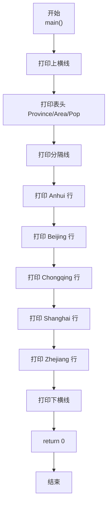
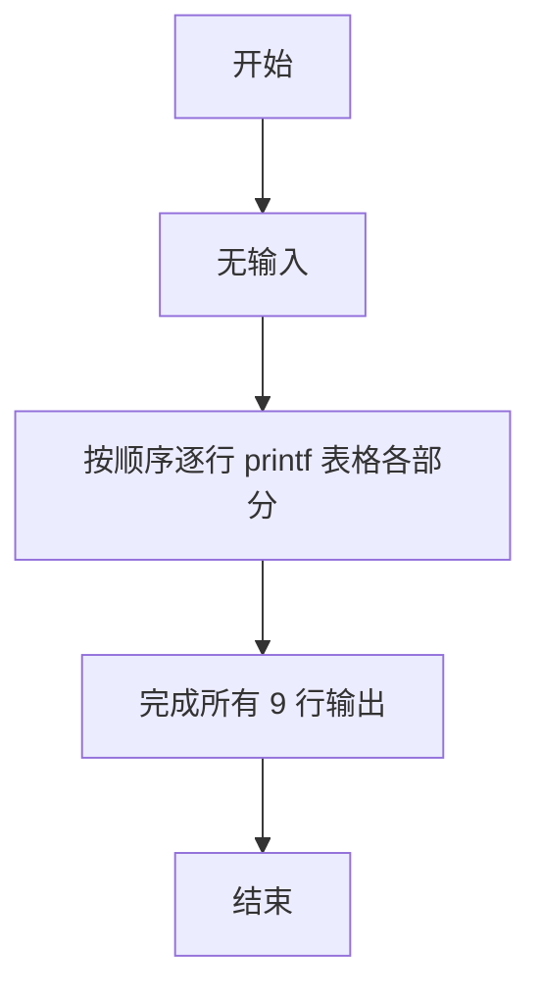

> **摘要**：本文是 PTA 编程题“7-5 表格输出”的题解，涵盖题目描述、输入输出格式及 C 语言实现，展示使用 printf 严格对齐输出多行列表内容的格式控制。

## 题目描述
本题要求编写程序，按照规定格式输出表格。

### 输入格式：

本题目没有输入。

### 输出格式：

要求严格按照给出的格式输出下列表格：

```out
------------------------------------
Province      Area(km2)   Pop.(10K)
------------------------------------
Anhui         139600.00   6461.00
Beijing        16410.54   1180.70
Chongqing      82400.00   3144.23
Shanghai        6340.50   1360.26
Zhejiang      101800.00   4894.00
------------------------------------
```

## 代码部分实现
```c
#include <stdio.h>  // 引入标准输入输出头文件

int main(void)  // 主函数
{
    printf("------------------------------------\n");  // 输出表格顶部横线
    printf("Province      Area(km2)   Pop.(10K)\n");  // 输出表头：省份、面积、人口
    printf("------------------------------------\n");  // 输出分隔线
    printf("Anhui         139600.00   6461.00\n");  // 输出安徽省数据
    printf("Beijing        16410.54   1180.70\n");  // 输出北京市数据
    printf("Chongqing      82400.00   3144.23\n");  // 输出重庆市数据
    printf("Shanghai        6340.50   1360.26\n");  // 输出上海市数据
    printf("Zhejiang      101800.00   4894.00\n");  // 输出浙江省数据
    printf("------------------------------------\n");  // 输出表格底部横线
}
```

## 解题思路

这道题的核心是**逐行完全匹配输出样例**，属于纯格式化输出题。

### 核心问题分析

1. **无输入**：不需要 scanf。
2. **精确匹配**：每行的空格数、小数点位置、每行长度必须与样例逐字符一致，否则 PTA 逐字符比对会判 Wrong Answer。
3. **结构**：上横线 → 表头 → 分隔线 → 5 条数据 → 下横线。

### 算法原理说明

8 条 printf 依次输出 8 行：每条 printf 里的字符串就是样例的对应行，不要改任何空格或字符。

### 具体计算步骤

1. 输出上横线
2. 输出表头
3. 输出分隔线
4. 依次输出 Anhui、Beijing、Chongqing、Shanghai、Zhejiang 五行
5. 输出下横线

## 代码流程说明

### 1. 第 1~3 行：表头区
- 上横线：36 个 '-' + 换行
- 表头字符串
- 分隔线（与上横线完全相同）

### 2. 第 4~8 行：数据区
- 每条数据的字符串固定：省名（10~14 字符宽空格填充）+ Area 数据 + 空格 + Pop 数据
- 严格和样例空格对齐，避免多/少空格

### 3. 第 9 行：下横线
- 与上横线完全相同

## 代码流程图



## 解题流程图


