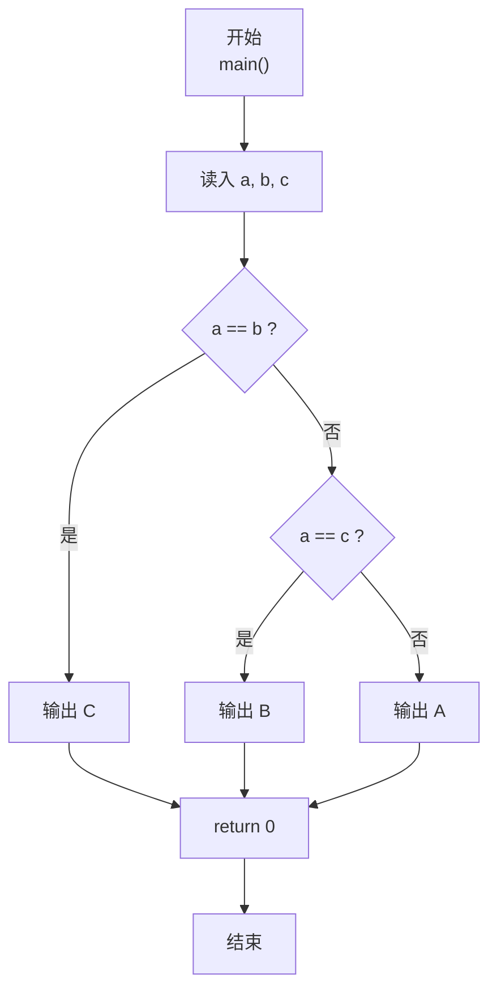
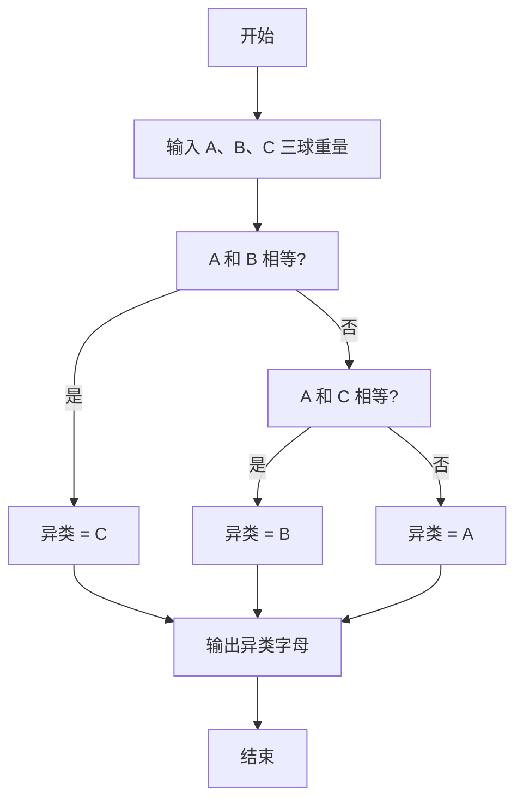

> **摘要**：本文是 PTA 编程题“7-9 用天平找小球”的题解，涵盖题目描述、输入输出格式及 C 语言实现，展示三球中通过两两相等比较唯一找出"重量不同者"的最简分支法。

## 题目描述
三个球A、B、C，大小形状相同且其中有一个球与其他球重量不同。要求找出这个不一样的球。

### 输入格式：

输入在一行中给出3个正整数，顺序对应球A、B、C的重量。

### 输出格式：

在一行中输出唯一的那个不一样的球。

### 输入样例：

```in
1 1 2
```

### 输出样例：

```out
C
```

## 解题思路

这道题的核心是**利用"有且只有一个异类"这一前提，做最多两次相等比较即可锁定**。

### 核心问题分析

前提为"三个数里恰好两个相等、一个不同"，因此：
1. 若 a == b → 不同者必为 C
2. 否则 (a != b) → 异类在 A/B 中；再用 a == c 判断：
   - 若 a == c → 异类是 B（因为 A 与 C 相同）
   - 否则 → 异类是 A（因为 B、C 都是另一个值）

### 算法原理说明

经典的 if-else if-else 三级分支：
- if (a == b) → 输出 C
- else if (a == c) → 输出 B
- else → 输出 A
（因为 a≠b 且 a≠c 时，b、c 必定相等，异类就是 A）

### 具体计算步骤

1. 读入 a, b, c
2. 比较 a==b? → C
3. 否则 a==c? → B
4. 否则 → A

## 代码部分实现
```c
#include <stdio.h>  // 引入标准输入输出头文件

int main(void)  // 主函数
{
    int a, b, c;  // 定义三个球的重量变量
    scanf("%d %d %d", &a, &b, &c);  // 读入三个球的重量
    
    if (a == b) {  // 如果A和B重量相同
        printf("C\n");  // 则C是不一样的球
    } else if (a == c) {  // 如果A和C重量相同
        printf("B\n");  // 则B是不一样的球
    } else {  // A与B、C都不同
        printf("A\n");  // 则A是不一样的球
    }
    
    return 0;  // 返回0表示程序正常结束
}
```

## 代码流程说明

### 1. 变量与输入
- int a, b, c; scanf 读入三个球的重量（顺序对应 A、B、C）。

### 2. 三级比较分支
- **a == b** → C 必为异类（题目保证只有一个异类）
- **否则 a == c** → B 必为异类
- **否则** → A 必为异类（此时 b、c 必然相等）

## 代码流程图



## 解题流程图


