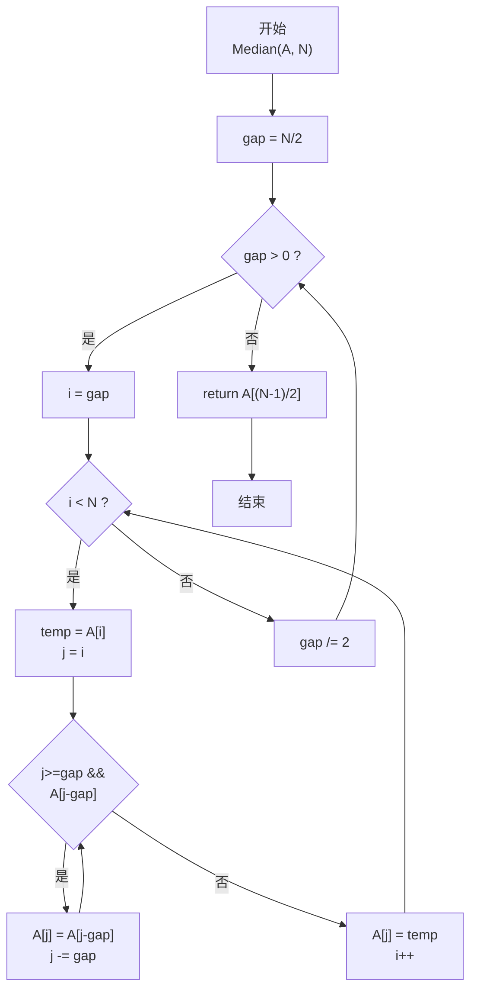
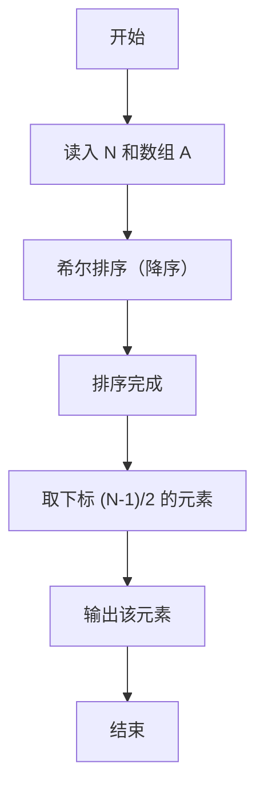

> **摘要**：本文是 PTA 函数题“6-11 求自定类型元素序列的中位数”的题解，涵盖题目描述、函数接口定义及 C 语言实现，展示希尔排序后取中间元素求中位数的实现方法。

## 题目描述

本题要求实现一个函数，求N个集合元素A[]的中位数，即序列中第⌊(N+1)/2⌋大的元素。其中集合元素的类型为自定义的ElementType。

函数接口定义：
ElementType Median( ElementType A[], int N );
其中给定集合元素存放在数组A[]中，正整数N是数组元素个数。该函数须返回N个A[]元素的中位数，其值也必须是ElementType类型。

裁判测试程序样例：
```c++
#include <stdio.h>

#define MAXN 10
typedef float ElementType;

ElementType Median( ElementType A[], int N );

int main ()
{
    ElementType A[MAXN];
    int N, i;

    scanf("%d", &N);
    for ( i=0; i<N; i++ )
        scanf("%f", &A[i]);
    printf("%.2f\n", Median(A, N));

    return 0;
}
/* 你的代码将被嵌在这里 */
```

输入样例：
```in
3
12.3 34 -5
```
输出样例：
```out
12.30
```

## 解题思路

这道题的核心是**求 N 个元素的中位数**。题目定义的中位数是"第 ⌊(N+1)/2⌋ 大的元素"，等价于把数组降序排列后，取下标为 (N-1)/2（整数除法向下取整）的元素。

### 核心问题分析

1. **排序选择**：中位数的最直接求法是"先排序再取中间"。由于 PTA 函数题往往对时间复杂度有要求（N 可能较大），选择 O(N^1.3) 左右的希尔排序比简单插入/冒泡 O(N²) 更稳妥。
2. **降序 or 升序**：题目要求的是"第 k 大"，用降序排序后 A[(N-1)/2] 正好对应第 ⌊(N+1)/2⌋ 大的元素。若用升序则需要计算转换下标。
3. **希尔排序增量**：采用经典的"折半增量序列"gap = N/2 → gap/=2 → ... → gap=1。gap=1 时退化为普通插入排序，但此时数组已基本有序。

### 算法原理说明

希尔排序（Shell Sort，降序）+ 取中间位：
1. 初始 gap = N/2。
2. 对每个 gap，把数组分成 gap 组（按下标 mod gap 分组），对每组做"降序插入排序"：
   - i 从 gap 到 N-1：temp = A[i] 暂存
   - j = i，当 j ≥ gap 且 A[j-gap] < temp 时：A[j] = A[j-gap]，j -= gap
   - A[j] = temp
3. gap /= 2，重复直到 gap = 0 退出。
4. 排序结束后 return A[(N-1)/2]（降序下第 ⌊(N+1)/2⌋ 大）。

### 具体计算步骤

1. gap = N / 2
2. while gap > 0：
   - i 从 gap 到 N-1：
     - temp = A[i]
     - j 从 i 开始，while j ≥ gap && A[j-gap] < temp → A[j] = A[j-gap]; j -= gap
     - A[j] = temp
   - gap /= 2
3. return A[(N-1)/2]

## 函数部分实现

```c
/* 6-11 求自定类型元素序列的中位数
 * 函数：Median
 * 功能：返回 N 个元素中的中位数（第 ⌊(N+1)/2⌋ 大）
 * 参数：
 *   A[] — 自定类型数组
 *   N   — 元素个数
 * 返回值：中位数（ElementType）
 * 实现原理：希尔排序（降序）后取 A[(N-1)/2]。
 *   - 增量 gap = N/2 起，每次 gap/=2，直到 gap=0
 *   - 每个 gap 下按间隔分组做降序插入排序
 *   - 排序后 A[(N-1)/2] 即为所求
 * 时间复杂度 O(N^1.3)，空间复杂度 O(1)
 */
ElementType Median( ElementType A[], int N )
{
    int i, j, gap;
    ElementType temp;

    /* 希尔排序（降序）：时间复杂度约 O(N^1.3)，可通大 N 时限 */
    for (gap = N / 2; gap > 0; gap /= 2) {           /* 增量序列：每次折半 */
        for (i = gap; i < N; i++) {                  /* 从 gap 开始向后扫描 */
            temp = A[i];                             /* 暂存当前元素 */
            /* 降序插入：若前一个增量位置的元素更小，则后移 */
            for (j = i; j >= gap && A[j - gap] < temp; j -= gap)
                A[j] = A[j - gap];
            A[j] = temp;                             /* 放入正确位置 */
        }
    }

    /* 降序排列后，A[(N-1)/2] 恰好是第 ⌊(N+1)/2⌋ 大的元素 */
    return A[(N - 1) / 2];
}
```

## 完整代码实现

```c
/* 6-11 求自定类型元素序列的中位数
 * 题目：实现函数 Median(A[], N)，返回 N 个元素的中位数。
 * 实现原理：先排序再取中间元素。
 *           这里用希尔排序把数组降序排列，
 *           排序后中位数位于下标 (N-1)/2（向下取整，
 *           对奇数/偶数长度都适用，偶数时取中间偏左者）。
 * 时间复杂度 O(N^1.3)（希尔），空间复杂度 O(1)。
 */
#include <stdio.h>

#define MAXN 10
typedef float ElementType;

ElementType Median( ElementType A[], int N );

int main ()
{
    ElementType A[MAXN];
    int N, i;

    scanf("%d", &N);
    for ( i = 0; i < N; i++ )
        scanf("%f", &A[i]);
    printf("%.2f\n", Median(A, N));

    return 0;
}

/* 希尔排序（降序）后返回中位数 */
ElementType Median( ElementType A[], int N )
{
    int i, j, gap;
    ElementType temp;

    /* 希尔排序（降序）：时间复杂度约 O(N^1.3)，可通大 N 时限 */
    for (gap = N / 2; gap > 0; gap /= 2) {           /* 增量序列：每次折半 */
        for (i = gap; i < N; i++) {                  /* 从 gap 开始向后扫描 */
            temp = A[i];                             /* 暂存当前元素 */
            /* 降序插入：若前一个增量位置的元素更小，则后移 */
            for (j = i; j >= gap && A[j - gap] < temp; j -= gap)
                A[j] = A[j - gap];
            A[j] = temp;                             /* 放入正确位置 */
        }
    }

    /* 降序排列后，A[(N-1)/2] 恰好是第 ⌊(N+1)/2⌋ 大的元素 */
    return A[(N - 1) / 2];
}
```

## 代码流程说明

### 1. 主函数：读数据
- 读入 N，再读入 N 个 float 存入 A[0..N-1]
- 调用 Median 后 %.2f 输出

### 2. Median 函数：希尔排序（降序）
- gap = N/2；当 gap > 0 时：
  - 外层 i = gap..N-1：每个待插入元素
    - temp = A[i]
    - j 从 i 向前走 gap 步：若 A[j-gap] < temp（更小，降序不合法）则后移，直到 j<gap 或找到更大/相等元素
    - A[j] = temp
  - gap /= 2

### 3. 取中位数
- return A[(N-1)/2]

## 代码流程图



## 解题流程图


