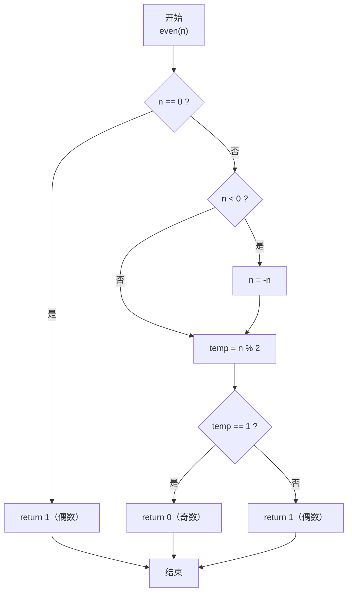
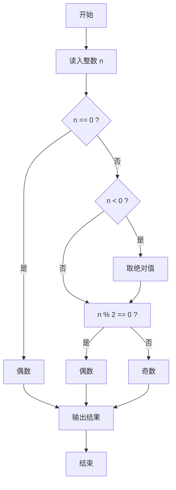

> **摘要**：本文是 PTA 函数题“6-12 判断奇偶性”的题解，涵盖题目描述、函数接口定义及 C 语言实现，展示利用"整数对 2 取余"判断奇偶并处理负数、零等边界情况。

## 题目描述

本题要求实现判断给定整数奇偶性的函数。

### 函数接口定义：

```c++
int even( int n );
```

其中`n`是用户传入的整型参数。当`n`为偶数时，函数返回1；`n`为奇数时返回0。注意：0是偶数。

### 裁判测试程序样例：

```c++
#include <stdio.h>

int even( int n );

int main()
{    
    int n;

    scanf("%d", &n);
    if (even(n))
        printf("%d is even.\n", n);
    else
        printf("%d is odd.\n", n);

    return 0;
}

/* 你的代码将被嵌在这里 */
```

### 输入样例1：

```in
-6
```

### 输出样例1：

```out
-6 is even.
```

### 输入样例2：

```
5
```

### 输出样例2：

```
5 is odd.
```

## 解题思路

这道题的核心是**整数取余判奇偶**：偶数 mod 2 = 0，奇数 mod 2 = ±1。关键细节是正确处理 0 与负数。

### 核心问题分析

1. **数学性质**：奇偶性只与绝对值有关，-6 和 6 都是偶数。
2. **C 语言负数取余**：(-6)%2 的结果是 0（因为 2×(-3) = -6，余 0）；(-5)%2 = -1。因此对负数若直接取余判断"等于 1"会误判。
3. **零的特殊性**：0 是偶数，直接特判即可。

### 算法原理说明

统一处理为"取绝对值→取余→判断"：
- n == 0 → return 1（偶数）
- n < 0 → n = -n（取正）
- 再判断 n%2：结果 1 → 奇数返回 0；否则 → 偶数返回 1

或者也可以直接判断 n%2 == 0，避免绝对值步骤（因为负数 % 2 == 0 也是偶数）。

### 具体计算步骤

1. 若 n == 0：return 1
2. 若 n < 0：n = -n
3. temp = n % 2
4. temp == 1 → return 0（奇）；否则 return 1（偶）

## 函数部分实现

```c
/* 6-12 判断奇偶性
 * 函数：even
 * 功能：判断 n 是否为偶数
 * 参数：n — 任意整数
 * 返回值：偶数返回 1，奇数返回 0
 * 实现原理：对 2 取余法。
 *   - n==0 特判为偶数
 *   - n<0 先取正不改变奇偶性
 *   - n%2 == 1 奇数返回 0，否则偶数返回 1
 * 时间复杂度 O(1)，空间复杂度 O(1)
 */
int even( int n )
{
    int temp;
    if(n == 0)
        return 1;                 /* 0 是偶数 */
    if(n < 0)
        n = -n;                   /* 负数取正，奇偶性不变 */
    if(n > 0)
        temp = n % 2;             /* 取余判断奇偶 */
    if(temp == 1)
        return 0;                 /* 余 1 -> 奇数 */
    else
        return 1;                 /* 否则 -> 偶数 */
}
```

## 完整代码实现

```c
/* 6-12 判断奇偶性
 * 题目：实现函数 even(n)，判断 n 的奇偶性。
 *       返回 1 表示偶数，返回 0 表示奇数。
 * 实现原理：利用“偶数对 2 取余为 0，奇数为 1”的性质。
 *           n==0 直接判为偶数；n<0 先取相反数不影响奇偶性；
 *           再用 n%2 判断：余 1 为奇数返回 0，否则返回 1。
 * 时间复杂度 O(1)，空间复杂度 O(1)。
 */
#include <stdio.h>

int even( int n );

int main()
{
    int n;

    scanf("%d", &n);
    if (even(n))
        printf("%d is even.\n", n);
    else
        printf("%d is odd.\n", n);

    return 0;
}

/* 返回 1 表示偶数，0 表示奇数 */
int even( int n )
{
    int temp;
    if(n == 0)
        return 1;                 /* 0 是偶数 */
    if(n < 0)
        n = -n;                   /* 负数取正，奇偶性不变 */
    if(n > 0)
        temp = n % 2;             /* 取余判断奇偶 */
    if(temp == 1)
        return 0;                 /* 余 1 -> 奇数 */
    else
        return 1;                 /* 否则 -> 偶数 */
}
```

## 代码流程说明

### 1. 主函数
- 读入 n
- even(n) 返回真：输出 "... is even."
- even(n) 返回假：输出 "... is odd."

### 2. even 函数：分支一 n == 0
- return 1（零是偶数）

### 3. even 函数：分支二 n < 0
- n = -n 取正，不改变奇偶性

### 4. even 函数：取余判断
- temp = n % 2
- temp == 1 → return 0（奇数）
- 否则 → return 1（偶数）

## 代码流程图



## 解题流程图


