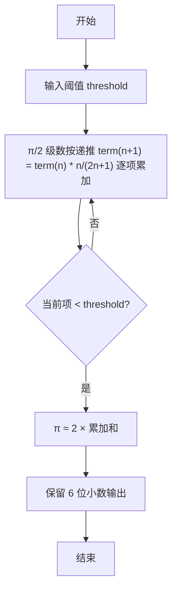

> **摘要**：本文是 PTA 编程题“7-15 计算圆周率”的题解，涵盖题目描述、输入输出格式及 C 语言实现，展示利用级数递推公式求 π/2 近似值，直到单项小于阈值的迭代方法。

## 题目描述
根据下面关系式，求圆周率的值，直到最后一项的值小于给定阈值。

关系式：
```
π/2 = 1 + 1/3 + 2!/(3×5) + 3!/(3×5×7) + ... + n!/(3×5×7×...×(2n+1)) + ...
```

### 输入格式：

输入在一行中给出小于1的阈值。

### 输出格式：

在一行中输出满足阈值条件的近似圆周率，输出到小数点后6位。

### 输入样例：

```
0.01
```

### 输出样例：

```
3.132157
```

## 解题思路

这道题的核心是**利用通项的"递推关系"避免重算阶乘和分母长乘**：设第 n 项 term[n]，则 term[n+1] = term[n] × n / (2n+1)。

### 核心问题分析

1. **首项**：和 sum 初始为 1（即 n=0 时 0!/(3×5×...×1) = 1），term 初值也为 1（进入循环后先乘比例算下一项）。
2. **递推**：从 term[n] 到 term[n+1]，相当于分子多乘 (n+1)、分母多乘 (2(n+1)+1) = 2n+3，即 term *= (n+1) / (2n+3)。代码里用 n 从 1 起、term *= n/(2n+1) 效果等价。
3. **终止条件**：当 term（最新一项）< threshold 时停止；但要注意此时该项已经加进 sum（题目要求"直到最后一项的值小于给定阈值"，即这一项虽然满足阈值仍需计入）。
4. **最终 π**：π = 2 × sum

### 算法原理说明

迭代求和 + 相邻项比例：
- sum = 1.0, term = 1.0, n = 1
- 无限循环：
  - term *= (double)n / (2*n+1)
  - sum += term
  - if (term < threshold) break
  - n++
- pi = 2*sum

### 具体计算步骤

1. scanf("%lf", &threshold)
2. sum = 1.0; term = 1.0; n = 1
3. while(1):
   - term = term × n / (2n+1)
   - sum += term
   - term < threshold → break
   - n++
4. pi = 2.0 * sum; printf("%.6f", pi)

## 代码部分实现
```c
#include <stdio.h>

int main(void)
{
    double threshold;
    scanf("%lf", &threshold);
    
    double sum = 1.0;  // 第一项是1
    double term = 1.0;
    int n = 1;
    
    while (1) {
        term *= (double)n / (2 * n + 1);
        sum += term;
        if (term < threshold) {
            break;
        }
        n++;
    }
    
    double pi = 2.0 * sum;
    printf("%.6f\n", pi);
    
    return 0;
}
```

## 代码流程说明

### 1. 变量与输入
- double threshold：阈值（小于 1）
- scanf("%lf", &threshold)

### 2. 初始化
- sum = 1.0：已经包含首项 1
- term = 1.0：用于递推下一项
- n = 1：当前项号

### 3. 迭代循环
- term = term * n / (2n + 1)：由前一项推后一项（递推式）
- sum += term：加入当前项
- if (term < threshold) break（该项已计入，然后退出）
- 否则 n++ 继续

### 4. 输出 π
- π = 2 × sum；printf("%.6f", pi)

## 代码流程图

```mermaid
flowchart TD
  A["开始\nmain()"] --> B["读入 threshold"]
  B --> C["sum = 1.0, term = 1.0, n = 1"]
  C --> D["term *= n/(2n+1)"]
  D --> E["sum += term"]
  E --> F{"term < threshold?"}
  F -- "否" --> G["n++"]
  G --> D
  F -- "是" --> H["pi = 2*sum"]
  H --> I["printf(\"%.6f\", pi)"]
  I --> J["return 0"]
  J --> K["结束"]
```

## 解题流程图


