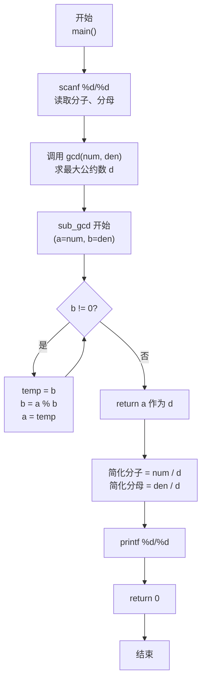
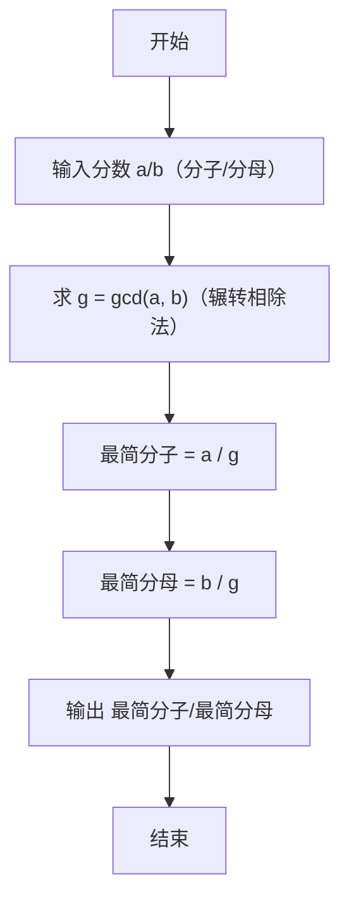

> **摘要**：本文是 PTA 编程题"7-24 约分最简分式"的题解，涵盖题目描述、输入输出格式及 C 语言实现，展示使用 `scanf("%d/%d")` 解析"分子/分母"格式输入，并通过辗转相除法（欧几里得算法）求最大公约数 gcd，再将分子分母同除以 gcd 得到最简分式的方法。

## 题目描述
分数可以表示为分子/分母的形式。编写一个程序，要求用户输入一个分数，然后将其约分为最简分式。最简分式是指分子和分母不具有可以约分的成分了。如6/12可以被约分为1/2。当分子大于分母时，不需要表达为整数又分数的形式，即11/8还是11/8；而当分子分母相等时，仍然表达为1/1的分数形式。

### 输入格式：

输入在一行中给出一个分数，分子和分母中间以斜杠/分隔，如：12/34表示34分之12。分子和分母都是正整数（不包含0，如果不清楚正整数的定义的话）。

提示：

对于C语言，在scanf的格式字符串中加入/，让scanf来处理这个斜杠。
对于Python语言，用a,b=map(int, input().split('/'))这样的代码来处理这个斜杠。

### 输出格式：

在一行中输出这个分数对应的最简分式，格式与输入的相同，即采用分子/分母的形式表示分数。如
5/6表示6分之5。

### 输入样例：

```in
66/120
```

### 输出样例：

```out
11/20
```

## 解题思路

这道题的核心是**求最大公约数（gcd）再做整数除法约分**：用辗转相除法（欧几里得算法）求分子、分母的最大公约数 d，然后最简分式 = (分子/d) / (分母/d)。由于 gcd(a,b)=gcd(b,a)，且辗转相除法天然保证得到正整数，直接即可。

### 核心问题分析

1. **格式解析**：输入是"分子/分母"形式，C 语言 `scanf("%d/%d", &a, &b)` 中格式串里的 `/` 会与输入中的 `/` 严格匹配，从而直接得到两个整数，无需手动分割字符串。
2. **约分本质**：最简分式 = 分子分母同除以两者的最大公约数（Greatest Common Divisor, gcd）。gcd 是能同时整除分子和分母的最大正整数，除以它后二者不再有公共因数。
3. **辗转相除法（欧几里得算法）**：原理是 `gcd(a, b) = gcd(b, a mod b)`，反复迭代直到余数为 0，此时的除数即为 gcd。时间复杂度 O(log min(a,b))，效率极高。
4. **特殊情况统一处理**：
   - 分子 > 分母（如 11/8）：题目要求不化为带分数，直接输出即可，无需额外分支。
   - 分子 = 分母（如 5/5）：gcd=5，约分后 1/1，同样由一般流程得到，无需特判。
   - 分子、分母都是正整数：无需处理 0 或负数。

### 算法原理说明

设输入分数 a/b：
1. 求 d = gcd(a, b)（辗转相除）
2. 最简分子 = a / d，最简分母 = b / d
3. 按 `"%d/%d\n"` 格式输出

辗转相除法步骤示例（以 66/120 为例）：
- gcd(120, 66)：120 % 66 = 54 → gcd(66, 54)
- gcd(66, 54)：66 % 54 = 12 → gcd(54, 12)
- gcd(54, 12)：54 % 12 = 6 → gcd(12, 6)
- gcd(12, 6)：12 % 6 = 0 → gcd = 6
- 66/6 = 11，120/6 = 20 → 结果 11/20

### 具体计算步骤

1. `scanf("%d/%d", &numerator, &denominator);` 读取分子分母
2. `d = gcd(numerator, denominator)` 求最大公约数
3. `simplified_num = numerator / d; simplified_den = denominator / d;`
4. `printf("%d/%d\n", simplified_num, simplified_den);`
5. return 0

## 代码部分实现
```c
#include <stdio.h> // 引入标准输入输出头文件，提供 scanf、printf

// 辗转相除法（欧几里得算法）求两个正整数的最大公约数
// 原理：gcd(a, b) = gcd(b, a mod b)，直到余数为 0 时，当前除数即为最大公约数
int gcd(int a, int b) {
    while (b != 0) { // 当余数 b 不为 0 时继续迭代
        int temp = b;       // 保存当前除数 b，作为下一轮的被除数 a
        b = a % b;          // 计算 a 除以 b 的余数，作为下一轮的除数 b
        a = temp;           // 将原除数 b 赋给 a，成为下一轮的被除数
    }
    return a;               // 当 b==0 时，a 即为两数的最大公约数
}

int main() { // 主函数入口
    int numerator, denominator; // numerator 为分子，denominator 为分母
    // 按"分子/分母"格式读取，格式串中的 '/' 会匹配输入中的 '/' 并自动跳过
    scanf("%d/%d", &numerator, &denominator);
    
    // 求出分子和分母的最大公约数（公约数），用于后续约分
    int common_divisor = gcd(numerator, denominator);
    
    // 分子分母同时除以最大公约数，得到最简分式的分子和分母
    int simplified_num = numerator / common_divisor;
    int simplified_den = denominator / common_divisor;
    
    // 按"分子/分母"格式输出最简分式
    printf("%d/%d\n", simplified_num, simplified_den);
    
    return 0; // 程序正常结束，返回 0
}
```

## 代码流程说明

### 1. 自定义函数 `gcd(a, b)`
- 输入：两个正整数 a、b（分子分母任意顺序均可，gcd(a,b)=gcd(b,a)）
- 过程：`while (b != 0)` 循环执行 `temp=b; b=a%b; a=temp`
- 输出：当 b=0 时的 a，即两数的最大公约数

### 2. 主函数变量与输入
- `int numerator, denominator`：存储分子、分母
- `scanf("%d/%d", ...)`：利用格式串中的 `/` 精确匹配输入斜杠

### 3. 约分计算
- `common_divisor = gcd(numerator, denominator)` 得最大公约数
- `simplified_num = numerator / common_divisor`：最简分子
- `simplified_den = denominator / common_divisor`：最简分母

### 4. 输出
- `printf("%d/%d\n", simplified_num, simplified_den)` 按格式输出

### 5. 返回
- `return 0`

## 代码流程图



## 解题流程图


