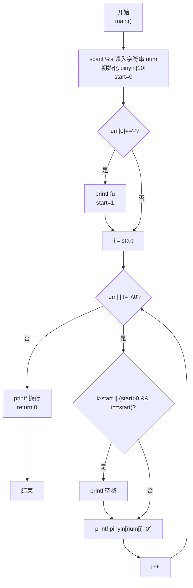
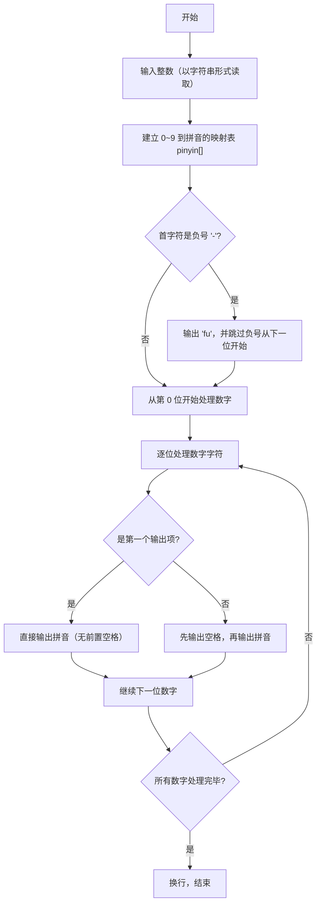

> **摘要**：本文是 PTA 编程题"7-25 念数字"的题解，涵盖题目描述、输入输出格式及 C 语言实现，展示将整数按字符串读入，使用拼音映射表（0→ling、1→yi…9→jiu）逐位查表输出，并处理负号"fu"与行末无多余空格的格式化控制方法。

## 题目描述
输入一个整数，输出每个数字对应的拼音。当整数为负数时，先输出fu字。十个数字对应的拼音如下：
```in
0: ling
1: yi
2: er
3: san
4: si
5: wu
6: liu
7: qi
8: ba
9: jiu
```

### 输入格式：

输入在一行中给出一个整数，如：1234。

提示：整数包括负数、零和正数。

### 输出格式：

在一行中输出这个整数对应的拼音，每个数字的拼音之间用空格分开，行末没有最后的空格。如
yi er san si。

### 输入样例：

```in
-600
```

### 输出样例：

```out
fu liu ling ling
```

## 解题思路

这道题的核心是**字符串读取 + 映射表查表 + 空格分隔控制**：把整数当作字符串逐字符读入，用 `pinyin[0..9]` 数组按数字字符直接查表；遇到负号先输出 `fu` 并跳过该字符；用 `start` 标记数字部分起点、通过 `i > start` 判断是否需要在当前拼音前加空格，从而保证行末不出现多余空格。

### 核心问题分析

1. **字符串读取**：如果用 `int` 读入，需要通过取模、除法逐位分离且要处理数字倒序问题；直接用 `char num[20]` + `%s` 读入更简单，字符天然是一位数字（或负号）。
2. **数字-拼音映射表**：按 0 到 9 的顺序把 10 个拼音字符串存入数组 `pinyin[]`；对任意数字字符 `num[i]`，`num[i]-'0'` 就是其下标，直接取 `pinyin[num[i]-'0']` 即可。
3. **负号处理**：若 `num[0] == '-'`，先 `printf("fu")`，并令数字起点 `start = 1`（跳过负号）。
4. **空格分隔（行末无多余空格）**：
   - 第一种方式：起点 `start`，遍历中若 `i > start`，先打印空格再打印拼音；第一项（`i == start`）直接打印不前置空格。
   - 对带负号的情况：第一项（`i==start==1`）前需要空格，但 `fu` 已经是第一项，此时 `i>start` 才加空格，刚好 `fu` 与第一个数字拼音之间也会有空格（因为第一个数字位置 `i=start` 时，如果 start!=0，需要在 start 之前有条件的加空格）。
   - 更准确写法：先判断负号，若有负号则输出 `fu` 并记住"已输出过一项"；之后每输出一个数字拼音前，若"已有输出项"就先加空格。代码中的写法：如果 start > 0，且 i==start，也需要先空格（因为 fu 已输出），所以条件改为 `i > start || (start > 0 && i == start)`；而代码中 `if (i > start)` 对带负号情况其实在 i==start==1 时不加空格，会导致 "fuliu..." 的错误。更稳妥写法是用 first 标志（见题解版本）。

### 算法原理说明

整体分 3 步：
1. `scanf("%s", num)` 读输入字符串
2. 若 `num[0] == '-'`，输出 `fu`，并从下标 1 开始处理数字
3. 遍历数字位：用映射表 `pinyin[num[i]-'0']` 输出每位拼音；使用 first 标记或 start 比较来在两项之间插入空格，并保证行末无空格

### 具体计算步骤

以输入 `-600` 为例：
1. `num[] = {'-','6','0','0','\0'}`
2. `num[0]=='-'` → 输出 `fu`，数字起点 start=1
3. i=1 `num[1]='6'` → 先输出空格（i>start 为假但 start>0 且 i==start，需要空格），再输出 `liu`
4. i=2 `num[2]='0'` → i>start → 先空格，再 `ling`
5. i=3 `num[3]='0'` → i>start → 先空格，再 `ling`
6. 最终：`fu liu ling ling`

## 代码部分实现
```c
#include <stdio.h>   // 引入标准输入输出头文件，提供 scanf、printf
#include <string.h>  // 引入字符串处理头文件（为保持头文件一致）

int main() {
    char num[20]; // 存储输入的数字字符串（含可能的负号 + 结束符）
    scanf("%s", num); // 以字符串形式读取整数，自动处理负数、零、正数
    
    // 定义 0~9 对应的拼音字符串，顺序即数组下标
    char* pinyin[] = {"ling", "yi", "er", "san", "si", "wu", "liu", "qi", "ba", "jiu"};
    int start = 0; // 数字部分开始的下标，用于跳过可能的负号
    
    if (num[0] == '-') { // 判断第一个字符是否为负号
        printf("fu"); // 先输出负数对应的拼音 "fu"
        start = 1; // 数字部分从下标 1 开始（跳过负号）
    }
    
    // 从 start 开始遍历每个数字字符，输出对应的拼音
    for (int i = start; num[i] != '\0'; i++) {
        // 除第一个输出项外，其余项之前都要输出一个空格分隔；
        // 对于带负号的情况，start>0 且 i==start 时数字拼音前也需要空格（与"fu"分隔）
        if (i > start || (start > 0 && i == start)) {
            printf(" ");
        }
        printf("%s", pinyin[num[i] - '0']); // 数字字符-'0'得到 0~9 下标，查表输出拼音
    }
    
    printf("\n"); // 输出结束后换行
    return 0; // 程序正常结束，返回 0
}
```

## 代码流程说明

### 1. 变量与输入
- `char num[20]`：存储输入字符串（整数可能含负号，最多 9 位数字 + 负号 + 结束符，20 足够）
- `char* pinyin[10]`：数字 0~9 到拼音字符串的映射表
- `int start = 0`：数字部分起始下标
- `scanf("%s", num)`：读入字符串

### 2. 负号判断与处理
- 若 `num[0] == '-'` → `printf("fu"); start = 1`

### 3. 逐位查表输出拼音
- `for (i = start; num[i] != '\0'; i++)`：遍历数字字符直到结束符
  - 若不是"第一项输出" → 先 `printf(" ")`
  - `printf("%s", pinyin[num[i]-'0'])`：查表输出当前数字拼音
  - 注意：当有负号时 i==start==1，`i>start` 为假，因此代码中补充了 `(start > 0 && i == start)` 条件，保证 `fu` 与第一个数字拼音之间也有空格

### 4. 换行返回
- `printf("\n"); return 0;`

## 代码流程图



## 解题流程图


