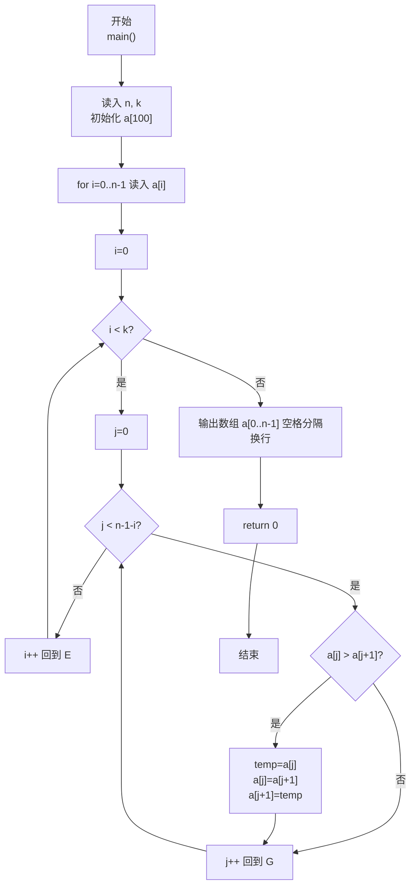
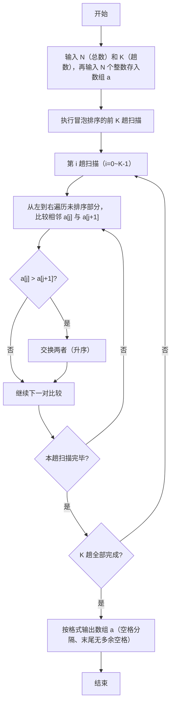

> **摘要**：本文是 PTA 编程题"7-27 冒泡法排序"的题解，涵盖题目描述、输入输出格式及 C 语言实现，展示冒泡排序算法进行 K 趟扫描（每趟将一个最大元素"冒泡"到末尾）的过程，并输出执行完第 K 趟扫描后的中间数组结果。

## 题目描述
将N个整数按从小到大排序的冒泡排序法是这样工作的：从头到尾比较相邻两个元素，如果前面的元素大于其紧随的后面元素，则交换它们。通过一遍扫描，则最后一个元素必定是最大的元素。然后用同样的方法对前N−1个元素进行第二遍扫描。依此类推，最后只需处理两个元素，就完成了对N个数的排序。

本题要求对任意给定的K（<N），输出扫描完第K遍后的中间结果数列。

### 输入格式：

输入在第1行中给出N和K（1≤K<N≤100），在第2行中给出N个待排序的整数，数字间以空格分隔。

### 输出格式：

在一行中输出冒泡排序法扫描完第K遍后的中间结果数列，数字间以空格分隔，但末尾不得有多余空格。

### 输入样例：

```in
6 2
2 3 5 1 6 4
```

### 输出样例：

```out
2 1 3 4 5 6
```

## 解题思路

这道题的核心是**冒泡排序前 K 趟的局部执行 + 中间结果输出**：不要求排完整个数组，只做冒泡排序中的前 K 轮"相邻比较+交换"；每做完一轮 i（0 ≤ i < K），末尾 i+1 个元素已就位（最大、次大…），因此内层只需比较到 `n-1-i` 位置；最后用首项空格控制输出整个数组。

### 核心问题分析

1. **冒泡排序基本思想**：从前往后两两比较相邻元素，若前者大于后者就交换。一轮下来，最大的元素会被"冒泡"到数组末尾；再对前 n-1 个元素做下一轮。
2. **本题只做 K 趟**：K < N，不要求完全排序。因此外层循环只要跑 K 次，而非 N-1 次。
   - 第 0 趟：对整个数组 [0, n-1) 比较 → 最大的元素沉到下标 n-1
   - 第 1 趟：对 [0, n-2) 比较 → 次大的元素沉到下标 n-2
   - …
   - 第 i 趟：比较下标区间 `[0, n-1-i)`，即 j 从 0 到 `n-2-i`（因为要比较 j 和 j+1，所以 j ≤ n-2-i → j < n-1-i）
3. **样例推导（6 2 / 2 3 5 1 6 4）**：
   - 初始：`[2,3,5,1,6,4]`
   - 第 1 趟（i=0）：比较 j=0..4 → 交换 5↔1、6↔4 → 得到 `[2,3,1,5,4,6]`，末尾 6 就位
   - 第 2 趟（i=1）：比较 j=0..3 → 交换 3↔1、5↔4 → 得到 `[2,1,3,4,5,6]`，末尾 5、6 就位
   - 输出：`2 1 3 4 5 6` ✓

### 算法原理说明

外层 `for (i=0; i<k; i++)` 共 K 趟，每趟：
- 内层 `for (j=0; j<n-1-i; j++)` 从头比较到未就位部分的倒数第二个元素
  - 若 `a[j] > a[j+1]` → 通过临时变量交换两者
- 一趟结束后，下标 `n-1-i` 处为当前未排序部分最大值

### 具体计算步骤

1. 读 N、K；读 N 个数存入数组 `a[0..N-1]`
2. 外层 i 从 0 到 K-1（共 K 趟）：
   - 内层 j 从 0 到 (N-2-i)：
     - 若 `a[j] > a[j+1]` → 交换 `a[j]` 与 `a[j+1]`
3. 输出数组 a[0..N-1]，格式：相邻数字间一个空格，末尾无多余空格
4. return 0

## 代码部分实现
```c
#include <stdio.h>  // 引入标准输入输出头文件，提供 scanf、printf

int main() {
    int n, k;       // n：待排序整数总数；k：需要输出的冒泡排序趟数（k<n）
    scanf("%d %d", &n, &k);  // 第 1 行读入 n 和 k
    int a[100];     // 数组 a 存储 n 个待排序整数（n≤100 因此开 100 够用）
    
    // 第 2 行读入 n 个待排序整数，依次存入数组
    for (int i = 0; i < n; i++) {
        scanf("%d", &a[i]);
    }
    
    // 冒泡排序：只进行前 k 趟扫描（题目要求输出第 k 趟后的中间结果）
    for (int i = 0; i < k; i++) {
        // 第 i 趟扫描：把未排序部分中最大的元素"冒泡"到末尾位置 n-1-i
        // 内层 j 只需比较到 未排序部分倒数第二个（因为 j 和 j+1 要比较）
        for (int j = 0; j < n - 1 - i; j++) {
            if (a[j] > a[j + 1]) {  // 若前一个元素大于后一个，则交换（升序）
                int temp = a[j];     // 借助临时变量 temp 完成两数交换
                a[j] = a[j + 1];
                a[j + 1] = temp;
            }
        }
    }
    
    // 输出经过 k 趟冒泡后的数组，数字间以空格分隔、末尾无多余空格
    for (int i = 0; i < n; i++) {
        if (i > 0) printf(" ");  // 除第 0 个元素外，其余元素前先输出一个空格
        printf("%d", a[i]);      // 输出当前元素
    }
    printf("\n"); // 全部输出完毕，换行
    
    return 0;  // 程序正常退出，返回 0
}
```

## 代码流程说明

### 1. 变量声明与输入
- `int n, k`：总数 n 与扫描趟数 k
- `int a[100]`：存储待排序数组（n ≤ 100）
- 第 1 行：`scanf("%d %d", &n, &k)`
- 第 2 行：`for (i=0; i<n; i++) scanf("%d", &a[i])` 依次读入

### 2. K 趟冒泡排序
- 外层循环 `i ∈ [0, k)`：第 i 趟扫描
  - 内层循环 `j ∈ [0, n-1-i)`：两两比较相邻位置
    - 若 `a[j] > a[j+1]` → 用 `temp` 交换 `a[j]` 和 `a[j+1]`
  - 每趟结束：下标 `n-1-i` 处就位该部分最大值

### 3. 输出中间结果数组
- `for (i=0; i<n; i++)` 从头到尾输出
  - `i > 0` 时先打印空格（首项不前置空格，保证行末无多余空格）
  - `printf("%d", a[i])`
- 循环结束后 `printf("\n")` 换行

### 4. 返回
- `return 0`

## 代码流程图



## 解题流程图


