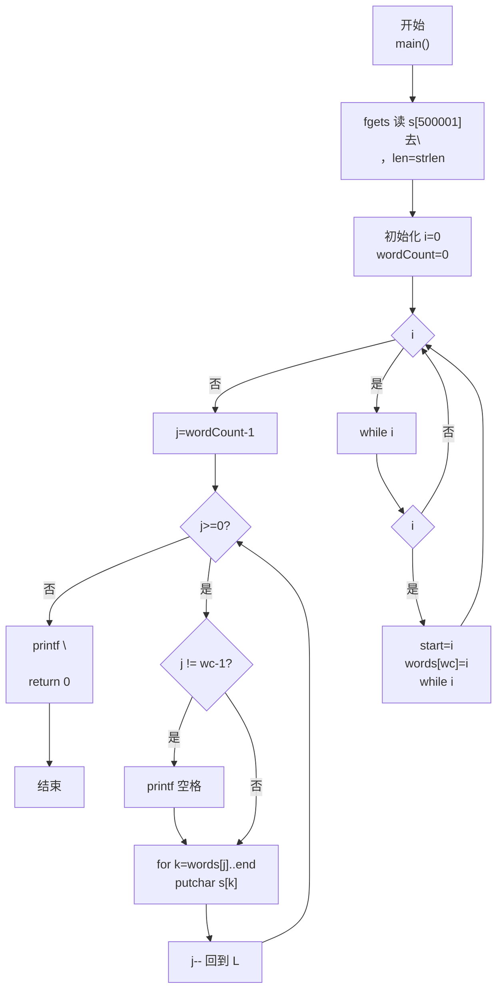
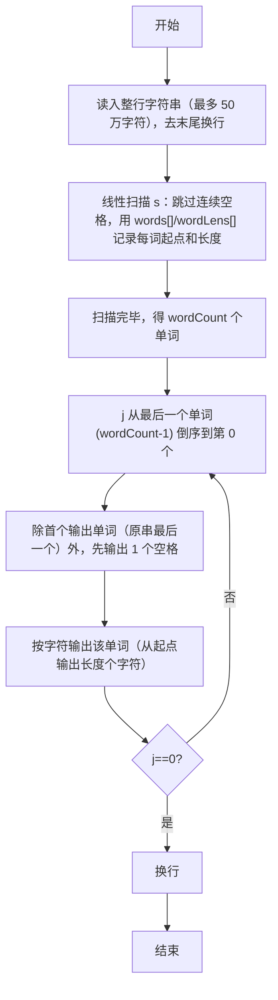

> **摘要**：本文是 PTA 编程题"7-32 说反话-加强版"的题解，涵盖题目描述、输入输出格式及 C 语言实现，展示大数据规模（50 万字符）下一次线性扫描用两个数组 `words[]`/`wordLens[]` 记录每个单词的起始位置与长度，再从最后一个单词开始倒序逐个 `putchar` 输出字符，单词间只输出一个空格的高效实现。

## 题目描述
给定一句英语，要求你编写程序，将句中所有单词的顺序颠倒输出。

### 输入格式：

测试输入包含一个测试用例，在一行内给出总长度不超过500 000的字符串。字符串由若干单词和若干空格组成，其中单词是由英文字母（大小写有区分）组成的字符串，单词之间用若干个空格分开。

### 输出格式：

每个测试用例的输出占一行，输出倒序后的句子，并且保证单词间只有1个空格。

### 输入样例：

```in
Hello World   Here I Come
```

### 输出样例：

```out
Come I Here World Hello
```

## 解题思路

这道题的核心是**一次线性扫描分词 + 反向遍历输出单词**。由于字符串可能非常长（50 万字符），不能用重复字符串拷贝等 O(n²) 做法；更有效方式：使用两个大数组 `words[500000]`（存每个单词的起始下标）和 `wordLens[500000]`（存每个单词的长度），在一次扫描中同时跳过连续空格并记录每个单词的起点与长度；然后 `j` 从 `wordCount-1` 到 0 倒序，用内部循环 `k` 按字符 `putchar` 输出单词本身，单词间插一个空格即可。

### 核心问题分析

1. **输入规模**：字符串最多 500 000 字符。算法必须是 O(n) 线性。C 语言中 `char s[500001]` 作为局部变量可能栈不够，实际上本代码声明在函数内部通常能通过（PTA 环境一般允许），也可以用静态数组或全局数组（放在栈外）。
2. **跳过连续空格与分词**：
   - 用 `i` 做下标遍历字符串
   - `while (i<len && s[i]==' ') i++;` 跳过所有空格
   - 若此时仍 `i<len` → 表示到达了一个单词的起点：记录 `words[wordCount]=i; start=i`
   - `while (i<len && s[i]!=' ') i++;` 走到单词末尾空格（或串尾）
   - 单词长度 = `i - start` → 存入 `wordLens[wordCount]`，`wordCount++`
3. **倒序输出格式（单词间 1 空格）**：
   - 第 1 个被输出的单词（即原串最后一个单词）前不加空格
   - 之后每输出一个单词前，先输出 1 个空格
   - 判断方法：`if (j != wordCount-1) printf(" ")`（j=wordCount-1 是第一个输出的单词，不加空格）
   - 这样自然不会有行首/行末多余空格
4. **按字符输出而不是 printf("%.*s")**：用 `for (k = words[j]; k < words[j]+wordLens[j]; k++) printf("%c", s[k])`（或者更快的 `putchar(s[k])`）逐字符输出，避免格式字符串开销。这样不会在输出单词时受结束符影响，因为只输出长度以内的字符。

### 算法原理说明

1. 读取行字符串 s（fgets），去换行，得 len
2. 线性扫描分词：
   - 循环 while i < len:
     - 跳过空格
     - 若没到末尾，记录 (起点, 长度) 到 words / wordLens 数组，wordCount++
     - 跳到单词尾
3. 倒序输出 j=wordCount-1 到 0：
   - 非首个输出项前 `printf(" ")`
   - 从 words[j] 开始逐字符输出 wordLens[j] 个字符
4. 换行

### 具体计算步骤

以样例 `"Hello World   Here I Come"` 为例：
1. 扫描得到 wordCount=5：
   - words[0]=0, wordLens[0]=5 (Hello)
   - words[1]=6, wordLens[1]=5 (World)
   - words[2]=14, wordLens[2]=4 (Here)
   - words[3]=19, wordLens[3]=1 (I)
   - words[4]=21, wordLens[4]=4 (Come)
2. 倒序输出 j=4,3,2,1,0：
   - j=4 Come → "Come"
   - j=3 I → 先空格再 I → "Come I"
   - j=2 Here → 先空格再 Here → "Come I Here"
   - j=1 World → 先空格再 World → "Come I Here World"
   - j=0 Hello → 先空格再 Hello → "Come I Here World Hello"
3. 输出换行 ✓

## 代码部分实现
```c
#include <stdio.h>       // 引入标准输入输出头文件，提供 fgets、printf、putchar
#include <string.h>      // 引入字符串处理头文件，提供 strlen

int main() {
    char s[500001];     // 输入字符串：最多 500000 字符 + 结束符 '\0'
    fgets(s, 500001, stdin);  // 从标准输入读取一整行（包含空格）
    int len = strlen(s);      // 获取字符串实际长度（含 fgets 读入的换行）
    if (s[len - 1] == '\n') { s[len - 1] = '\0'; len--; }  // 去掉末尾换行符

    int words[500000];       // words[k]：第 k 个单词在原串中的起始下标
    int wordLens[500000];    // wordLens[k]：第 k 个单词的字符长度
    int wordCount = 0;       // 单词总数计数器，初始化为 0

    int i = 0;               // 遍历字符串的当前下标
    while (i < len) {        // 从头到尾扫描一遍字符串（线性 O(len)）
        while (i < len && s[i] == ' ') i++;  // 跳过连续空格
        if (i < len) {       // 仍在串内说明遇到了一个单词的开头
            words[wordCount] = i;           // 保存该单词起始下标
            int start = i;                  // 记住起点以便算长度
            while (i < len && s[i] != ' ') i++;  // 继续走直到空格/串尾（单词末尾）
            wordLens[wordCount] = i - start;     // 单词长度 = 末尾下标 - 起点下标
            wordCount++;                         // 单词计数 +1
        }
    }

    // 从最后一个单词开始倒序输出，单词之间仅 1 个空格
    for (int j = wordCount - 1; j >= 0; j--) {
        // j==wordCount-1 是第一个被输出的单词（最右端），前面不加空格
        if (j != wordCount - 1) printf(" ");
        // 按字符输出当前单词：从起点开始输出长度个字符
        for (int k = words[j]; k < words[j] + wordLens[j]; k++) {
            putchar(s[k]);  // 逐个字符输出（比 printf 格式更高效）
        }
    }
    printf("\n");          // 所有单词输出完毕，换行结束

    return 0;              // 程序正常结束
}
```

## 代码流程说明

### 1. 读入字符串并清理
- `char s[500001]` 最多存 50 万字符
- `fgets` 读整行 → 去末尾换行 → 求 len

### 2. 一次线性扫描分词（O(len)）
- `int i=0; while (i<len)`：
  - 跳过空格段 → i 走到非空格（或 len）
  - 若 `i<len`：起点 `start=i`；再走到空格（或 len）；长度 = i-start；写入 `words[wordCount]` 与 `wordLens[wordCount]`，`wordCount++`
- 扫描结束得到 `wordCount` 个 (起点,长度) 信息

### 3. 倒序输出
- `for (j = wordCount-1; j >= 0; j--)`：
  - 若不是第一个被输出的单词（`j != wordCount-1`）→ 先打印空格
  - `for (k=words[j]; k<words[j]+wordLens[j]; k++) putchar(s[k])` 输出该单词
- `printf("\n")` 换行

### 4. 返回
- `return 0`

## 代码流程图



## 解题流程图


