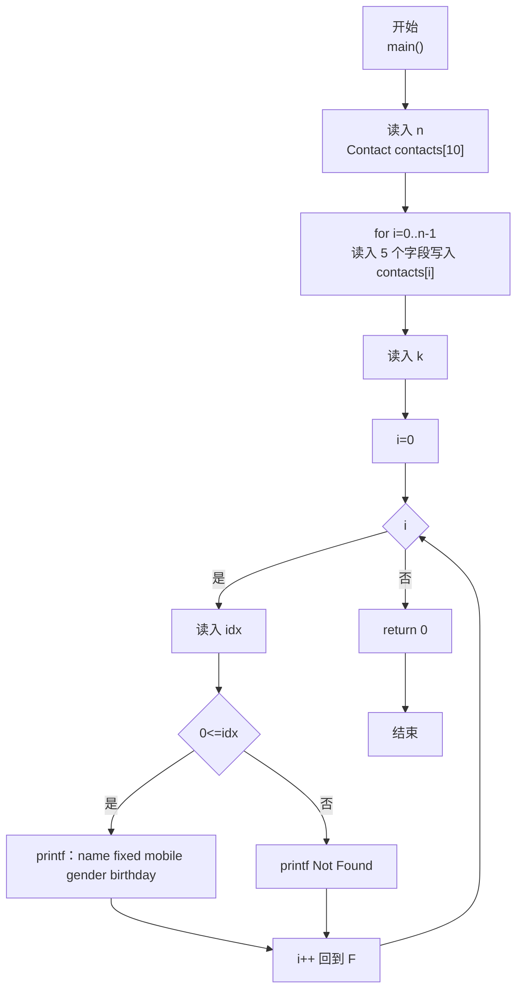
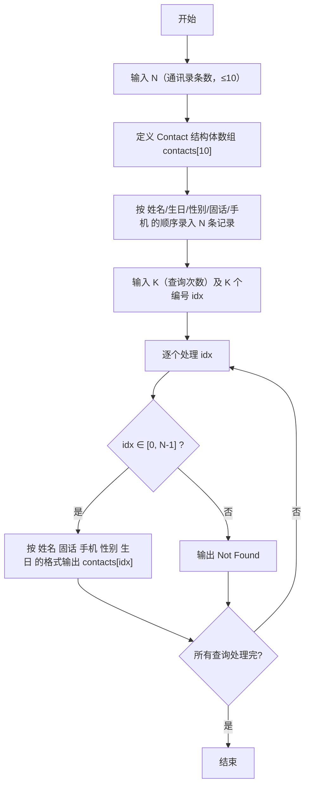

> **摘要**：本文是 PTA 编程题"7-34 通讯录的录入与显示"的题解，涵盖题目描述、输入输出格式及 C 语言实现，展示使用 `struct Contact` 结构体（name、birthday、gender、fixedPhone、mobilePhone）数组一次性录入 N 条通讯录记录，再依次处理 K 次查询，对编号 0~N-1 内按"姓名 固话 手机 性别 生日"格式输出，否则输出 `Not Found`。

## 题目描述
通讯录中的一条记录包含下述基本信息：朋友的姓名、出生日期、性别、固定电话号码、移动电话号码。
本题要求编写程序，录入N条记录，并且根据要求显示任意某条记录。

### 输入格式：

输入在第一行给出正整数N（≤10）；随后N行，每行按照格式姓名 生日 性别 固话 手机给出一条记录。其中姓名是不超过10个字符、不包含空格的非空字符串；生日按yyyy/mm/dd的格式给出年月日；性别用M表示"男"、F表示"女"；固话和手机均为不超过15位的连续数字，前面有可能出现+。

在通讯录记录输入完成后，最后一行给出正整数K，并且随后给出K个整数，表示要查询的记录编号（从0到N−1顺序编号）。数字间以空格分隔。

### 输出格式：

对每一条要查询的记录编号，在一行中按照姓名 固话 手机 性别 生日的格式输出该记录。若要查询的记录不存在，则输出Not Found。

### 输入样例：

```in
3
Chris 1984/03/10 F +86181779452 13707010007
LaoLao 1967/11/30 F 057187951100 +8618618623333
QiaoLin 1980/01/01 M 84172333 10086
2 1 7
```

### 输出样例：

```out
LaoLao 057187951100 +8618618623333 F 1967/11/30
Not Found
```

## 解题思路

这道题的核心是**使用 C 语言 struct 结构体定义"通讯录记录"数据类型 + 数组存 N 条记录 + 顺序查询编号并判断越界**。结构体内存 5 个字段（姓名、生日、性别、固话、手机），其中性别是单个字符用 `char gender`，其余是字符串用 `char[]` 足够长度存储；输入每条记录时用一个 `scanf("%s %s %c %s %s", ...)` 按顺序读入 5 项（除性别 `&c` 取地址外，其余数组名退化为指针无需 `&`）；查询阶段读 K 个编号 idx，若 idx 在 [0, N-1] 内按"姓名 固话 手机 性别 生日"输出，否则 `Not Found`。

### 核心问题分析

1. **结构体定义**：
   ```c
   typedef struct {
       char name[11];         // 姓名 ≤10 字符 + '\0'
       char birthday[11];     // yyyy/mm/dd 共 10 字符 + '\0'
       char gender;           // 性别 单字符 M/F
       char fixedPhone[16];   // 固话 ≤15 字符(可能含+) + '\0'
       char mobilePhone[16];  // 手机 ≤15 字符(可能含+) + '\0'
   } Contact;
   ```
2. **录入 N 条记录**：N ≤ 10，`Contact contacts[10];` 即可。for 循环 N 次，每次 `scanf("%s %s %c %s %s", name, birthday, &gender, fixed, mobile)`。`%c` 前有个空格可以过滤掉空白（不过上一个 `%s` 已跳过空白，所以通常没问题）。
3. **查询 K 次**：先读 K，再 for 循环 K 次读入一个整数 idx：
   - 若 `idx >= 0 && idx < N` → 合法，输出：
     `printf("%s %s %s %c %s\n", name, fixedPhone, mobilePhone, gender, birthday)`
     注意输出字段顺序和输入顺序不同：**姓名 固话 手机 性别 生日**
   - 否则 → `printf("Not Found\n")`
4. **样例对照**：
   - N=3，三条：
     - 0: Chris…；1: LaoLao…；2: QiaoLin…
   - K=2 个查询：1 和 7
     - idx=1 → 合法，输出 LaoLao 固话 手机 性别 生日 ✓（样例第一行输出）
     - idx=7 → 超出 [0,2] → Not Found ✓

### 算法原理说明

1. 读 N
2. for i=0..N-1：
   - scanf 读 5 个字段 → 写入 contacts[i]
3. 读 K：
   - for i=0..K-1：
     - scanf("%d", &idx)
     - 若 0 ≤ idx < N → 按顺序打印 5 字段（注意输出顺序不同于输入）
     - 否则 → Not Found
4. return 0

### 具体计算步骤

1. 输入 N=3
2. 录入 3 条记录到 contacts[0..2]
3. 输入 K=2，再依次读 idx=1 与 idx=7
   - idx=1 ∈ [0,3)：输出 contacts[1] 的"姓名 固话 手机 性别 生日"
   - idx=7 ∉ [0,3)：输出 Not Found
4. 结束

## 代码部分实现
```c
#include <stdio.h>
#include <string.h>

// 定义"通讯录记录"结构体：姓名、生日、性别(M/F)、固话、手机
typedef struct {
    char name[11];         // 姓名：不超过 10 字符 + 结束符 '\0'
    char birthday[11];     // 生日：yyyy/mm/dd 形式共 10 字符 + 结束符
    char gender;           // 性别：单个字符 M 或 F
    char fixedPhone[16];   // 固话：不超过 15 字符(可能含 +) + 结束符
    char mobilePhone[16];  // 手机：不超过 15 字符(可能含 +) + 结束符
} Contact;

int main() {
    int n;                    // n：通讯录记录总数（≤10）
    scanf("%d", &n);          // 第 1 行读入 n
    
    Contact contacts[10];     // 结构体数组：最多 10 条通讯录记录
    // 逐行录入 n 条通讯录记录
    for (int i = 0; i < n; i++) {
        // 按"姓名 生日 性别 固话 手机"的顺序一次读入 5 项
        scanf("%s %s %c %s %s", 
              contacts[i].name,           // 姓名字符串
              contacts[i].birthday,       // 生日字符串(含 /)
              &contacts[i].gender,         // 单个字符（需取地址）
              contacts[i].fixedPhone,     // 固话字符串
              contacts[i].mobilePhone);   // 手机字符串
    }
    
    int k;                    // k：查询次数
    scanf("%d", &k);          // 读入查询次数 k
    // 依次处理 k 个查询编号
    for (int i = 0; i < k; i++) {
        int idx;
        scanf("%d", &idx);    // 读入要查询的记录编号（0 ~ n-1）
        if (idx >= 0 && idx < n) {  // 编号在合法范围内
            // 按"姓名 固话 手机 性别 生日"的输出顺序格式化打印
            printf("%s %s %s %c %s\n", 
                   contacts[idx].name, 
                   contacts[idx].fixedPhone, 
                   contacts[idx].mobilePhone, 
                   contacts[idx].gender, 
                   contacts[idx].birthday);
        } else {                // 编号越界或负，记录不存在
            printf("Not Found\n");
        }
    }
    
    return 0;
}
```

## 代码流程说明

### 1. 结构体 Contact 定义
- 5 个字段：name[11], birthday[11], gender（char）, fixedPhone[16], mobilePhone[16]

### 2. 输入 N 条记录
- `int n; scanf("%d", &n);`
- `Contact contacts[10];`
- for i=0..n-1：
  - `scanf("%s %s %c %s %s", ...)` 依次写 5 个字段

### 3. 查询处理 K 次
- `int k; scanf("%d", &k);`
- for i=0..k-1：
  - 读 idx
  - 合法 → 输出顺序：`姓名 固话 手机 性别 生日`（与输入顺序不同）
  - 不合法 → `Not Found`

### 4. 返回
- `return 0`

## 代码流程图



## 解题流程图


