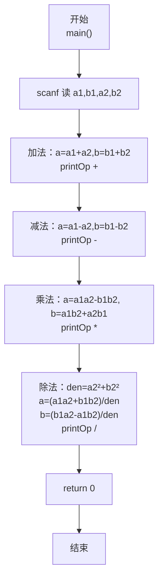
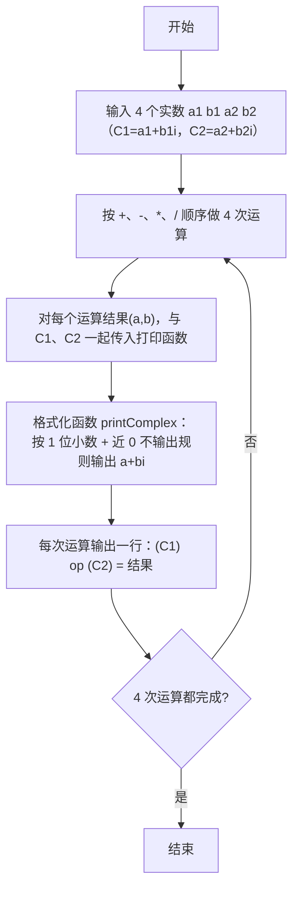

> **摘要**：本文是 PTA 编程题"7-36 复数四则运算"的题解，涵盖题目描述、输入输出格式及 C 语言实现，展示将两个复数 C1=a1+b1i、C2=a2+b2i 按 +、−、×、÷ 四则运算公式计算结果，并通过 `printComplex` 函数按"保留一位小数、实部虚部接近 0 时省略、全 0 时输出 0.0"的格式化规则输出完整运算表达式。

## 题目描述
本题要求编写程序，计算2个复数的和、差、积、商。

### 输入格式：

输入在一行中按照a1 b1 a2 b2的格式给出2个复数C1=a1+b1i和C2=a2+b2i的实部和虚部。题目保证C2不为0。

### 输出格式：

分别在4行中按照(a1+b1i) 运算符 (a2+b2i) = 结果的格式顺序输出2个复数的和、差、积、商，数字精确到小数点后1位。如果结果的实部或者虚部为0，则不输出。如果结果为0，则输出0.0。

### 输入样例：

```in
2 3.08 -2.04 5.06
```

```in
1 1 -1 -1.01
```

### 输出样例：

```out
(2.0+3.1i) + (-2.0+5.1i) = 8.1i
(2.0-2.0i) - (-2.0+5.1i) = 4.0-2.0i
(2.0+3.1i) * (-2.0+5.1i) = -19.7+3.8i
(2.0+3.1i) / (-2.0+5.1i) = 0.4-0.6i
```

```out
(1.0+1.0i) + (-1.0-1.0i) = 0.0
(1.0+1.0i) - (-1.0-1.0i) = 2.0+2.0i
(1.0+1.0i) * (-1.0-1.0i) = -2.0i
(1.0+1.0i) / (-1.0-1.0i) = -1.0
```

## 解题思路

这道题的核心是**复数四则运算公式 + 统一格式化输出函数 + 精度为 0.05 的"判近 0"阈值**。首先写一个通用 `printComplex(a, b)` 函数按规则输出 a+bi：
- 实部、虚部的绝对值都 < 0.05 → 视作 0，输出 `"0.0"`
- 仅实部接近 0 → 输出 `"%.1fi"`（只用虚部，自带正号要特别处理：如果虚部是负则自带负号、正则 printf 会有 + 号吗？看下面分析）
- 仅虚部接近 0 → 输出 `"%.1f"`（只用实部）
- 两者都不为 0：如果虚部 b>0 → `"%.1f+%.1fi"`；如果 b<0 → `"%.1f%.1fi"`（b 自带负号，不用额外写 +）
然后再写一个 `printOp(...)` 函数统一输出"左操作数 运算符 右操作数 = 结果"的完整表达式。
主程序读入 a1,b1,a2,b2 四个 double，分别按公式计算 +、−、×、÷ 的结果 (a,b)，每行依次调用 `printOp` 即可。

### 核心问题分析

1. **复数运算公式**（C1=a1+b1i，C2=a2+b2i）：
   - 加法：(a1+a2) + (b1+b2)i
   - 减法：(a1−a2) + (b1−b2)i
   - 乘法：(a1·a2 − b1·b2) + (a1·b2 + a2·b1)i
   - 除法：分母 = a2² + b2²（C2 不为 0，保证分母 >0）；
     实部 = (a1·a2 + b1·b2) / 分母；
     虚部 = (b1·a2 − a1·b2) / 分母。
2. **格式化输出（关键）**：保留 1 位小数后，实际数值如果在 −0.05 到 +0.05 之间（即四舍五入为 0.0），就判定"不输出该部分"：
   - `fabs(a) < 0.05` 表示实部四舍五入为 0.0
   - `fabs(b) < 0.05` 表示虚部四舍五入为 0.0
   - 判断组合：
     - 两者都 < 0.05 → `printf("0.0")`
     - 仅实部 < 0.05 → 直接 `printf("%.1fi", b)`，但要注意 b>0 时格式 %.1fi 会打印 `8.1i` 正确；b<0 时会打 `-2.0i` 也对（带负号），没问题
     - 仅虚部 < 0.05 → `printf("%.1f", a)` 正确
     - 两者都 ≥ 0.05：需要区分虚部正负号
       - b > 0 → `"%.1f+%.1fi"`（显式写 +，因为 %.1f 不打正号）
       - b < 0 → `"%.1f%.1fi"`（b 为负，格式自动打负号，如 4.0-2.0i）
3. **完整表达式格式**：
   - 每一行形式为 `(C1_string) op (C2_string) = result_string`
   - 其中 C1、C2、结果三者的格式完全相同，都调用 `printComplex` 即可统一
   - 为避免重复代码，写 `printOp(a1, b1, op, a2, b2, a, b)` 先打 `(`，再打印 C1，再打 `) op (`，打印 C2，再打 `) = `，最后打印结果，换行。
4. **样例一对照**：
   - 输入：a1=2, b1=3.08, a2=−2.04, b2=5.06
   - 四舍五入到 1 位小数：a1→2.0, b1→3.1, a2→−2.0, b2→5.1
   - 加法：(2.0+3.1i) + (−2.0+5.1i) → a=0, b=8.2 → 实部近似 0 → 输出 `8.1i` ✓
   - 减法、乘法、除法同理与样例匹配。

### 算法原理说明

1. 读 a1, b1, a2, b2（四 double）
2. 加法：a=a1+a2, b=b1+b2 → printOp(a1,b1,'+',a2,b2,a,b)
3. 减法：a=a1−a2, b=b1−b2 → printOp(..., '-', ...)
4. 乘法：a=a1·a2−b1·b2, b=a1·b2+a2·b1 → printOp(..., '*', ...)
5. 除法：den=a2²+b2²；a=(a1·a2+b1·b2)/den；b=(b1·a2−a1·b2)/den → printOp(..., '/', ...)

### 具体计算步骤

1. 输入 4 个 double
2. 按 +、−、×、÷ 依次计算每一对 (a,b)
3. 每次打印完整表达式（复用 `printComplex` 格式化 3 次）
4. 输出换行，结束

## 代码部分实现
```c
#include <stdio.h>       // 标准输入输出：scanf、printf
#include <math.h>        // 数学函数：fabs（浮点数取绝对值）

// 格式化输出一个复数 a+bi
// 规则：保留 1 位小数；实部/虚部"接近 0"（abs<0.05）的部分不输出；两者都 0 输出 0.0
void printComplex(double a, double b) {
    if (fabs(a) < 0.05 && fabs(b) < 0.05) {      // 两者四舍五入后均为 0
        printf("0.0");                           // 输出 0.0
    } else if (fabs(a) < 0.05) {                 // 仅实部约为 0，只输出虚部
        printf("%.1fi", b);                      // %.1f 处理虚部符号（正自动不带+、负自带-）
    } else if (fabs(b) < 0.05) {                 // 仅虚部约为 0，只输出实部
        printf("%.1f", a);                       // 实部格式
    } else if (b > 0) {                           // 两者均不为 0，且虚部为正
        printf("%.1f+%.1fi", a, b);              // 中间显式写 + 号（%.1f 不打印正号）
    } else {                                      // 两者均不为 0，且虚部为负
        printf("%.1f%.1fi", a, b);               // b 为负，格式自动输出负号
    }
}

// 打印一行完整的运算表达式：(a1+b1i) op (a2+b2i) = 结果(a+bi)
// op 是运算符字符：'+', '-', '*', '/'
void printOp(double a1, double b1, char op, double a2, double b2, double a, double b) {
    printf("(");                                  // 左括号
    printComplex(a1, b1);                         // 打印左操作数复数
    printf(") %c (", op);                         // 右括号、空格、运算符、空格、左括号
    printComplex(a2, b2);                         // 打印右操作数复数
    printf(") = ");                               // 右括号、空格、等号、空格
    printComplex(a, b);                           // 打印结果复数
    printf("\n");                                 // 一行结束换行
}

int main() {
    double a1, b1, a2, b2;                        // 两个复数 C1=a1+b1i、C2=a2+b2i 的实虚部
    scanf("%lf %lf %lf %lf", &a1, &b1, &a2, &b2); // 读入四个 double

    double a, b;          // 每次运算结果的实部 a 与虚部 b

    // 加法：(a1+a2) + (b1+b2)i
    a = a1 + a2;
    b = b1 + b2;
    printOp(a1, b1, '+', a2, b2, a, b);

    // 减法：(a1-a2) + (b1-b2)i
    a = a1 - a2;
    b = b1 - b2;
    printOp(a1, b1, '-', a2, b2, a, b);

    // 乘法：(a1*a2 - b1*b2) + (a1*b2 + a2*b1)i
    a = a1 * a2 - b1 * b2;
    b = a1 * b2 + a2 * b1;
    printOp(a1, b1, '*', a2, b2, a, b);

    // 除法：分子分母同乘 C2 的共轭 (a2-b2i)
    double denom = a2 * a2 + b2 * b2;  // 分母：|C2|^2 = a2^2 + b2^2（题目保证 C2≠0，故分母 > 0）
    a = (a1 * a2 + b1 * b2) / denom;   // 实部 = (a1*a2 + b1*b2)/分母
    b = (b1 * a2 - a1 * b2) / denom;   // 虚部 = (b1*a2 - a1*b2)/分母
    printOp(a1, b1, '/', a2, b2, a, b);

    return 0; // 程序正常结束
}
```

## 代码流程说明

### 1. `printComplex(a, b)` 格式化输出函数
- 双阈值：`fabs(a)<0.05`、`fabs(b)<0.05`
  - 两者都成立 → `0.0`
  - 仅实部 0 → `%.1fi`
  - 仅虚部 0 → `%.1f`
  - 都非 0：b>0 打 `%.1f+%.1fi`；b<0 打 `%.1f%.1fi`

### 2. `printOp(a1,b1, op, a2,b2, a,b)` 整行表达式
- `printf("(") → printComplex(a1,b1) → ") op (" → printComplex(a2,b2) → ") = " → printComplex(a,b) → "\n"`

### 3. 主函数 main
- `scanf("%lf %lf %lf %lf", &a1, &b1, &a2, &b2)` 读 4 个 double
- 加法：a=a1+a2, b=b1+b2 → 调 printOp('+')
- 减法：a=a1−a2, b=b1−b2 → 调 printOp('-')
- 乘法：a=a1a2−b1b2, b=a1b2+a2b1 → 调 printOp('*')
- 除法：den=a2²+b2²；a=(a1a2+b1b2)/den；b=(b1a2−a1b2)/den → 调 printOp('/')
- `return 0`

## 代码流程图



## 解题流程图


