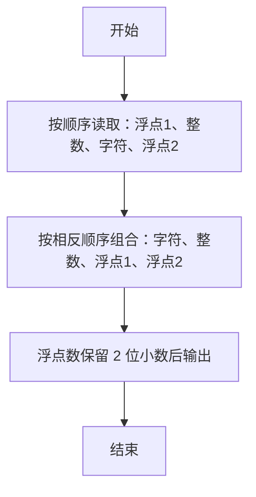

> **摘要**：本文是 PTA 编程题“7-6 混合类型数据格式化输入”的题解，涵盖题目描述、输入输出格式及 C 语言实现，展示按格式读取不同类型数据、再按指定顺序与小数位输出的方法。

## 题目描述
本题要求编写程序，顺序读入浮点数1、整数、字符、浮点数2，再按照字符、整数、浮点数1、浮点数2的顺序输出。

### 输入格式：

输入在一行中顺序给出浮点数1、整数、字符、浮点数2，其间以1个空格分隔。

### 输出格式：

在一行中按照字符、整数、浮点数1、浮点数2的顺序输出，其中浮点数保留小数点后2位。

### 输入样例：

```in
2.12 88 c 4.7
```

### 输出样例：

```out
c 88 2.12 4.70
```

## 解题思路

这道题的核心是**scanf 多类型混合读取 + printf 按指定顺序与精度格式化输出**。

### 核心问题分析

1. **类型对应**：输入 4 个数据依次是 double、int、char、double → 对应 %lf、%d、%c、%lf。
2. **scanf 对 %c 的陷阱**：空格会被当作普通字符。但本题输入格式里"其间以 1 个空格分隔"，且 %c 前面的 %d 解析后，格式串里的空格会匹配输入中的空格——正确写法是 `%lf %d %c %lf`，其中 ` %c` 前面有空格显式跳过空白字符（题目输入保证只有一个空格，因此可以正确工作）。
3. **输出精度**：两个浮点数都用 %.2f 强制保留两位小数（如 4.7 → 4.70）。

### 算法原理说明

顺序读入 → 换序输出：
- 读：%lf %d %c %lf → num1, integer, ch, num2
- 打：%c %d %.2f %.2f → 顺序为 ch、integer、num1、num2

### 具体计算步骤

1. 声明变量：double num1, num2; int integer; char ch;
2. scanf("%lf %d %c %lf", &num1, &integer, &ch, &num2)
3. printf("%c %d %.2f %.2f\n", ch, integer, num1, num2)

## 代码部分实现
```c
#include <stdio.h>  // 引入标准输入输出头文件

int main(void)  // 主函数
{
    double num1, num2;  // 定义两个双精度浮点型变量
    int integer;  // 定义整型变量
    char ch;  // 定义字符型变量
    
    scanf("%lf %d %c %lf", &num1, &integer, &ch, &num2);  // 按顺序读入浮点数1、整数、字符、浮点数2
    printf("%c %d %.2f %.2f\n", ch, integer, num1, num2);  // 按字符、整数、浮点数1、浮点数2的顺序输出
    
    return 0;  // 返回0表示程序正常结束
}
```

## 代码流程说明

### 1. 变量声明
- double num1, num2：存两个浮点数
- int integer：存整数
- char ch：存字符

### 2. 读取输入
- scanf("%lf %d %c %lf", ...)：按 double→int→char→double 的顺序读取；格式串里的空格正好对应输入的分隔空格。

### 3. 输出（换序 + 精度）
- 顺序改为 ch、integer、num1、num2
- 浮点数格式 %.2f → 保留两位小数（不足补零）

## 代码流程图

```mermaid
flowchart TD
  A["开始\nmain()"] --> B["声明 num1, num2, integer, ch"]
  B --> C["scanf(\"%lf %d %c %lf\")"]
  C --> D["printf(\"%c %d %.2f %.2f\", ch, integer, num1, num2)"]
  D --> E["return 0"]
  E --> F["结束"]
```

## 解题流程图


