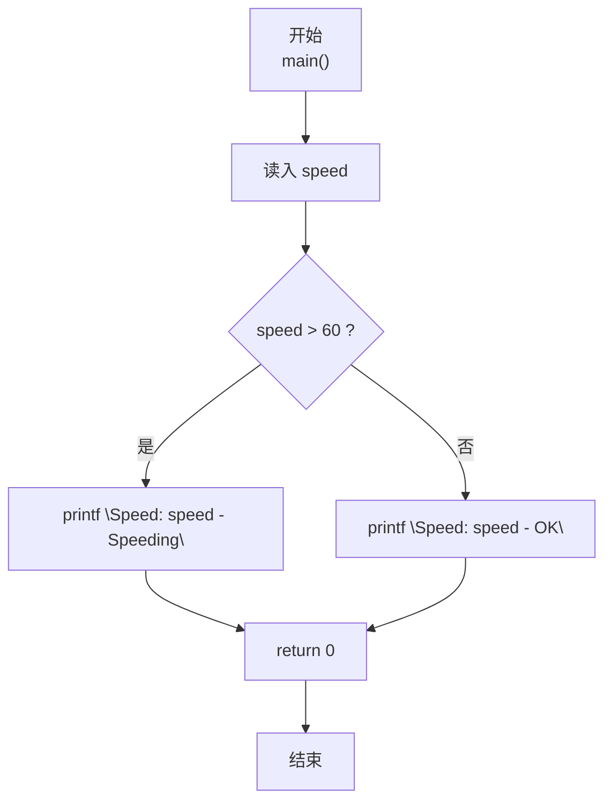
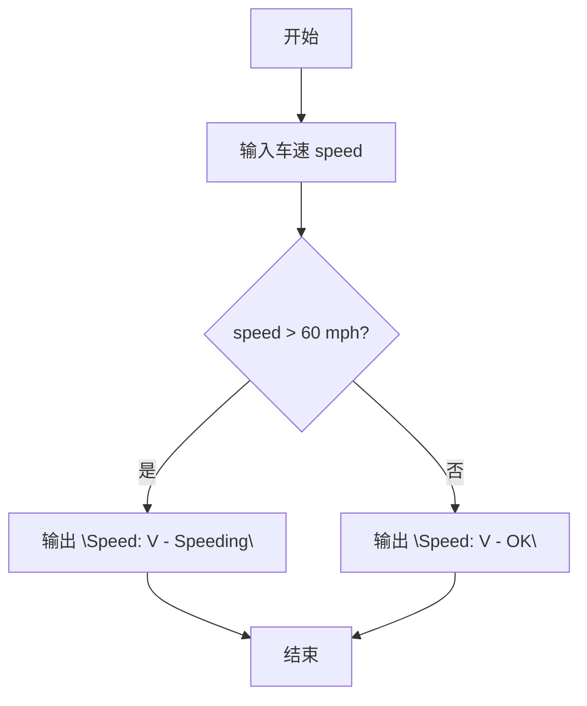

> **摘要**：本文是 PTA 编程题“7-8 超速判断”的题解，涵盖题目描述、输入输出格式及 C 语言实现，展示用简单 if-else 分支判断车速是否超过 60 mph 并按指定格式输出。

## 题目描述
模拟交通警察的雷达测速仪。输入汽车速度，如果速度超出60 mph，则显示“Speeding”，否则显示“OK”。

### 输入格式：

输入在一行中给出1个不超过500的非负整数，即雷达测到的车速。

### 输出格式：

在一行中输出测速仪显示结果，格式为：Speed: V - S，其中V是车速，S或者是Speeding、或者是OK。

### 输入样例：

```in
40
```

```in
75
```

### 输出样例：

```out
Speed: 40 - OK
```

```out
Speed: 75 - Speeding
```

## 解题思路

这道题的核心是**单条件分支**：速度是否大于 60 mph。

### 核心问题分析

1. **判断条件**：speed > 60 属于超速（60 本身合法）。
2. **输出格式**：固定前缀 `Speed: ` + V + ` - ` + 状态字符串（OK / Speeding）。

### 算法原理说明

直接 if-else：
- if (speed > 60) → "Speed: %d - Speeding"
- else → "Speed: %d - OK"

### 具体计算步骤

1. scanf("%d", &speed)
2. speed > 60 ？
   - 是 → printf Speeding 串
   - 否 → printf OK 串

## 代码部分实现
```c
#include <stdio.h>  // 引入标准输入输出头文件

int main(void)  // 主函数
{
    int speed;  // 定义车速变量
    scanf("%d", &speed);  // 读入车速
    
    if (speed > 60) {  // 如果车速超过60mph
        printf("Speed: %d - Speeding\n", speed);  // 输出超速提示
    } else {  // 车速不超过60mph
        printf("Speed: %d - OK\n", speed);  // 输出正常提示
    }
    
    return 0;  // 返回0表示程序正常结束
}
```

## 代码流程说明

### 1. 变量与输入
- int speed；scanf("%d", &speed) 读取非负整数车速。

### 2. 超速判定分支
- **speed > 60** → 输出 `"Speed: %d - Speeding"`
- **否则**（speed ≤ 60） → 输出 `"Speed: %d - OK"`
- 注意临界值 60 mph 属合法区间。

## 代码流程图



## 解题流程图


