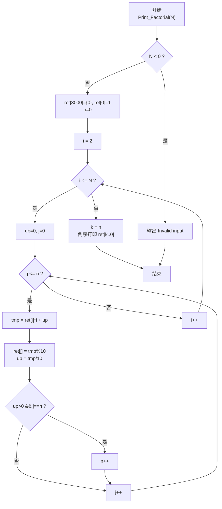
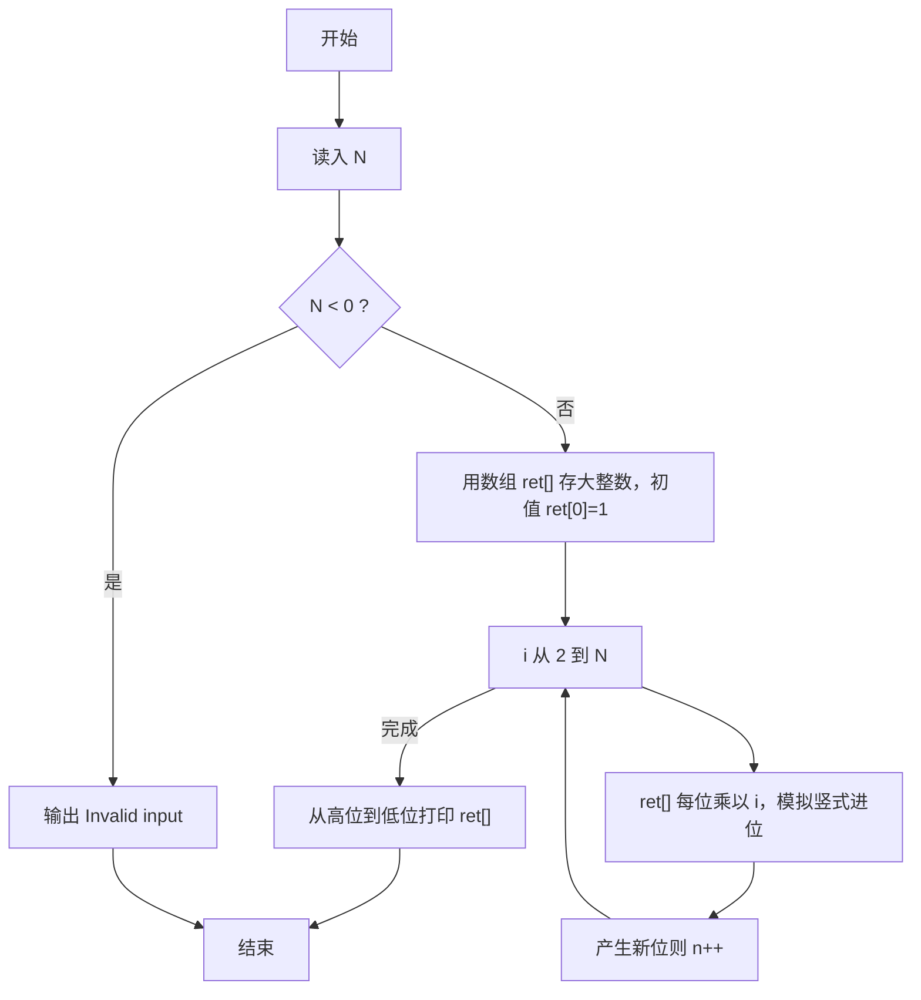

> **摘要**：本文是 PTA 函数题“6-10 阶乘计算升级版”的题解，涵盖题目描述、函数接口定义及 C 语言实现，展示用数组模拟大整数乘法解决 N! 超范围问题的思路。

## 题目描述

本题要求实现一个打印非负整数阶乘的函数。

### 函数接口定义：

```c++
void Print_Factorial ( const int N );
```

其中`N`是用户传入的参数，其值不超过1000。如果`N`是非负整数，则该函数必须在一行中打印出`N`!的值，否则打印“Invalid input”。

### 裁判测试程序样例：

```c++
#include <stdio.h>

void Print_Factorial ( const int N );

int main()
{
    int N;

    scanf("%d", &N);
    Print_Factorial(N);
    return 0;
}

/* 你的代码将被嵌在这里 */
```

### 输入样例：

```in
15
```

### 输出样例：

```out
1307674368000
```

## 解题思路

这道题的核心是**大整数阶乘**：N 可高达 1000，1000! 有两千多位，远超 C 语言内置整型/长整型范围，必须用"数组按位存储 + 模拟手算竖式乘法"的大整数算法。

### 核心问题分析

1. **数据范围**：1000! ≈ 4 × 10²⁵⁶⁷，约 2568 位十进制。用 int ret[3000] 足够。
2. **存储方式**：用 ret[i] 存储结果"从右往左第 i 位"（即个位存在 ret[0]，十位 ret[1]…），这样进位可以自然地向数组下标增长的方向传递。
3. **竖式乘法模拟**：把当前的大整数（ret 数组）依次乘以 i（从 2 到 N）。每一位乘以 i 再加上低位进位 up，当前位保留 tmp%10，进位 up = tmp/10。
4. **新最高位产生**：当乘到 ret 最高位后仍有进位 up>0，需要 n++（记录新增了一位），把 up 也继续向前进位。

### 算法原理说明

1. 初始化：ret[3000] = {0}，ret[0] = 1，n = 0（当前最高位下标），up = 0。
2. 若 N < 0：输出 "Invalid input"。
3. 对 i = 2 到 N：
   - up = 0
   - 对 j = 0 到 n：
     - tmp = ret[j] * i + up
     - ret[j] = tmp % 10
     - up = tmp / 10
     - 若 up > 0 且 j == n → n++（新最高位标记 +1）
4. 完成后，从 k = n 到 0 依次打印 ret[k]，即得到 N! 的十进制字符串。

### 具体计算步骤

1. 校验输入：N<0 → printf("Invalid input"); return;
2. ret[0] = 1，n = 0
3. 外层 i = 2..N：
   - up = 0
   - 内层 j = 0..n：
     - tmp = ret[j]*i + up
     - ret[j] = tmp%10
     - up = tmp/10
     - if up>0 && j==n → n++
4. k 从 n 到 0：printf("%d", ret[k])

## 函数部分实现

```c
/* 6-10 阶乘计算升级版
 * 函数：Print_Factorial
 * 功能：按十进制输出 N! 的精确值（N 可到 1000）
 * 参数：N — 非负整数；负数打印 "Invalid input"
 * 实现原理：数组模拟大整数乘法（个位存在 ret[0]）。
 *   - 初值 ret[0]=1，n 标记当前最高位下标
 *   - 对 i=2..N，把 ret[] 的每一位都乘以 i，并维护进位 up
 *   - 最后从 ret[n] 倒序打印到 ret[0]
 * 时间复杂度 O(N × 位数)，空间复杂度 O(位数)
 */
void Print_Factorial(const int N)
{
    int up = 0;              /* 进位 */
    int tmp = 0;             /* 某位 × i + 进位 的临时结果 */
    int n = 0;               /* 当前结果最高位的下标 */
    int ret[3000] = {0};     /* 按位存 N!，ret[0] 是个位 */
    ret[0] = 1;
    if ( N < 0 ){
        printf("Invalid input");
    }
    else{
        for (int i = 2; i <= N; i++){
            up = 0;
            for ( int j = 0; j <= n; j++){
                tmp = ret[j] * i + up;      /* 某位 × i + 来自低位的进位 */
                ret[j] = tmp % 10;          /* 当前位保留个位 */
                up = tmp / 10;              /* 剩余部分作为新的进位 */

                if(up > 0 && j == n){       /* 进位到了目前最高位之外 */
                    n++;                    /* 结果位数 +1 */
                }
            }
        }
        for( int k = n; k >= 0; k-- ){
            printf("%d", ret[k]);           /* 从最高位到低位顺序打印 */
        }
    }
}
```

## 完整代码实现

```c
/* 6-10 阶乘计算升级版
 * 题目：实现函数 Print_Factorial(N)，按位从高到低输出 N!（N 可能很大，
 *       结果远超 long long 范围，因此必须用“大整数”思想）。
 * 实现原理：用数组 ret[] 按“个位在前”的顺序保存结果的每一位数字，
 *           模拟手算乘法：
 *           1) 初值 ret[0]=1，n 表示当前有效数字位数（从 0 开始）。
 *           2) 对 i=2..N，把 ret 的每一位乘以 i，加上进位 up，
 *              当前位保留 tmp%10，进位 tmp/10；
 *              当产生新最高位（up>0 且 j==n）时 n++。
 *           3) 从最高位 n 倒序打印到 0，即得 N!。
 * 时间复杂度 O(N * 位数)，空间复杂度 O(位数)。
 */
#include <stdio.h>

void Print_Factorial ( const int N );

int main()
{
    int N;

    scanf("%d", &N);
    Print_Factorial(N);
    return 0;
}

/* 用数组模拟大整数乘法，逐位打印 N! */
void Print_Factorial(const int N)
{
    int up = 0;              /* 进位 */
    int tmp = 0;             /* 中间乘积 */
    int n = 0;               /* 当前最高位下标 */
    int ret[3000] = {0};     /* 按位存储结果，ret[0] 为个位 */
    ret[0] = 1;
    if ( N < 0 ){
        printf("Invalid input");   /* 负数非法 */
    }
    else{
        for (int i = 2; i <= N; i++){
            up = 0;
            for ( int j = 0; j <= n; j++){
                tmp = ret[j] * i + up;
                ret[j] = tmp % 10;   /* 当前位 */
                up = tmp / 10;     /* 进位 */

                if(up > 0 && j == n){
                    n++;           /* 产生了新的最高位 */
                }
            }
        }
        for( int k = n; k >= 0; k-- ){
            printf("%d", ret[k]);  /* 从高位到低位输出 */
        }
    }
}
```

## 代码流程说明

### 1. 输入校验 & 初始化
- N < 0 → printf("Invalid input")
- N ≥ 0 → ret[0] = 1，n = 0，ret[] 清零

### 2. 外层 i = 2..N：大整数乘 i
- up 重置为 0
- 内层 j = 0..n：
  - tmp = ret[j] * i + up
  - ret[j] = tmp % 10（保留个位）
  - up = tmp / 10（进位）
  - 若 up>0 且 j==n → n++（扩展一位）

### 3. 倒序打印
- k 从 n 到 0 依次 printf("%d", ret[k])

## 代码流程图



## 解题流程图


