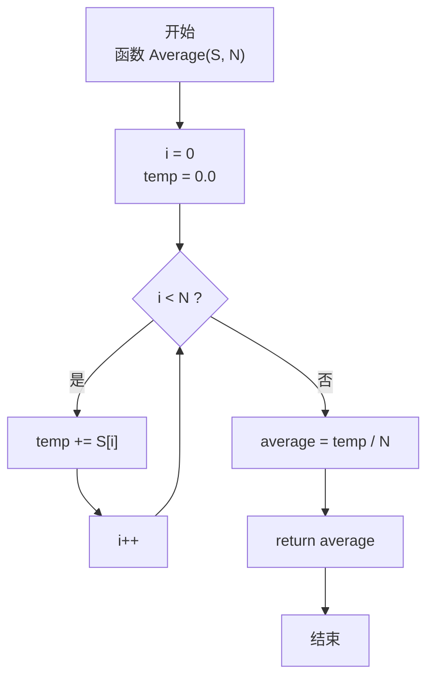
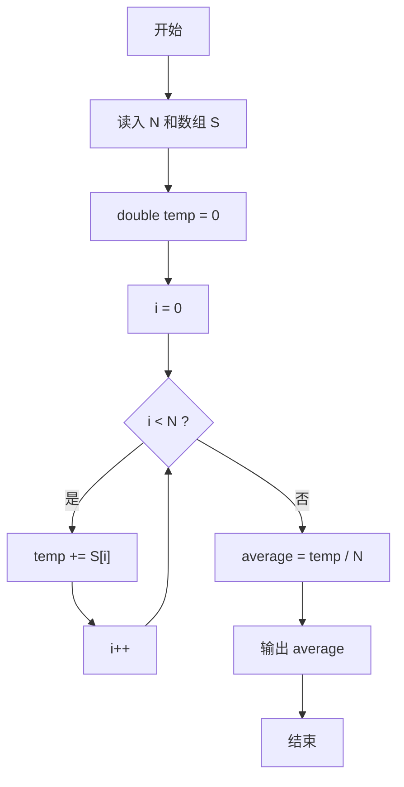

> **摘要**：本文是 PTA 函数题“6-4 求自定类型元素的平均”的题解，涵盖题目描述、函数接口定义及 C 语言实现，展示先求和后除法求均值，并使用 double 类型避免精度丢失。

## 题目描述

本题要求实现一个函数，求`N`个集合元素`S[]`的平均值，其中集合元素的类型为自定义的`ElementType`。

### 函数接口定义：

```c++
ElementType Average( ElementType S[], int N );
```

其中给定集合元素存放在数组`S[]`中，正整数`N`是数组元素个数。该函数须返回`N`个`S[]`元素的平均值，其值也必须是`ElementType`类型。

### 裁判测试程序样例：

```c++
#include <stdio.h>

#define MAXN 10
typedef float ElementType;

ElementType Average( ElementType S[], int N );

int main ()
{
    ElementType S[MAXN];
    int N, i;

    scanf("%d", &N);
    for ( i=0; i<N; i++ )
        scanf("%f", &S[i]);
    printf("%.2f\n", Average(S, N));

    return 0;
}

/* 你的代码将被嵌在这里 */
```

### 输入样例：

```in
3
12.3 34 -5
```

### 输出样例：

```out
13.77
```

## 解题思路

这道题的核心是**求数组元素的算术平均值**，即总和除以元素个数。

### 核心问题分析

平均值 = (S[0] + S[1] + ... + S[N-1]) / N。实现时有两个关键细节：
1. **求和精度**：如果用 ElementType（float）累加，N 较大时容易累积误差可能影响结果，因此通常用更高精度的 double 做累加器。
2. **除法类型**：必须是浮点除法而非整数除法——由于 temp 和 N 中至少一方是浮点，C 会自动提升。

### 算法原理说明

线性累加 + 最后除 N：
- 声明 double 累加器 temp = 0
- 遍历数组逐个 temp += S[i]（自动类型提升 ElementType→double）
- average = temp / N
- 返回时隐式转回 ElementType

### 具体计算步骤

1. 循环变量 i = 0，累加器 temp = 0（double 类型）
2. 循环 i 从 0 到 N-1：temp += S[i]
3. 计算 average = temp / N（浮点除法）
4. 返回 average

## 函数部分实现

```c
/* 6-4 求自定类型元素的平均
 * 函数：Average
 * 功能：求 N 个 ElementType 元素的算术平均值
 * 参数：
 *   S[] — 自定类型数组（输入）
 *   N   — 数组元素个数
 * 返回值：平均值（ElementType）
 * 实现原理：先求和再除以 N。
 *   - 用 double 类型 temp 做累加器防止精度丢失
 *   - 遍历数组每个元素累加到 temp
 *   - 最后 temp / N 得到平均值（浮点除法）
 * 时间复杂度 O(N)，空间复杂度 O(1)
 */
ElementType Average( ElementType S[], int N )
{
    int i = 0;
    double temp = 0;          /* 累加器，用 double 防止精度丢失 */
    double average;
    for(; i < N; i++)
        temp = temp + S[i];

    average = temp / N;          /* 总和 / 个数 */
    return average;
}
```

## 完整代码实现

```c
/* 6-4 求自定类型元素的平均
 * 题目：实现函数 Average(S[], N)，返回 N 个元素的平均值（保留 2 位小数）。
 * 实现原理：先累加求和，再除以元素个数 N。
 *           用 double 保存累加和与平均值以避免整型除法丢失精度；
 *           由于 ElementType 可能是 float，求和时转成 double 计算更稳妥。
 * 时间复杂度 O(N)，空间复杂度 O(1)。
 */
#include <stdio.h>

#define MAXN 10
typedef float ElementType;

ElementType Average( ElementType S[], int N );

int main ()
{
    ElementType S[MAXN];
    int N, i;

    scanf("%d", &N);
    for ( i = 0; i < N; i++ )
        scanf("%f", &S[i]);
    printf("%.2f\n", Average(S, N));

    return 0;
}

/* 先求和再除以 N 得到平均值 */
ElementType Average( ElementType S[], int N )
{
    int i = 0;
    double temp = 0;          /* 累加器，用 double 防止精度丢失 */
    double average;
    for(; i < N; i++)
        temp = temp + S[i];

    average = temp / N;          /* 总和 / 个数 */
    return average;
}
```

## 代码流程说明

### 1. 主函数：读取数据
- 读入 N
- 循环读入 N 个 float 存入 S[0..N-1]
- printf("%.2f") 保留两位小数输出

### 2. Average 函数：求和阶段
- `double temp = 0`：高精度累加器初始化
- for 循环 i = 0 ~ N-1：temp += S[i]，每步自动做 ElementType→double 提升

### 3. Average 函数：求平均
- `average = temp / N`：浮点除法，得到平均值
- return average：隐式转换为 ElementType 返回

## 代码流程图



## 解题流程图


