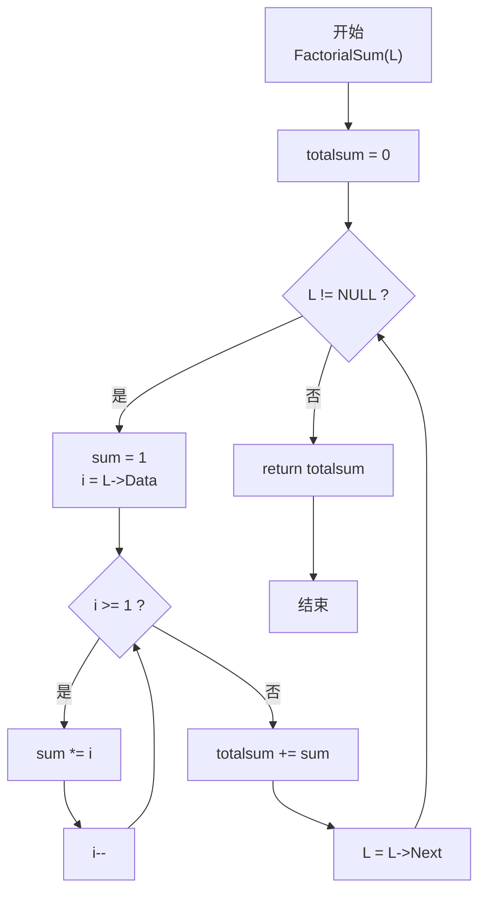
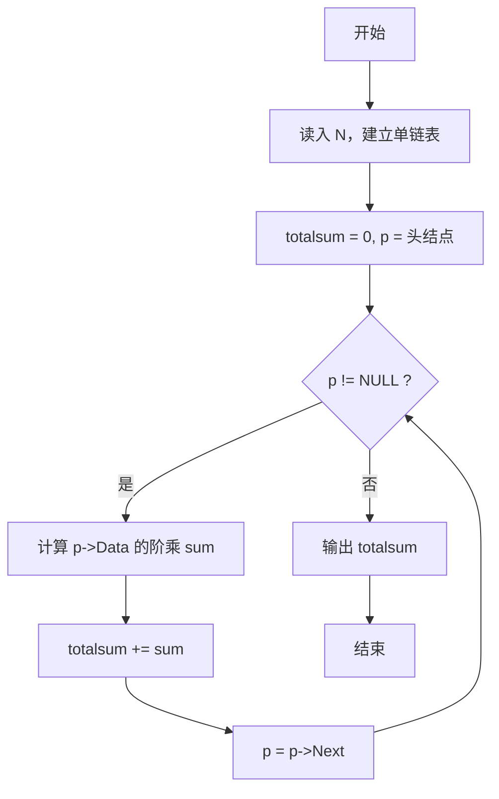

> **摘要**：本文是 PTA 函数题“6-6 求单链表结点的阶乘和”的题解，涵盖题目描述、函数接口定义、单链表结构及 C 语言实现，展示链表遍历与阶乘计算的综合应用。

## 题目描述

本题要求实现一个函数，求单链表`L`结点的阶乘和。这里默认所有结点的值非负，且题目保证结果在`int`范围内。

### 函数接口定义：

```c++
int FactorialSum( List L );
```

其中单链表`List`的定义如下：

```c++
typedef struct Node *PtrToNode;
struct Node {
    int Data; /* 存储结点数据 */
    PtrToNode Next; /* 指向下一个结点的指针 */
};
typedef PtrToNode List; /* 定义单链表类型 */
```

### 裁判测试程序样例：

```c++
#include <stdio.h>
#include <stdlib.h>

typedef struct Node *PtrToNode;
struct Node {
    int Data; /* 存储结点数据 */
    PtrToNode Next; /* 指向下一个结点的指针 */
};
typedef PtrToNode List; /* 定义单链表类型 */

int FactorialSum( List L );

int main()
{
    int N, i;
    List L, p;

    scanf("%d", &N);
    L = NULL;
    for ( i=0; i<N; i++ ) {
        p = (List)malloc(sizeof(struct Node));
        scanf("%d", &p->Data);
        p->Next = L;  L = p;
    }
    printf("%d\n", FactorialSum(L));

    return 0;
}

/* 你的代码将被嵌在这里 */
```

### 输入样例：

```in
3
5 3 6
```

### 输出样例：

```out
846
```

## 解题思路

这道题的核心是**单链表遍历 + 各结点数据的阶乘求和**：先沿 Next 指针走完整个链表，对每个结点的 Data 值计算其阶乘，再把所有阶乘加起来。

### 核心问题分析

1. **链表遍历**：不能像数组那样按下标访问，必须从表头 L 开始，每次 `L = L->Next` 走向下一个结点，直到 `L == NULL` 表示链表结束。
2. **阶乘计算**：每个结点的 Data 值是独立的，对每个 Data 单独做一次连乘即可（注意 0! = 1 的定义）。
3. **结果累加**：用 totalsum 保存所有阶乘之和。

### 算法原理说明

外层 while 循环走完整条链表：
- 内层 for 循环计算当前结点 Data 的阶乘：从 Data 连乘到 1
- 每个结点的阶乘 sum 累加到 totalsum

### 具体计算步骤

1. 初始化 totalsum = 0
2. 当 L != NULL 时：
   - sum = 1（阶乘初值）
   - 对 i 从 Data 到 1：sum *= i（计算 Data!）
   - totalsum += sum
   - L = L->Next（前进到下一结点）
3. 返回 totalsum

## 函数部分实现

```c
/* 6-6 求单链表结点的阶乘和
 * 函数：FactorialSum
 * 功能：求单链表所有结点 Data 的阶乘之和
 * 参数：L — 单链表头指针
 * 返回值：所有结点 Data! 的和（int）
 * 实现原理：链表遍历 + 逐点阶乘。
 *   - while 沿 Next 走完整条链表
 *   - 对每个 Data 用 for 从 Data 连乘到 1 得到阶乘
 *   - 累加到 totalsum
 * 时间复杂度 O(结点数 × 平均 Data 值)，空间复杂度 O(1)
 */
int FactorialSum(List L)
{
    int i;
    int sum, totalsum = 0;
    while(L != NULL){
        sum = 1;
        for(i = L->Data; i >= 1; i--){
            sum = sum * i;          /* 计算 L->Data 的阶乘 */
        }
        totalsum += sum;              /* 累加到总和 */
        L = L->Next;                  /* 移动到下一个结点 */
    }
    return totalsum;
}
```

## 完整代码实现

```c
/* 6-6 求单链表结点的阶乘和
 * 题目：给定一条单链表，每个结点含一个整数 Data，
 *       求所有结点 Data 的阶乘之和。
 * 实现原理：遍历链表。用 while 沿 Next 指针走完整条链表，
 *           对每个结点的 Data 用循环计算其阶乘 sum，
 *           再把 sum 累加到 totalsum，最后返回 totalsum。
 * 时间复杂度 O(总节点数值之和)，空间复杂度 O(1)。
 */
#include <stdio.h>
#include <stdlib.h>

typedef struct Node *PtrToNode;
struct Node {
    int Data;
    PtrToNode Next;
};
typedef PtrToNode List;

int FactorialSum( List L );

int main()
{
    int N, i;
    List L, p;

    scanf("%d", &N);
    L = NULL;
    for ( i = 0; i < N; i++ ) {
        p = (List)malloc(sizeof(struct Node));
        scanf("%d", &p->Data);
        p->Next = L;  L = p;        /* 头插法建立链表 */
    }
    printf("%d\n", FactorialSum(L));

    return 0;
}

/* 遍历链表，逐点计算阶乘并求和 */
int FactorialSum(List L)
{
    int i;
    int sum, totalsum = 0;
    while(L != NULL){
        sum = 1;
        for(i = L->Data; i >= 1; i--){
            sum = sum * i;          /* 计算 L->Data 的阶乘 */
        }
        totalsum += sum;              /* 累加到总和 */
        L = L->Next;                  /* 移动到下一个结点 */
    }
    return totalsum;
}
```

## 代码流程说明

### 1. 主函数：建立链表
- 读入结点数 N
- 循环 N 次：用 malloc 分配新结点 → 读 Data → 头插法插入（p->Next = L; L = p），形成倒序链表（但求和与顺序无关，结果正确）

### 2. FactorialSum 函数：遍历 + 阶乘
- `totalsum = 0` 初始化总和
- while (L != NULL)：
  - `sum = 1` 重置阶乘初值
  - for (i = L->Data; i >= 1; i--) sum *= i：计算当前结点的阶乘
  - `totalsum += sum` 累加
  - `L = L->Next` 前进指针

### 3. 返回 totalsum

## 代码流程图



## 解题流程图


