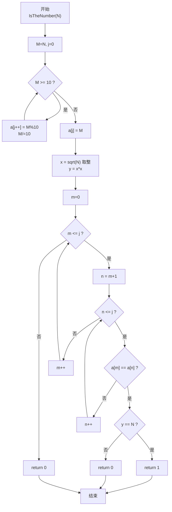
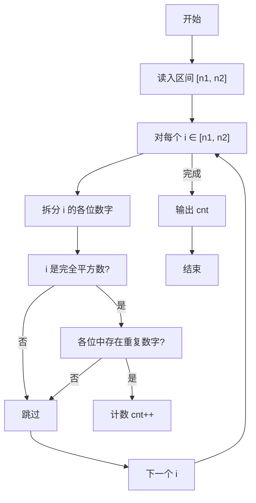

> **摘要**：本文是 PTA 函数题“6-7 统计某类完全平方数”的题解，涵盖题目描述、函数接口定义及 C 语言实现，展示整数各位拆分、完全平方数判定与重复数字检测的综合思路。

## 题目描述

本题要求实现一个函数，判断任一给定整数`N`是否满足条件：它是完全平方数，又至少有两位数字相同，如144、676等。

### 函数接口定义：

```c++
int IsTheNumber ( const int N );
```

其中`N`是用户传入的参数。如果`N`满足条件，则该函数必须返回1，否则返回0。

### 裁判测试程序样例：

```c++
#include <stdio.h>
#include <math.h>

int IsTheNumber ( const int N );

int main()
{
    int n1, n2, i, cnt;

    scanf("%d %d", &n1, &n2);
    cnt = 0;
    for ( i=n1; i<=n2; i++ ) {
        if ( IsTheNumber(i) )
            cnt++;
    }
    printf("cnt = %d\n", cnt);

    return 0;
}

/* 你的代码将被嵌在这里 */
```

### 输入样例：

```in
105 500
```

### 输出样例：

```out
cnt = 6
```

## 解题思路

这道题的核心是对单个整数 `N` 同时做两个判断：**是否为完全平方数**，以及**各位数字中是否至少有两位相同**。两者都满足时返回 1，否则返回 0。

### 核心问题分析

1. **完全平方数判定**：对 N 开平方取整得 x = (int)sqrt(N)，若 x*x == N，则是完全平方数。需要注意浮点数精度，但 PTA 数据范围下直接使用 math.h 的 sqrt 即可。
2. **重复数字检测**：把 N 的每一位数字拆出存入数组 a[]，再用双重循环两两比较 a[i] 和 a[j]（i<j），只要有一对相等就说明存在重复数字。

### 算法原理说明

步骤拆分：
1. 用"除 10 取余"法拆分 N 的每一位到数组 a[]（低位在前），j 记录最高位的下标。
2. x = (int)sqrt(N)，y = x * x，y == N 即判定为完全平方数。
3. 双重 for (m=0..j, n=m+1..j) 检查 a[m] == a[n]，若找到一对且 y==N 则立刻 return 1；遍历完未找到 return 0。

### 具体计算步骤

1. 复制 M = N，while (M >= 10)：a[j++] = M%10; M /= 10；最后 a[j] = M。
2. x = (int)sqrt(N); y = x*x。
3. 两层循环 m=0..j、n=m+1..j：
   - 若 a[m] == a[n] 且 y == N → return 1
   - 若有重复但 y != N → return 0（优化：已经有重复了还不是平方数就直接排除）
4. 循环完仍没 return → return 0。

## 函数部分实现

```c
/* 6-7 统计某类完全平方数
 * 函数：IsTheNumber
 * 功能：判断 N 是否同时满足 ① 是完全平方数；② 至少有两位数字相同
 * 参数：N — 待判断的整数
 * 返回值：满足返回 1，否则 0
 * 实现原理：
 *   - 拆分 N 的各位数字存入数组 a[]
 *   - sqrt(N) 取整平方判断是否完全平方数
 *   - 双重循环两两比较 a[] 中是否有相同数字
 * 时间复杂度 O(位数²)，空间复杂度 O(1)
 */
int IsTheNumber( const int N)
{
    int M = N;
    int j = 0;
    int a[10];                  /* 存放 N 的各位数字 */

    while(M >= 10)              /* 逐位取余数，拆分各位数字 */
    {
        a[j++] = M % 10;
        M = M / 10;
    }
    a[j] = M;                   /* 最后剩下的最高位 */

    int x = (int)sqrt(N);
    int y = x * x;              /* y 为不大于 N 的最大平方数 */

    int m, n;
    for(m = 0; m <= j; m++)         /* 双重循环检查是否有两位数字相同 */
    {
        for(n = m+1; n <= j; n++)
        {
            if(a[m] == a[n])
            {
                if(y == N)     /* 有重复数字且是完全平方数 */
                    return 1;
                else
                    return 0;
            }
        }
    }

    return 0;
}
```

## 完整代码实现

```c
/* 6-7 统计某类完全平方数
 * 题目：在 [n1, n2] 区间内统计“各位数字中至少有两位相同，
 *       且本身是一个完全平方数”的数的个数。
 * 实现原理（针对单个整数 N 判断，函数 IsTheNumber）：
 *   1) 把 N 的每一位拆出存入数组 a[]（低位在前）。
 *   2) 用 sqrt(N) 取整后平方，判断 N 是否为完全平方数（y == N）。
 *   3) 用双重循环检查 a[] 中是否存在两位数字相同；
 *      若存在相同数字，再结合是否为完全平方数返回 1/0。
 * 主函数对区间内每个数调用该函数并计数。
 * 时间复杂度 O((n2-n1) * 位数²)，空间复杂度 O(1)。
 */
#include <stdio.h>
#include <math.h>

int IsTheNumber ( const int N );

int main()
{
    int n1, n2, i, cnt;

    scanf("%d %d", &n1, &n2);
    cnt = 0;
    for ( i = n1; i <= n2; i++ ) {
        if ( IsTheNumber(i) )
            cnt++;
    }
    printf("cnt = %d\n", cnt);

    return 0;
}

/* 判断 N 是否“是完全平方数且至少含两位相同数字” */
int IsTheNumber( const int N)
{
    int M = N;
    int j = 0;
    int a[10];                  /* 存放 N 的各位数字 */

    while(M >= 10)              /* 逐位取余数，拆分各位数字 */
    {
        a[j++] = M % 10;
        M = M / 10;
    }
    a[j] = M;                   /* 最后剩下的最高位 */

    int x = (int)sqrt(N);
    int y = x * x;              /* y 为不大于 N 的最大平方数 */

    int m, n;
    for(m = 0; m <= j; m++)         /* 双重循环检查是否有两位数字相同 */
    {
        for(n = m+1; n <= j; n++)
        {
            if(a[m] == a[n])
            {
                if(y == N)     /* 有重复数字且是完全平方数 */
                    return 1;
                else
                    return 0;
            }
        }
    }

    return 0;
}
```

## 代码流程说明

### 1. 主函数：区间遍历
- 读入 n1, n2
- cnt = 0；循环 i 从 n1 到 n2：IsTheNumber(i) 为真 cnt++
- 输出 cnt

### 2. IsTheNumber 函数：拆位
- M = N（保护 const 参数不被修改）
- while (M >= 10)：每次 M%10 取个位 → a[j++]，M /= 10 去个位
- 循环结束后把剩余的最高位也放入 a[j]

### 3. 完全平方数判定
- x = (int)sqrt(N); y = x*x;
- y == N 则是完全平方数

### 4. 重复数字检测
- 两层循环：m 固定，n 从 m+1 到 j 依次对比 a[m] 和 a[n]
- 发现相等立刻：若 y==N return 1，否则 return 0
- 循环结束没找到 return 0

## 代码流程图



## 解题流程图


