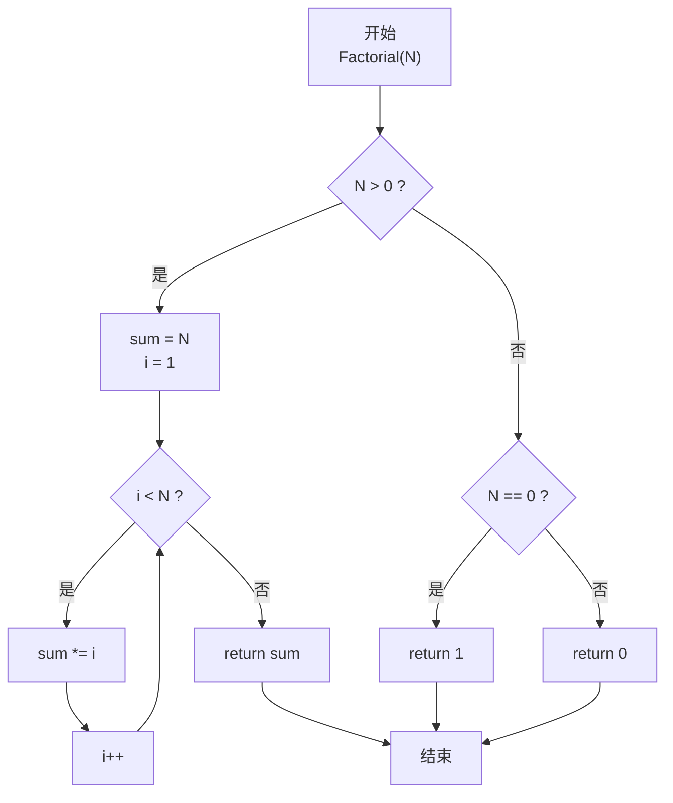
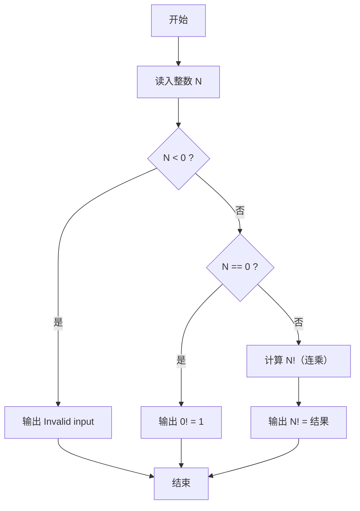

> **摘要**：本文是 PTA 函数题“6-8 简单阶乘计算”的题解，涵盖题目描述、函数接口定义及 C 语言实现，展示连乘法计算阶乘并处理边界条件（0! = 1、负数输入非法）。

## 题目描述

本题要求实现一个计算非负整数阶乘的简单函数。

### 函数接口定义：

```c++
int Factorial( const int N );
```

其中`N`是用户传入的参数，其值不超过12。如果`N`是非负整数，则该函数必须返回`N`的阶乘，否则返回0。

### 裁判测试程序样例：

```c++
#include <stdio.h>

int Factorial( const int N );

int main()
{
    int N, NF;

    scanf("%d", &N);
    NF = Factorial(N);
    if (NF)  printf("%d! = %d\n", N, NF);
    else printf("Invalid input\n");

    return 0;
}

/* 你的代码将被嵌在这里 */
```

### 输入样例：

```in
5
```

### 输出样例：

```out
5! = 120
```

## 解题思路

这道题的核心是**正整数阶乘的连乘计算**，并正确处理 0! = 1 和负数返回 0 的边界条件。

### 核心问题分析

阶乘定义：N! = N × (N-1) × ... × 1；特殊规定 0! = 1。
- N ≥ 1：连乘
- N = 0：直接返回 1
- N < 0：非法，返回 0

### 算法原理说明

分支处理 + 连乘循环：
1. 先判断 N 正负：N<0 → return 0；N==0 → return 1。
2. N>0 时，sum 初值赋 N（或赋 1 再从 N 乘到 1 也可以），再乘上 1..N-1 或 N..1。
3. 注意 N ≤ 12 的题设保证 int 不会溢出（12! = 479001600，约 4.8 亿，在 32 位 int 范围内）。

### 具体计算步骤

1. 若 N > 0：
   - sum = N
   - for i=1 到 N-1：sum *= i
   - return sum
2. else if N == 0：return 1
3. else：return 0

## 函数部分实现

```c
/* 6-8 简单阶乘计算
 * 函数：Factorial
 * 功能：返回 N!（0! = 1；N<0 视为非法返回 0）
 * 参数：N — 整数（题目保证 |N| 正常范围内，N≤12 时 int 不溢出）
 * 返回值：阶乘结果或 0（非法输入）
 * 实现原理：连乘法。
 *   - N<0: return 0
 *   - N==0: return 1
 *   - N>0: sum=N; i 从 1 到 N-1 连乘
 * 时间复杂度 O(N)，空间复杂度 O(1)
 */
int Factorial( const int N )
{
    if (N > 0)
    {
        int i;
        int sum = 1;
        sum = N;                      /* 初始值设为 N */
        for(i = 1; i < N; i++)
        {
            sum = sum * i;            /* 依次乘上 (N-1)...1 */
        }
        return sum;
    }
    else if (N == 0)
    {
        return 1;                     /* 0! = 1 */
    }
    else
        return 0;                     /* 负数视为非法输入 */
}
```

## 完整代码实现

```c
/* 6-8 简单阶乘计算
 * 题目：实现函数 Factorial(N)，计算 N 的阶乘。
 *       0! = 1；当 N < 0（非法输入）时返回 0。
 * 实现原理：连乘法。N! = N * (N-1) * ... * 1。
 *           先令 sum = N，再用 for 循环从 1 乘到 N-1；
 *           特殊情况：N==0 直接返回 1，N<0 返回 0。
 * 时间复杂度 O(N)，空间复杂度 O(1)。
 */
#include <stdio.h>

int Factorial( const int N );

int main()
{
    int N, NF;

    scanf("%d", &N);
    NF = Factorial(N);
    if (NF)  printf("%d! = %d\n", N, NF);
    else printf("Invalid input\n");

    return 0;
}

/* 连乘计算 N! */
int Factorial( const int N )
{
    if (N > 0)
    {
        int i;
        int sum = 1;
        sum = N;                      /* 初始值设为 N */
        for(i = 1; i < N; i++)
        {
            sum = sum * i;            /* 依次乘上 (N-1)...1 */
        }
        return sum;
    }
    else if (N == 0)
    {
        return 1;                     /* 0! = 1 */
    }
    else
        return 0;                     /* 负数视为非法输入 */
}
```

## 代码流程说明

### 1. 主函数
- 读入 N
- NF = Factorial(N)
- 若 NF != 0：按 "N! = NF" 格式输出；否则输出 "Invalid input"

### 2. Factorial 函数：分支一 N > 0
- sum = N（先乘上最大的因子）
- i 从 1 到 N-1：sum *= i → 累积 N!
- return sum

### 3. Factorial 函数：分支二 N == 0
- return 1（0! = 1 的数学规定）

### 4. Factorial 函数：分支三 N < 0
- return 0（主函数据此判断为非法输入）

## 代码流程图



## 解题流程图


