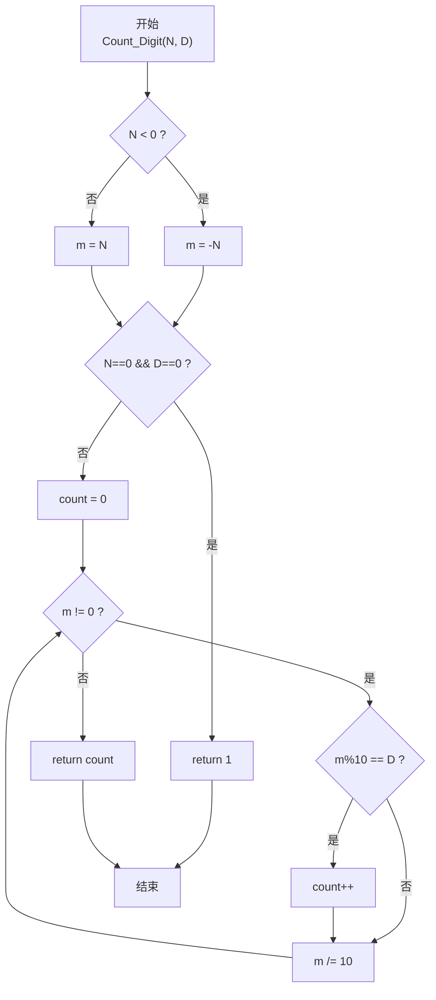
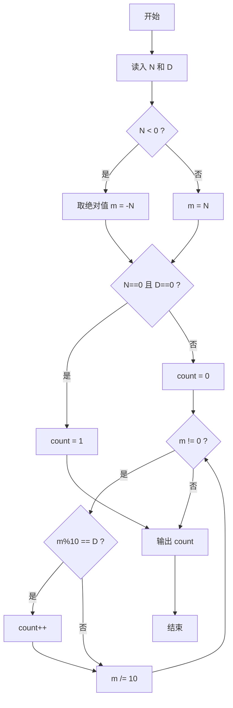

> **摘要**：本文是 PTA 函数题“6-9 统计个位数字”的题解，涵盖题目描述、函数接口定义及 C 语言实现，展示"除 10 取余法"逐位统计数字出现次数的技巧。

## 题目描述

本题要求实现一个函数，可统计任一整数中某个位数出现的次数。例如-21252中，2出现了3次，则该函数应该返回3。

### 函数接口定义：

```c++
int Count_Digit ( const int N, const int D );
```

其中`N`和`D`都是用户传入的参数。`N`的值不超过`int`的范围；`D`是[0, 9]区间内的个位数。函数须返回`N`中`D`出现的次数。

### 裁判测试程序样例：

```c++
#include <stdio.h>

int Count_Digit ( const int N, const int D );

int main()
{
    int N, D;

    scanf("%d %d", &N, &D);
    printf("%d\n", Count_Digit(N, D));
    return 0;
}

/* 你的代码将被嵌在这里 */
```

### 输入样例：

```in
-21252 2
```

### 输出样例：

```out
3
```

## 解题思路

这道题的核心是**逐位拆解整数并统计目标数字 D 的出现次数**。由于 N 可能是负数，需要先取绝对值，且特别处理 N=0 且 D=0 的特殊情形（因为 while(0) 不会进入循环，统计会得到 0）。

### 核心问题分析

1. **负数处理**：数字的各位与符号无关，-21252 的数字就是 2,1,2,5,2，因此取绝对值 m = |N| 后再处理。
2. **逐位取数**：每次 m%10 得到最低位数字，m /= 10 去掉最低位，循环直到 m=0。
3. **特殊情形**：当 N=0 且 D=0 时，m=0 会直接跳过循环，但实际数字 0 中含有一个数字 0，因此需要先单独判断返回 1。

### 算法原理说明

1. 先处理 N 负数→取绝对值；
2. 若 N==0 且 D==0：return 1；
3. count = 0；
4. while (m)：
   - m%10 == D → count++
   - m /= 10
5. return count

### 具体计算步骤

1. m = (N<0) ? -N : N
2. if (N==0 && D==0) return 1
3. count = 0
4. while (m != 0) {
   - 若 m%10 == D → count++
   - m /= 10
   }
5. return count

## 函数部分实现

```c
/* 6-9 统计个位数字
 * 函数：Count_Digit
 * 功能：统计整数 N 的十进制表示中，数字 D 出现的次数（支持负数）
 * 参数：
 *   N — 待统计的整数
 *   D — 目标数字（0~9）
 * 返回值：D 出现的次数
 * 实现原理：除 10 取余法逐位检查。
 *   - 负数先取绝对值
 *   - N=0 且 D=0 特判返回 1
 *   - while(m)：m%10 取最低位对比 D，计数后 m/=10
 * 时间复杂度 O(位数)，空间复杂度 O(1)
 */
int Count_Digit( const int N, const int D){
    int m;
    if(N < 0)
        m = -N;              /* 负数取绝对值后再统计 */
    else
        m = N;

    if(N == 0 && D == 0)
        return 1;            /* 0 中包含 1 个数字 0 */

    int count = 0;
    while(m){
        if(m % 10 == D)        /* 当前最低位是否等于 D */
            count++;
        m /= 10;             /* 去掉最低位 */
    }
    return count;
}
```

## 完整代码实现

```c
/* 6-9 统计个位数字
 * 题目：实现函数 Count_Digit(N, D)，统计整数 N 的十进制表示中
 *       数字 D 出现的次数（N 可为负数）。
 * 实现原理：取绝对值后用“除 10 取余”法逐位检查。
 *           每轮 m%10 得到最低位数字，若等于 D 则计数加一，
 *           再 m /= 10 去掉最低位，直到 m 为 0。
 *           特例：N 与 D 同时为 0 时返回 1（数字 0 含有一个 0）。
 * 时间复杂度 O(位数)，空间复杂度 O(1)。
 */
#include <stdio.h>

int Count_Digit ( const int N, const int D );

int main()
{
    int N, D;

    scanf("%d %d", &N, &D);
    printf("%d\n", Count_Digit(N, D));
    return 0;
}

/* 逐位统计数字 D 出现的次数 */
int Count_Digit( const int N, const int D){
    int m;
    if(N < 0)
        m = -N;              /* 负数取绝对值后再统计 */
    else
        m = N;

    if(N == 0 && D == 0)
        return 1;            /* 0 中包含 1 个数字 0 */

    int count = 0;
    while(m){
        if(m % 10 == D)        /* 当前最低位是否等于 D */
            count++;
        m /= 10;             /* 去掉最低位 */
    }
    return count;
}
```

## 代码流程说明

### 1. 主函数
- 读入 N 和 D
- 调用 Count_Digit(N, D) 输出返回值

### 2. Count_Digit：符号处理
- 若 N < 0：m = -N；否则 m = N（保留 N 原值以便 0 的特判）

### 3. Count_Digit：0 的特判
- 若 N == 0 && D == 0：直接 return 1，避免 while(0) 跳过计数

### 4. Count_Digit：循环统计
- count = 0
- while (m != 0)：
  - 当前位 m%10 == D → count++
  - m /= 10：去掉最低位

### 5. 返回 count

## 代码流程图



## 解题流程图


