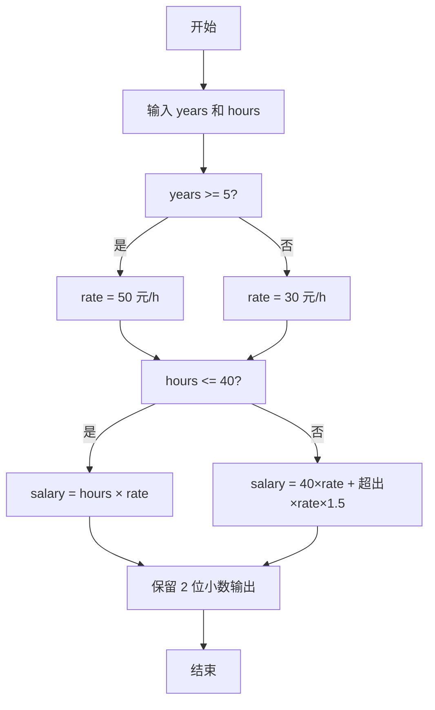

> **摘要**：本文是 PTA 编程题“7-10 计算工资”的题解，涵盖题目描述、输入输出格式及 C 语言实现，展示按"新/老职工"确定时薪，再按"是否超时"计加班工资 1.5 倍的分段计费思路。

## 题目描述
某公司员工的工资计算方法如下：一周内工作时间不超过40小时，按正常工作时间计酬；超出40小时的工作时间部分，按正常工作时间报酬的1.5倍计酬。员工按进公司时间分为新职工和老职工，进公司不少于5年的员工为老职工，5年以下的为新职工。新职工的正常工资为30元/小时，老职工的正常工资为50元/小时。请按该计酬方式计算员工的工资。

### 输入格式：

输入在一行中给出2个正整数，分别为某员工入职年数和周工作时间，其间以空格分隔。

### 输出格式：

在一行输出该员工的周薪，精确到小数点后2位。

### 输入样例：

```in
5 40
```

```in
3 50
```

### 输出样例：

```out
2000.00
```

```out
1650.00
```

## 解题思路

这道题的核心是**两级分段计费**：先按入职年数分"新/老职工"定正常时薪，再按是否超过 40 小时分"正常工时/加班工时"计工资。

### 核心问题分析

1. **职工类型判据**：years ≥ 5 → 老职工 rate = 50；否则 rate = 30。
2. **工时分段**：
   - hours ≤ 40 → salary = hours × rate
   - hours > 40 → salary = 40×rate + (hours-40)×rate×1.5
3. **输出精度**：%.2f 强制两位小数。

### 算法原理说明

两级 if-else 嵌套 + 算术运算：
1. 读 years, hours
2. if (years≥5) rate=50 else rate=30
3. if (hours≤40) salary=hours*rate else 40*rate+(hours-40)*rate*1.5
4. printf("%.2f", salary)

### 具体计算步骤

1. scanf("%d %d", &years, &hours)
2. 确定 rate（50 或 30）
3. 根据 hours ≤ 40 选择公式计算 salary
4. %.2f 输出 salary

## 代码部分实现
```c
#include <stdio.h>  // 引入标准输入输出头文件

int main(void)  // 主函数
{
    int years, hours;  // 定义入职年数和周工作时间
    double rate, salary;  // 定义工资率和工资变量
    
    scanf("%d %d", &years, &hours);  // 读取入职年数和周工作时间
    
    if (years >= 5) {  // 判断是否为老职工（入职不少于5年）
        rate = 50.0;  // 老职工正常工资为50元/小时
    } else {  // 否则为新职工
        rate = 30.0;  // 新职工正常工资为30元/小时
    }
    
    if (hours <= 40) {  // 判断工作时间是否不超过40小时
        salary = hours * rate;  // 正常计酬：工资 = 工时 × 工资率
    } else {  // 超过40小时
        salary = 40 * rate + (hours - 40) * rate * 1.5;  // 正常工时+加班工时（1.5倍计酬）
    }
    
    printf("%.2f\n", salary);  // 输出工资，保留两位小数
    return 0;  // 返回0，表示程序正常结束
}
```

## 代码流程说明

### 1. 变量与输入
- int years, hours：入职年数、周工作小时数
- double rate, salary：时薪（由职工类型决定）、最终工资
- scanf 读入两个整数

### 2. 确定时薪 rate
- years ≥ 5 → 老职工 rate = 50.0
- 否则 → 新职工 rate = 30.0

### 3. 分段计算 salary
- hours ≤ 40：salary = hours × rate
- hours > 40：salary = 40×rate + (hours-40)×rate×1.5（加班部分 1.5 倍）

### 4. 输出
- printf("%.2f\n", salary)：保留两位小数

## 代码流程图

```mermaid
flowchart TD
  A["开始\nmain()"] --> B["读入 years, hours"]
  B --> C{"years >= 5 ?"}
  C -- "是" --> D["rate = 50.0"]
  C -- "否" --> E["rate = 30.0"]
  D --> F{"hours <= 40 ?"}
  E --> F
  F -- "是" --> G["salary = hours*rate"]
  F -- "否" --> H["salary = 40*rate + (hours-40)*rate*1.5"]
  G --> I["printf(\"%.2f\", salary)"]
  H --> I
  I --> J["return 0"]
  J --> K["结束"]
```

## 解题流程图


