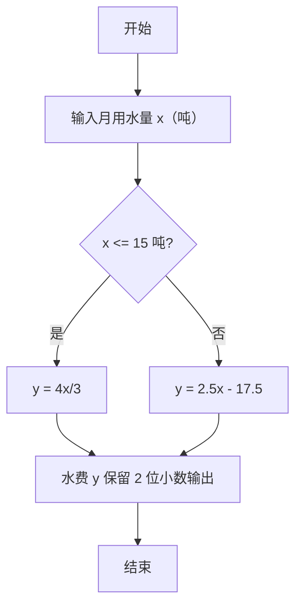

> **摘要**：本文是 PTA 编程题“7-11 分段计算居民水费”的题解，涵盖题目描述、输入输出格式及 C 语言实现，展示两段式阶梯水价的条件分支计算与两位小数格式化输出。

## 题目描述
为鼓励居民节约用水，自来水公司采取按用水量阶梯式计价的办法，居民应交水费y（元）与月用水量x（吨）相关：当x不超过15吨时，y=4x/3；超过后，y=2.5x−17.5。请编写程序实现水费的计算。

### 输入格式：

输入在一行中给出非负实数x。

### 输出格式：

在一行输出应交的水费，精确到小数点后2位。

### 输入样例：

```in
12
```

```in
16
```

### 输出样例：

```out
16.00
```

```out
22.50
```

## 解题思路

这道题的核心是**两段阶梯水价的分段函数**：x ≤ 15 用 4x/3；x > 15 用 2.5x − 17.5。

### 核心问题分析

1. **分界点 x = 15**：两段公式在 x=15 处都给出 y=20，因此等号放哪一边都可以；代码里写成 x ≤ 15。
2. **浮点精度**：输入 x 是实数，需用 double 存储；输出强制 %.2f。

### 算法原理说明

简单 if-else 分支：
- if (x ≤ 15) → y = 4*x/3
- else → y = 2.5*x - 17.5

### 具体计算步骤

1. scanf("%lf", &x) 读 double
2. if (x ≤ 15) y = 4*x/3；否则 y = 2.5*x - 17.5
3. printf("%.2f\n", y)

## 代码部分实现
```c
#include <stdio.h>  // 引入标准输入输出头文件

int main(void)  // 主函数
{
    double x, y;  // 定义月用水量和应交水费
    scanf("%lf", &x);  // 读取月用水量
    
    if (x <= 15) {  // 判断用水量是否不超过15吨
        y = 4 * x / 3;  // 不超过15吨时：水费 = 4x/3
    } else {  // 超过15吨
        y = 2.5 * x - 17.5;  // 超过15吨时：水费 = 2.5x - 17.5
    }
    
    printf("%.2f\n", y);  // 输出水费，保留两位小数
    return 0;  // 返回0，表示程序正常结束
}
```

## 代码流程说明

### 1. 变量与输入
- double x, y：用水量（吨）和水费（元）
- scanf("%lf", &x) 读取实数 x

### 2. 两段分支
- x ≤ 15 → y = 4*x/3（约 1.333 元/吨）
- x > 15 → y = 2.5*x - 17.5（超过部分按 2.5 元/吨，并在分界处与前式衔接）

### 3. 输出
- printf("%.2f\n", y)：强制两位小数

## 代码流程图

```mermaid
flowchart TD
  A["开始\nmain()"] --> B["读入用水量 x（double）"]
  B --> C{"x <= 15 ?"}
  C -- "是" --> D["y = 4*x / 3"]
  C -- "否" --> E["y = 2.5*x - 17.5"]
  D --> F["printf(\"%.2f\", y)"]
  E --> F
  F --> G["return 0"]
  G --> H["结束"]
```

## 解题流程图


