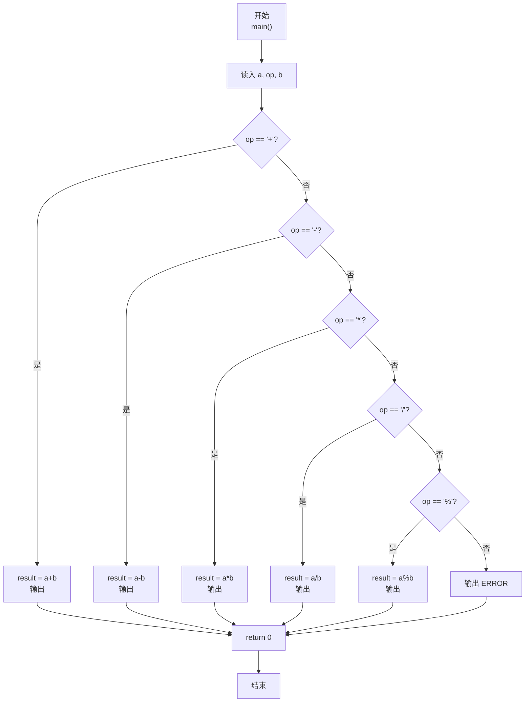
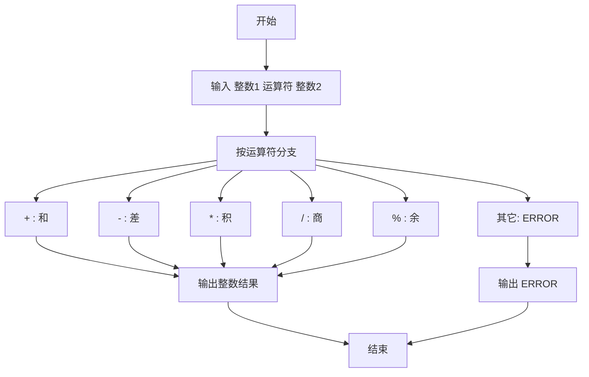

> **摘要**：本文是 PTA 编程题“7-12 两个数的简单计算器”的题解，涵盖题目描述、输入输出格式及 C 语言实现，展示用多分支 if-else 链识别运算符并执行对应运算、非法符号报错的处理。

## 题目描述
本题要求编写一个简单计算器程序，可根据输入的运算符，对2个整数进行加、减、乘、除或求余运算。题目保证输入和输出均不超过整型范围。

### 输入格式：

输入在一行中依次输入操作数1、运算符、操作数2，其间以1个空格分隔。操作数的数据类型为整型，且保证除法和求余的分母非零。

### 输出格式：

当运算符为+、-、*、/、%时，在一行输出相应的运算结果。若输入是非法符号（即除了加、减、乘、除和求余五种运算符以外的其他符号）则输出ERROR。

### 输入样例：

```in
-7 / 2
```

```in
3 & 6
```

### 输出样例：

```out
-3
```

```out
ERROR
```

## 解题思路

这道题的核心是**按运算符分 6 支执行：5 种合法运算 + 1 种非法报错**。

### 核心问题分析

1. **运算类型**：`+ - * / %` 五种。其中 `/` 和 `%` 题目保证分母非零，无需判除零。
2. **整数除法**：C 的 `/` 对负数朝零截断，如 -7/2 = -3，符合样例。
3. **非法符号**：若 op 不属于上述 5 个，统一输出 ERROR。

### 算法原理说明

用 if-else if-else 链依次匹配运算符：
- op == '+' → a+b；op == '-' → a-b；op == '*' → a*b；op == '/' → a/b；op == '%' → a%b；
- 其它 → ERROR。

### 具体计算步骤

1. scanf("%d %c %d", &a, &op, &b)
2. 依次匹配 5 个合法算符 → 算 result 并打印
3. 否则 → printf("ERROR")

## 代码部分实现
```c
#include <stdio.h>  // 引入标准输入输出头文件

int main(void)  // 主函数
{
    int a, b, result;  // 定义操作数1、操作数2和结果变量
    char op;  // 定义运算符变量
    
    scanf("%d %c %d", &a, &op, &b);  // 读取操作数1、运算符和操作数2
    
    if (op == '+') {  // 加法运算
        result = a + b;  // 计算两数之和
        printf("%d\n", result);  // 输出结果
    } else if (op == '-') {  // 减法运算
        result = a - b;  // 计算两数之差
        printf("%d\n", result);  // 输出结果
    } else if (op == '*') {  // 乘法运算
        result = a * b;  // 计算两数之积
        printf("%d\n", result);  // 输出结果
    } else if (op == '/') {  // 除法运算
        result = a / b;  // 计算两数之商
        printf("%d\n", result);  // 输出结果
    } else if (op == '%') {  // 求余运算
        result = a % b;  // 计算两数之余
        printf("%d\n", result);  // 输出结果
    } else {  // 非法运算符
        printf("ERROR\n");  // 输出错误提示
    }
    
    return 0;  // 返回0，表示程序正常结束
}
```

## 代码流程说明

### 1. 变量与输入
- int a, b, result；char op
- scanf("%d %c %d", &a, &op, &b)：格式串空格自动对应输入的空格。

### 2. 分支运算
- 依次匹配 `+ - * / %` 五个合法算符 → 计算 result 并 `printf("%d", result)`
- 以上都不匹配 → `printf("ERROR")`

## 代码流程图



## 解题流程图


