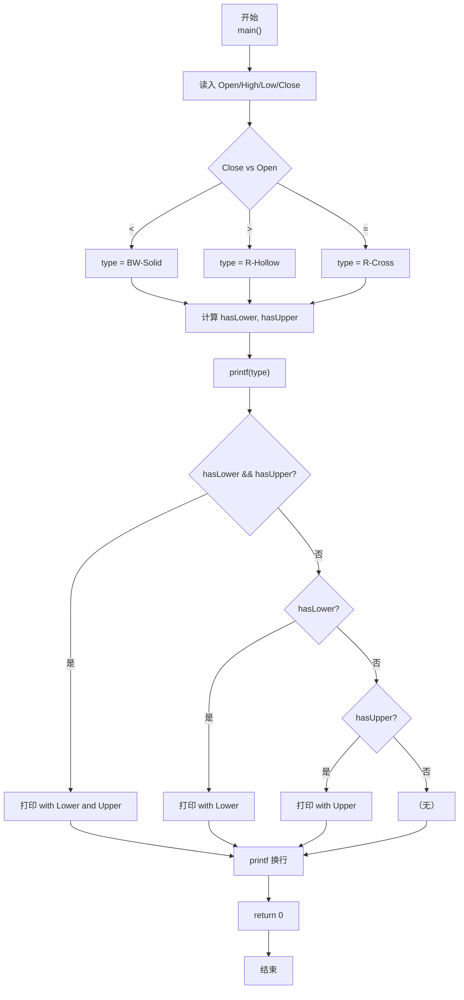
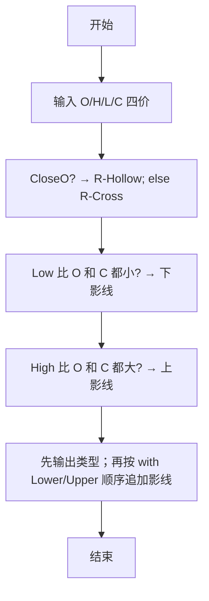

> **摘要**：本文是 PTA 编程题“7-13 日K蜡烛图”的题解，涵盖题目描述、输入输出格式及 C 语言实现，展示基于 Open/High/Low/Close 四个价格判断蜡烛颜色类型及上下影线有无的多重比较方法。

## 题目描述
股票价格涨跌趋势，常用蜡烛图技术中的K线图来表示，分为按日的日K线、按周的周K线、按月的月K线等。以日K线为例，每天股票价格从开盘到收盘走完一天，对应一根蜡烛小图，要表示四个价格：开盘价格Open（早上刚刚开始开盘买卖成交的第1笔价格）、收盘价格Close（下午收盘时最后一笔成交的价格）、中间的最高价High和最低价Low。

如果Close&lt;Open，表示为“BW-Solid”（即“实心蓝白蜡烛”）；如果Close&gt;Open，表示为“R-Hollow”（即“空心红蜡烛”）；如果Open等于Close，则为“R-Cross”（即“十字红蜡烛”）。如果Low比Open和Close低，称为“Lower Shadow”（即“有下影线”），如果High比Open和Close高，称为“Upper Shadow”（即“有上影线”）。请编程序，根据给定的四个价格组合，判断当日的蜡烛是一根什么样的蜡烛。

### 输入格式：

输入在一行中给出4个正实数，分别对应Open、High、Low、Close，其间以空格分隔。

### 输出格式：

在一行中输出日K蜡烛的类型。如果有上、下影线，则在类型后加上with 影线类型。如果两种影线都有，则输出with Lower Shadow and Upper Shadow。

### 输入样例：

```in
5.110 5.250 5.100 5.105
```

```in
5.110 5.110 5.110 5.110
```

```in
5.110 5.125 5.112 5.126
```

### 输出样例：

```out
BW-Solid with Lower Shadow and Upper Shadow
```

```out
R-Cross
```

```out
R-Hollow
```

## 解题思路

这道题的核心是**两组独立判断**：蜡烛类型（Close vs Open）、上下影线（Low/High vs Open 和 Close），然后按固定顺序拼接输出。

### 核心问题分析

1. **蜡烛类型（三者必居其一）**：
   - Close < Open → BW-Solid（收阴实心）
   - Close > Open → R-Hollow（收阳空心）
   - Close = Open → R-Cross（十字线）
2. **影线独立于类型判断**：
   - hasLower = Low < Open && Low < Close
   - hasUpper = High > Open && High > Close
3. **拼接顺序**：先打类型，再按"先下影线后上影线"的顺序带 "with ... and ..." 连接。

### 算法原理说明

- 根据 Close 与 Open 的关系选定 type 字符串
- 用两个布尔标志 hasLower, hasUpper 分别判断两方向影线
- printf("%s", type) 先输出类型，再按 (hasLower&&hasUpper) → (hasLower) → (hasUpper) → 无 的顺序追加

### 具体计算步骤

1. scanf("%lf %lf %lf %lf", &Open, &High, &Low, &Close)
2. 三选一确定 type
3. hasLower = Low < Open && Low < Close
4. hasUpper = High > Open && High > Close
5. 拼接打印 type + with 影线

## 代码部分实现
```c
#include <stdio.h>  // 引入标准输入输出头文件

int main(void)  // 主函数
{
    double Open, High, Low, Close;  // 定义开盘价、最高价、最低价、收盘价
    int hasLower, hasUpper;  // 定义下影线和上影线标志
    const char *type;  // 定义蜡烛类型字符串指针
    
    scanf("%lf %lf %lf %lf", &Open, &High, &Low, &Close);  // 读取四个价格
    
    if (Close < Open) {  // 收盘价低于开盘价
        type = "BW-Solid";  // 实心蓝白蜡烛
    } else if (Close > Open) {  // 收盘价高于开盘价
        type = "R-Hollow";  // 空心红蜡烛
    } else {  // 收盘价等于开盘价
        type = "R-Cross";  // 十字红蜡烛
    }
    
    hasLower = (Low < Open && Low < Close) ? 1 : 0;  // 判断最低价是否低于开盘价和收盘价（有下影线）
    hasUpper = (High > Open && High > Close) ? 1 : 0;  // 判断最高价是否高于开盘价和收盘价（有上影线）
    
    printf("%s", type);  // 输出蜡烛类型
    if (hasLower && hasUpper) {  // 同时有上影线和下影线
        printf(" with Lower Shadow and Upper Shadow");  // 输出双影线
    } else if (hasLower) {  // 仅有下影线
        printf(" with Lower Shadow");  // 输出下影线
    } else if (hasUpper) {  // 仅有上影线
        printf(" with Upper Shadow");  // 输出上影线
    }
    printf("\n");  // 输出换行
    
    return 0;  // 返回0，表示程序正常结束
}
```

## 代码流程说明

### 1. 变量与输入
- double Open, High, Low, Close：四个价格
- int hasLower, hasUpper：0/1 标志位
- const char *type：指向类型字符串的指针
- scanf("%lf %lf %lf %lf", ...) 依次读 4 个实数

### 2. 判定蜡烛类型 type
- Close < Open → BW-Solid
- Close > Open → R-Hollow
- Close = Open → R-Cross

### 3. 判定上下影线标志
- hasLower = (Low < Open && Low < Close)
- hasUpper = (High > Open && High > Close)

### 4. 顺序输出
- 先 `printf("%s", type)` 输出类型
- 再按优先级追加影线：双影线 → 下影线 → 上影线 → 无

## 代码流程图



## 解题流程图


