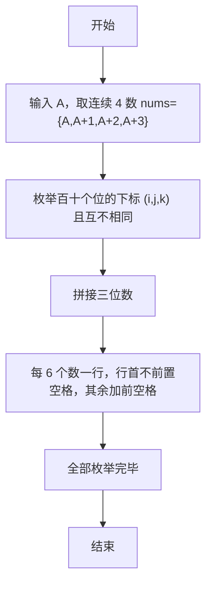

> **摘要**：本文是 PTA 编程题“7-16 求符合给定条件的整数集”的题解，涵盖题目描述、输入输出格式及 C 语言实现，展示从 4 个连续数字中全排列取 3 位组成无重复三位数，并按 6 个一行、行末无多余空格的格式化输出。

## 题目描述
给定不超过6的正整数A，考虑从A开始的连续4个数字。请输出所有由它们组成的无重复数字的3位数。

### 输入格式：

输入在一行中给出A。

### 输出格式：

输出满足条件的的3位数，要求从小到大，每行6个整数。整数间以空格分隔，但行末不能有多余空格。

### 输入样例：

```
2
```

### 输出样例：

```
234 235 243 245 253 254
324 325 342 345 352 354
423 425 432 435 452 453
523 524 532 534 542 543
```

## 解题思路

这道题的核心是**从 4 个元素中枚举 3 个位置（i,j,k）的全排列（i≠j, j≠k, i≠k）**，并按数组递增下标的遍历顺序输出，最后控制行末空格格式。

### 核心问题分析

1. **4 个连续数字**：nums = {A, A+1, A+2, A+3}。
2. **无重复 3 位数**：i、j、k 必须两两不同，才能保证 nums[i], nums[j], nums[k] 三个数字不重复。
3. **输出顺序**：因为数组本身递增，且遍历顺序是最外层 i=0→3，次层 j=0→3，内层 k=0→3，所以组合自然是"升序"的（234,235,243,245,...），与样例完全一致。
4. **格式**：每行 6 个数；第一个数前不加空格，其余前面加空格 → 行末不会有多余空格。

### 算法原理说明

三重 for 嵌套 + 两两不同判据：
- for (i=0..3), for (j=0..3), for (k=0..3)：
  - if (i!=j && j!=k && i!=k)：
    - num = nums[i]*100 + nums[j]*10 + nums[k]
    - 若 count%6==0：首个，直接 %d 并考虑前是否需换行
    - 否则：前置空格
    - count++

### 具体计算步骤

1. scanf("%d", &A)
2. int nums[4] = {A, A+1, A+2, A+3}, count=0
3. 三层 i,j,k in 0..3：
   - if 互不相同 → 组成 num
   - 每 6 个先判断 count>0 且 count%6==0 → 换行
   - 每行第一个 %d，其它 " %d"
   - count++
4. 最后补 printf("\n")

## 代码部分实现
```c
#include <stdio.h>  // 引入标准输入输出头文件

int main(void)  // 主函数
{
    int A, i, j, k, count = 0;  // 定义起始数字、三个循环变量和计数器
    scanf("%d", &A);  // 读取输入的正整数A
    int nums[4] = {A, A+1, A+2, A+3};  // 存储从A开始的连续4个数字
    
    for (i = 0; i < 4; i++) {  // 遍历百位数字
        for (j = 0; j < 4; j++) {  // 遍历十位数字
            for (k = 0; k < 4; k++) {  // 遍历个位数字
                if (i != j && j != k && i != k) {  // 确保三个数位上的数字互不相同
                    int num = nums[i] * 100 + nums[j] * 10 + nums[k];  // 组成三位数
                    if (count > 0 && count % 6 == 0) {  // 每行输出6个，到第6个时换行
                        printf("\n");
                    }
                    if (count % 6 == 0) {  // 每行第一个数前不加空格
                        printf("%d", num);
                    } else {  // 每行其余数前加空格分隔
                        printf(" %d", num);
                    }
                    count++;  // 计数器加1
                }
            }
        }
    }
    printf("\n");  // 输出换行
    
    return 0;  // 返回0，表示程序正常结束
}
```

## 代码流程说明

### 1. 变量与输入
- A：起始整数（≤6）
- nums[4] = {A, A+1, A+2, A+3}
- count = 0：已输出个数

### 2. 三重循环遍历所有位置
- i, j, k 各自从 0..3，分别对应百、十、个位在 nums 的下标
- 仅当三者互不相同才进入构造：num = nums[i]*100 + nums[j]*10 + nums[k]

### 3. 行首换行 & 空格分隔
- **换行**：在输出新数前，若 count>0 且 count%6==0（说明上一行刚满 6 个）→ printf("\n")
- **空格**：
  - count%6 == 0（行首第一个）→ 直接 printf("%d", num)，不加前置空格
  - 其它 → " %d"，前置一个空格 → 行末不会有多余空格

### 4. count++ & 末尾补换行
- 每输出一个数 count++
- 全部循环结束后再一个 printf("\n")，确保最后有换行

## 代码流程图

```mermaid
flowchart TD
  A["开始\nmain()"] --> B["读入 A\nnums[4]={A,A+1,A+2,A+3}\ncount=0"]
  B --> C["i∈0..3"]
  C --> D["j∈0..3"]
  D --> E["k∈0..3"]
  E --> F{"i≠j && j≠k && i≠k?"}
  F -- "否" --> G["下一组 i,j,k"]
  F -- "是" --> H["num = nums[i]*100 + nums[j]*10 + nums[k]"]
  H --> I{"count>0 && count%6==0?"}
  I -- "是" --> J["printf 换行"]
  I -- "否" --> K{"count%6==0?"}
  J --> K
  K -- "是" --> L["printf(\"%d\", num)"]
  K -- "否" --> M["printf(\" %d\", num)"]
  L --> N["count++"]
  M --> N
  N --> G
  G --> O["三层循环结束?"]
  O -- "否" --> C
  O -- "是" --> P["printf 换行"]
  P --> Q["return 0"]
  Q --> R["结束"]
```

## 解题流程图


