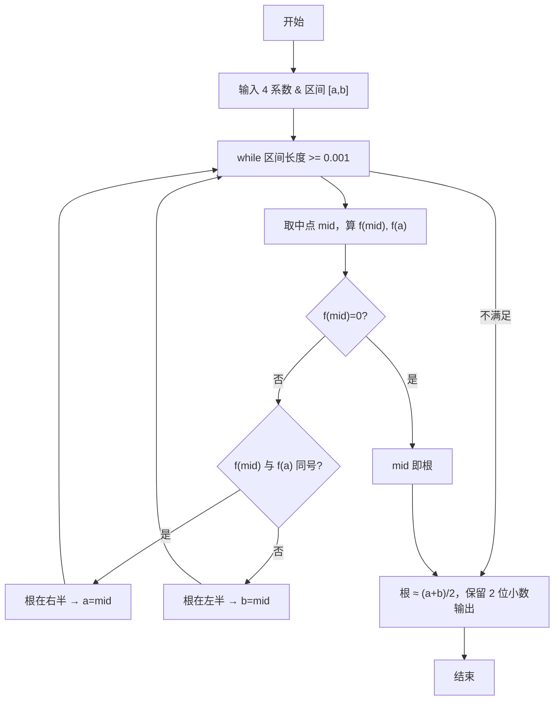

> **摘要**：本文是 PTA 编程题“7-18 二分法求多项式单根”的题解，涵盖题目描述、输入输出格式及 C 语言实现，展示在区间 [a,b] 上连续异号端点时，用中点反复折半直到区间长度 < 阈值，取中点近似根的数值方法。

## 题目描述
二分法求函数根的原理为：如果连续函数f(x)在区间[a,b]的两个端点取值异号，即f(a)f(b)<0，则它在这个区间内至少存在1个根r，即f(r)=0。

二分法的步骤为：

检查区间长度，如果小于给定阈值，则停止，输出区间中点(a+b)/2；否则
如果f(a)f(b)<0，则计算中点的值f((a+b)/2)；
如果f((a+b)/2)正好为0，则(a+b)/2就是要求的根；否则
如果f((a+b)/2)与f(a)同号，则说明根在区间[(a+b)/2,b]，令a=(a+b)/2，重复循环；
如果f((a+b)/2)与f(b)同号，则说明根在区间[a,(a+b)/2]，令b=(a+b)/2，重复循环。

本题目要求编写程序，计算给定3阶多项式f(x)=a₃x³ + a₂x² + a₁x + a₀在给定区间[a,b]内的根。

### 输入格式：

输入在第1行中顺序给出多项式的4个系数a₃、a₂、a₁、a₀，在第2行中顺序给出区间端点a和b。题目保证多项式在给定区间内存在唯一单根。

### 输出格式：

在一行中输出该多项式在该区间内的根，精确到小数点后2位。

### 输入样例：

```
3 -1 -3 1
-0.5 0.5
```

### 输出样例：

```
0.33
```

## 解题思路

这道题的核心是**二分法求函数根**：在函数两端异号的 [a,b] 上不断取中点 mid，判断中点函数值与端点同号来缩小区间，直到区间长度 < 0.001（保证最后四舍五入保留 2 位小数的正确性）。

### 核心问题分析

1. **函数计算**：直接用 f(x) = a3·x³ + a2·x² + a1·x + a0；可用辅助函数避免重复写。
2. **同号判定**：fm * fa > 0 表示 f(mid) 与 f(a) 同号 → 根在右半；否则在左半。
3. **阈值**：要求输出精确到 0.01，取 b-a < 0.001 就足够（因为区间的中点到真实根的距离 < 区间长度一半 < 0.0005，四舍五入到两位小数无误差）。
4. **特殊情况**：若 fm == 0，mid 就是根，可直接 break。

### 算法原理说明

循环缩小区间：
- while (b - a >= 0.001)
  - mid = (a+b)/2
  - 计算 fa = f(a), fm = f(mid)
  - if (fm == 0) break
  - else if (fm * fa > 0) → a = mid
  - else → b = mid
- 结果 = (a+b)/2，%.2f 输出

### 具体计算步骤

1. scanf 读 a3, a2, a1, a0；再读 a, b
2. while (b - a >= 0.001):
   - mid = (a+b)/2
   - fm = f(mid); fa = f(a)
   - fm==0 退出
   - fm*fa>0 → 根在右半(a=mid)；否则根在左半(b=mid)
3. printf("%.2f\n", (a+b)/2)

## 代码部分实现
```c
#include <stdio.h>

// 计算多项式f(x) = a3*x^3 + a2*x^2 + a1*x + a0的值
double f(double a3, double a2, double a1, double a0, double x)
{
    return a3 * x * x * x + a2 * x * x + a1 * x + a0; // 返回多项式在x处的值
}

int main(void)
{
    double a3, a2, a1, a0; // 多项式的四个系数
    double a, b, mid; // 区间端点a、b和中点mid
    scanf("%lf %lf %lf %lf", &a3, &a2, &a1, &a0); // 读取多项式系数
    scanf("%lf %lf", &a, &b); // 读取区间端点
    
    while (b - a >= 0.001) { // 当区间长度大于等于0.001时继续二分
        mid = (a + b) / 2; // 计算中点
        double fm = f(a3, a2, a1, a0, mid); // 计算中点处的函数值
        double fa = f(a3, a2, a1, a0, a); // 计算左端点处的函数值
        
        if (fm == 0) { // 中点处函数值为0，找到根
            break;
        } else if (fm * fa > 0) { // 中点与左端点函数值同号，根在右半区间
            a = mid; // 更新左端点
        } else { // 根在左半区间
            b = mid; // 更新右端点
        }
    }
    
    printf("%.2f\n", (a + b) / 2); // 输出区间中点作为根的近似值，精确到小数点后2位
    return 0;
}
```

## 代码流程说明

### 1. 辅助函数 f(x)
- 输入 x：返回 a3*x³ + a2*x² + a1*x + a0

### 2. 主函数输入
- 先读 a3, a2, a1, a0（四个系数）
- 再读 a, b（区间两端点）

### 3. while 迭代缩区
- 终止条件：b - a < 0.001
- 每轮：
  - mid = (a+b)/2
  - fm = f(mid), fa = f(a)
  - **fm == 0** → 已找到精确根，break
  - **fm 与 fa 同号 (fm*fa > 0)** → 根在右半，a = mid
  - **否则** → 根在左半，b = mid

### 4. 输出近似根
- 取当前区间中点 (a+b)/2；%.2f 四舍五入到 2 位小数

## 代码流程图

```mermaid
flowchart TD
  A["开始\nmain()"] --> B["读入 4 系数和 [a,b]"]
  B --> C{"b - a >= 0.001?"}
  C -- "是" --> D["mid = (a+b)/2\nfm=f(mid), fa=f(a)"]
  D --> E{"fm == 0?"}
  E -- "是" --> F["break（已找到根）"]
  E -- "否" --> G{"fm*fa > 0?"}
  G -- "是" --> H["a = mid（根在右）"]
  G -- "否" --> I["b = mid（根在左）"]
  H --> C
  I --> C
  C -- "否" --> J["近似根 = (a+b)/2"]
  F --> J
  J --> K["printf(\"%.2f\", root)"]
  K --> L["return 0"]
  L --> M["结束"]
```

## 解题流程图


