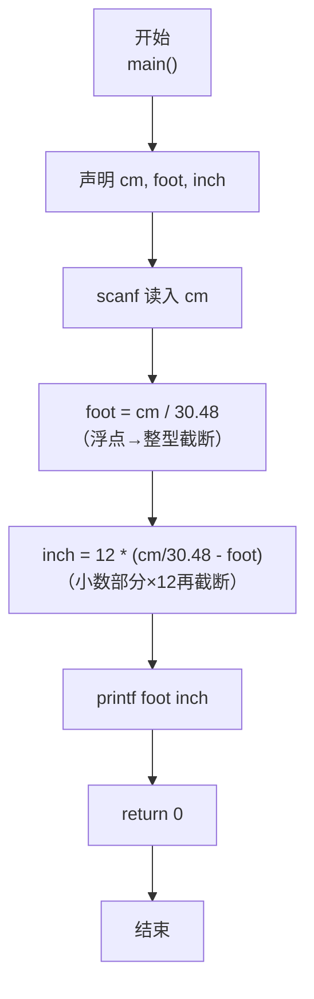
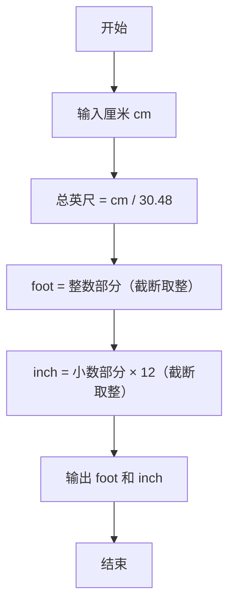

> **摘要**：本文是 PTA 编程题“7-1 厘米换算英尺英寸”的题解，涵盖题目描述、输入输出格式及 C 语言实现，展示厘米转英制英尺英寸的换算方法与浮点到整型的截断处理。

## 题目描述
如果已知英制长度的英尺*f**oo**t*和英寸*in**c**h*的值，那么对应的米是(*f**oo**t*+*in**c**h*/12)×0.3048。现在，如果用户输入的是厘米数，那么对应英制长度的英尺和英寸是多少呢？别忘了1英尺等于12英寸。

### 输入格式：

输入在一行中给出1个正整数，单位是厘米。

### 输出格式：

在一行中输出这个厘米数对应英制长度的英尺和英寸的整数值，中间用空格分开。英寸的值应小于12。

### 输入样例：

```in
170
```

### 输出样例：

```out
5 6
```

## 解题思路

这道题的核心是**单位换算 + 截断取整分离整数/小数部分**。

### 核心问题分析

已知 1 英尺 = 0.3048 米 = 30.48 厘米。输入厘米数 cm 后：
1. 先算总英尺数（带小数）：cm / 30.48
2. 对总英尺数做"截断取整"得到整数英尺 foot
3. 小数部分 × 12 得到剩余英寸 inch（需再做一次截断取整）

### 算法原理说明

利用 C 语言"浮点赋值给整型自动截断（朝零取整）"的特性：
- foot = cm / 30.48（浮点除法得到总英尺数，赋给 int 自动去小数）
- inch = 12 × (cm/30.48 - foot)（小数部分 × 12 再赋给 int 截断）

### 具体计算步骤

1. 读入正整数 cm
2. foot = cm / 30.48（浮点除 → 赋值给 int 截断）
3. inch = 12 * (cm / 30.48 - foot)（剩余小数 × 12 再截断）
4. 输出 "%d %d\n", foot, inch

## 代码部分实现
```c
#include <stdio.h> // 引入标准输入输出头文件

int main() // 主函数入口
{
    int cm; // 声明整型变量cm，存储输入的厘米数
    int foot, inch; // 声明整型变量foot和inch，分别存储英尺和英寸
    scanf("%d", &cm); // 从标准输入读取一个整数，存入cm
    foot = cm / 30.48; // 将厘米转换为英尺：1英尺=30.48厘米，整数赋值自动取整
    inch = 12 * (cm / 30.48 - foot); // 计算剩余的英寸：总英寸数减去整英尺数后乘12
    printf("%d %d\n", foot, inch); // 输出英尺和英寸，中间用空格分隔
    return 0; // 程序正常结束，返回0
}
```

## 代码流程说明

### 1. 变量声明
- `int cm`：存输入的厘米数（正整数）
- `int foot, inch`：存换算后的英尺和英寸整数部分

### 2. 读取输入
- `scanf("%d", &cm)` 读取正整数厘米

### 3. 换算英尺
- `foot = cm / 30.48`：cm ÷ 30.48 得到总英尺浮点数，赋给 int 自动截断小数

### 4. 换算英寸
- `inch = 12 * (cm/30.48 - foot)`：总英尺数减去整数英尺得到小数英尺，乘以 12 转英寸后赋给 int 截断

### 5. 输出结果
- `printf("%d %d\n", foot, inch)`：按要求输出

## 代码流程图



## 解题流程图


