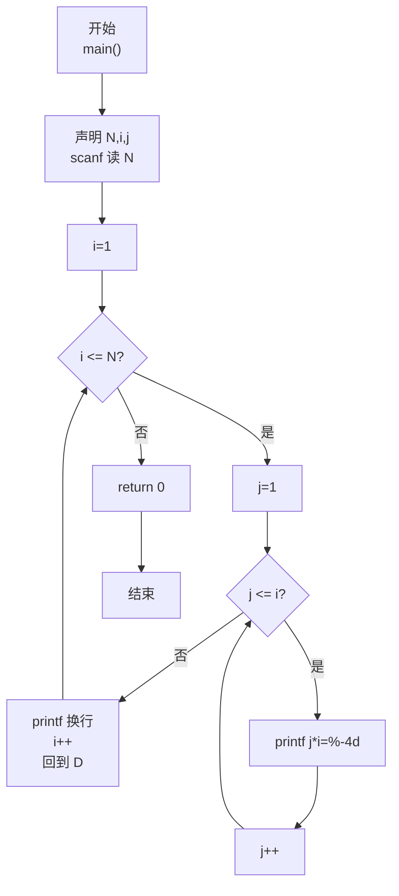
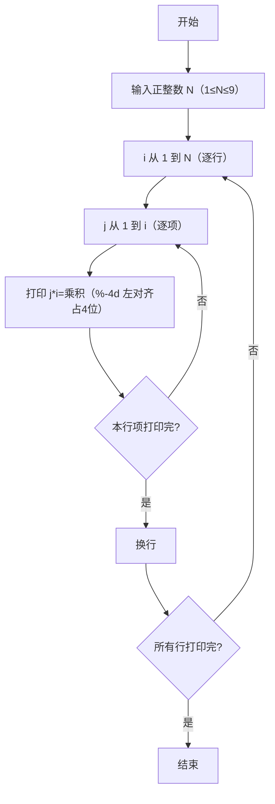

> **摘要**：本文是 PTA 编程题"7-20 打印九九口诀表"的题解，涵盖题目描述、输入输出格式及 C 语言实现，展示使用双层循环输出下三角乘法口诀表，以及使用 `%-4d` 格式控制符实现等号右边数字左对齐占 4 位的格式化输出方法。

## 题目描述
下面是一个完整的下三角九九口诀表：

1*1=1   
1*2=2   2*2=4   
1*3=3   2*3=6   3*3=9   
1*4=4   2*4=8   3*4=12  4*4=16  
1*5=5   2*5=10  3*5=15  4*5=20  5*5=25  
1*6=6   2*6=12  3*6=18  4*6=24  5*6=30  6*6=36  
1*7=7   2*7=14  3*7=21  4*7=28  5*7=35  6*7=42  7*7=49  
1*8=8   2*8=16  3*8=24  4*8=32  5*8=40  6*8=48  7*8=56  8*8=64  
1*9=9   2*9=18  3*9=27  4*9=36  5*9=45  6*9=54  7*9=63  8*9=72  9*9=81  

本题要求对任意给定的一位正整数N，输出从1*1到N*N的部分口诀表。

### 输入格式：

输入在一行中给出一个正整数N（1≤N≤9）。

### 输出格式：

输出下三角N*N部分口诀表，其中等号右边数字占4位、左对齐。

### 输入样例：

```
4
```

### 输出样例：

```
1*1=1   
1*2=2   2*2=4   
1*3=3   2*3=6   3*3=9   
1*4=4   2*4=8   3*4=12  4*4=16  
```

## 解题思路

这道题的核心是**双层循环控制下三角输出 + 格式化对齐**：外层循环控制行数（被乘数 i），内层循环控制每行的项数（乘数 j 从 1 到 i），用 `%-4d` 保证乘积左对齐占 4 个字符宽度。

### 核心问题分析

1. **下三角结构**：第 i 行（i 从 1 到 N）恰好有 i 项乘法式，形式为 `j*i`，其中 j 从 1 到 i。这保证了只输出下三角部分（不重复上三角）。
2. **格式化对齐**：等号右边的乘积需要"占 4 位、左对齐"。C 语言中 `%-4d` 的 `-` 表示左对齐，`4` 表示最小宽度为 4，不足时用空格补齐。例如：
   - `1` → `"1   "`（1 + 3 空格）
   - `12` → `"12  "`（12 + 2 空格）
   - `81` → `"81  "`（81 + 2 空格）

### 算法原理说明

两层嵌套 for 循环：
- 外层 `for (i = 1; i <= N; i++)`：枚举每一行（被乘数为 i）
- 内层 `for (j = 1; j <= i; j++)`：枚举当前行中的每一项（乘数 j 从 1 到 i）
- 每行结束后输出换行 `printf("\n")`

### 具体计算步骤

1. 读入正整数 N
2. 外层 i 从 1 到 N：
   - 内层 j 从 1 到 i：
     - `printf("%d*%d=%-4d", j, i, j*i)`
   - 输出换行
3. return 0

## 代码部分实现
```c
#include <stdio.h> // 引入标准输入输出头文件，提供 scanf、printf

int main(void) // 主函数入口，void 表示无命令行参数
{
    int N, i, j; // N 为口诀表的行数（1≤N≤9），i 为当前行号（被乘数），j 为当前列号（乘数）
    scanf("%d", &N); // 从标准输入读取一个正整数存入 N
    
    // 输出下三角 N*N 部分口诀表
    for (i = 1; i <= N; i++) { // 外层循环：控制行数，从第 1 行到第 N 行
        for (j = 1; j <= i; j++) { // 内层循环：控制第 i 行的项数，j 从 1 到 i（保证下三角）
            printf("%d*%d=%-4d", j, i, j * i); // 输出 j*i=乘积，%-4d 左对齐占 4 位，不足补空格
        }
        printf("\n"); // 第 i 行所有项输出完毕，换行进入下一行
    }
    
    return 0; // 程序正常结束，返回 0
}
```

## 代码流程说明

### 1. 变量声明
- `int N`：口诀表的规模（1 到 9），决定行数和最大乘法式
- `int i`：外层循环变量，表示当前行号（即被乘数），取值 1..N
- `int j`：内层循环变量，表示当前项的乘数，取值 1..i

### 2. 读取输入
- `scanf("%d", &N)` 读取用户输入的正整数 N

### 3. 双层循环输出口诀表
- **外层 i 循环**：i 从 1 到 N，共 N 轮，每轮对应一行
- **内层 j 循环**：j 从 1 到 i，第 i 行恰好有 i 项乘法式
  - `printf("%d*%d=%-4d", j, i, j*i)`：按格式输出一项，如 `1*4=4   `
  - `%-4d` 中 `-` 表示左对齐，`4` 表示最小宽度 4，不足部分用空格填充
- 每行结束后 `printf("\n")` 换行

### 4. 返回
- `return 0`

## 代码流程图



## 解题流程图


