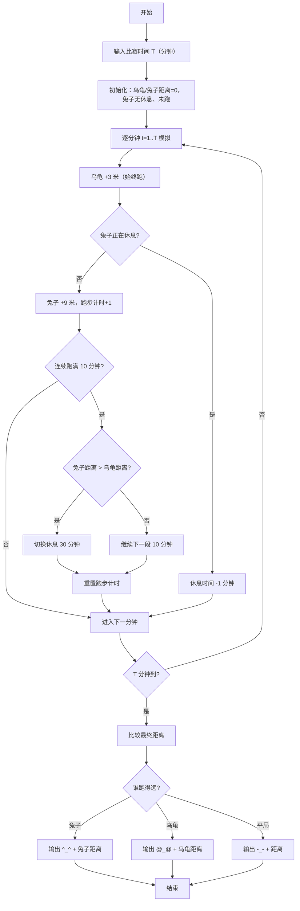

> **摘要**：本文是 PTA 编程题"7-22 龟兔赛跑"的题解，涵盖题目描述、输入输出格式及 C 语言实现，展示通过逐分钟模拟（乌龟匀速前进、兔子每跑 10 分钟检查一次并可能休息 30 分钟）的过程模拟法，最终比较 T 分钟后两者距离并按格式输出胜者及距离。

## 题目描述
乌龟与兔子进行赛跑，跑场是一个矩型跑道，跑道边可以随地进行休息。乌龟每分钟可以前进3米，兔子每分钟前进9米；兔子嫌乌龟跑得慢，觉得肯定能跑赢乌龟，于是，每跑10分钟回头看一下乌龟，若发现自己超过乌龟，就在路边休息，每次休息30分钟，否则继续跑10分钟；而乌龟非常努力，一直跑，不休息。假定乌龟与兔子在同一起点同一时刻开始起跑，请问T分钟后乌龟和兔子谁跑得快？

### 输入格式：

输入在一行中给出比赛时间T（分钟）。

### 输出格式：

在一行中输出比赛的结果：乌龟赢输出@_@，兔子赢输出^_^，平局则输出-_-；后跟1空格，再输出胜利者跑完的距离（平局输出乌龟或兔子跑完的距离均可）。

### 输入样例：

```in
242
```

### 输出样例：

```out
@_@ 726
```

## 解题思路

这道题的核心是**按分钟为单位的过程模拟**：乌龟每分钟 +3 米（始终跑）；兔子存在"跑 10 分钟 → 判断 → 要么继续跑 10 分钟、要么休息 30 分钟"的状态机。使用 `run_time` 记录当前连续跑了几分钟，`rest_time` 记录剩余休息分钟数，逐分钟推进到 T 分钟，再比较距离。

### 核心问题分析

1. **乌龟行为**：始终匀速跑，每分钟 3 米。T 分钟后距离 = 3 × T，直接公式即可，但为了和兔子统一，模拟中同样每分钟 +3。
2. **兔子行为（状态机）**：
   - **运行态**：每分钟跑 +9 米，`run_time++`；当 `run_time == 10` 时，检查是否 `rabbit > turtle`：
     - 若超过 → 切换到"休息态"，`rest_time = 30`，`run_time = 0`
     - 若未超过 → 继续跑，`run_time = 0`（开始新的一段 10 分钟）
   - **休息态**：不跑，每分钟 `rest_time--`，到 0 时回到"运行态"
3. **最终判定**：比较 `rabbit` 和 `turtle`：
   - rabbit > turtle → `^_^ rabbit`
   - turtle > rabbit → `@_@ turtle`
   - 相等 → `-_- turtle`（题目说平局输出任一个距离均可）

### 算法原理说明

逐分钟 for 循环 `for (t=1; t<=T; t++)`：
- 先无条件 `turtle += 3`（乌龟一直跑）
- 若 `rest_time > 0`：兔子休息，`rest_time--`
- 否则：兔子跑步，`rabbit += 9; run_time++`；若 `run_time == 10`，则判断是否切换休息，然后 `run_time = 0`
- 最后比较两者距离，按规定符号+距离输出

### 具体计算步骤

1. 读入 T
2. 初始化 `turtle=0, rabbit=0, rest_time=0, run_time=0`
3. `for (int t = 1; t <= T; t++)`：
   - `turtle += 3`
   - 若 `rest_time > 0` → `rest_time--`
   - 否则：
     - `rabbit += 9; run_time++`
     - 若 `run_time == 10`：
       - 若 `rabbit > turtle` → `rest_time = 30`
       - `run_time = 0`
4. 比较 rabbit 与 turtle，按格式输出对应表情符号和距离
5. return 0

## 代码部分实现
```c
#include <stdio.h> // 引入标准输入输出头文件，提供 scanf、printf

int main() // 主函数入口
{
    int T; // T 为比赛总时间（分钟）
    scanf("%d", &T); // 从标准输入读取比赛时间 T
    
    int turtle = 0;  // 乌龟累计跑过的距离（米），初始 0
    int rabbit = 0;  // 兔子累计跑过的距离（米），初始 0
    int rest_time = 0;  // 兔子当前剩余休息时间（分钟），>0 表示处于休息态
    int run_time = 0;   // 兔子当前连续跑步时间（分钟），每到 10 分钟触发一次检查
    
    // 以分钟为单位，逐分钟模拟 T 分钟内的比赛过程
    for (int t = 1; t <= T; t++) {
        turtle += 3;  // 乌龟每分钟跑 3 米（永不休息）
        
        if (rest_time > 0) {
            rest_time--;  // 兔子在休息，每分钟剩余休息时间减 1
        } else {
            rabbit += 9;  // 兔子在跑步，每分钟跑 9 米
            run_time++;   // 连续跑步时间累加
            
            // 每累计跑满 10 分钟，回头检查并决定是否休息
            if (run_time == 10) {
                if (rabbit > turtle) {
                    rest_time = 30;  // 超过乌龟，切换到休息态，休息 30 分钟
                }
                run_time = 0;  // 重置连续跑步计时，开始新一段
            }
        }
    }
    
    // 比较 T 分钟后两者距离，按要求输出结果
    if (rabbit > turtle) {
        printf("^_^ %d\n", rabbit);  // 兔子赢：^_^ + 兔子距离
    } else if (turtle > rabbit) {
        printf("@_@ %d\n", turtle);  // 乌龟赢：@_@ + 乌龟距离
    } else {
        printf("-_- %d\n", turtle);  // 平局：-_- + 任一距离均可，此处取乌龟
    }
    
    return 0; // 程序正常结束，返回 0
}
```

## 代码流程说明

### 1. 变量声明与输入
- `int T`：总比赛分钟数
- `int turtle = 0`、`int rabbit = 0`：两者累计米数
- `int rest_time = 0`：兔子剩余休息分钟（0 表示不休息）
- `int run_time = 0`：兔子本轮连续跑步分钟数
- `scanf("%d", &T)` 读入 T

### 2. 逐分钟模拟 T 分钟
- **乌龟**：`turtle += 3`，每分钟无条件加 3 米
- **兔子**：
  - 若 `rest_time > 0` → 休息，`rest_time--`
  - 否则 → 跑步：`rabbit += 9; run_time++`
    - 若 `run_time == 10`：
      - 若 `rabbit > turtle` → `rest_time = 30`（进入 30 分钟休息）
      - `run_time = 0`（重置跑步计时）

### 3. 结果输出
- rabbit > turtle → `^_^ rabbit`
- turtle > rabbit → `@_@ turtle`
- 相等 → `-_- turtle`（平局取任一均可）

### 4. 返回
- `return 0`

## 代码流程图

```mermaid
flowchart TD
  A["开始\nmain()"] --> B["读入 T\nturtle=0, rabbit=0\nrest=0, run=0"]
  B --> C["t=1"]
  C --> D{"t <= T?"}
  D -- "否" --> P["比较 rabbit vs turtle"]
  D -- "是" --> E["turtle += 3"]
  E --> F{"rest_time > 0?"}
  F -- "是" --> G["rest_time--"]
  F -- "否" --> H["rabbit += 9\nrun_time++"]
  H --> I{"run_time == 10?"}
  I -- "否" --> N
  I -- "是" --> J{"rabbit > turtle?"}
  J -- "是" --> K["rest_time = 30"]
  J -- "否" --> L["继续跑"]
  K --> M["run_time = 0"]
  L --> M
  M --> N["t++"]
  G --> N
  N --> D
  P --> Q{"rabbit>turtle?"}
  Q -- "是" --> R["printf ^_^ rabbit"]
  Q -- "否" --> S{"turtle>rabbit?"}
  S -- "是" --> T["printf @_@ turtle"]
  S -- "否" --> U["printf -_- turtle"]
  R --> V["return 0"]
  T --> V
  U --> V
  V --> W["结束"]
```

## 解题流程图


