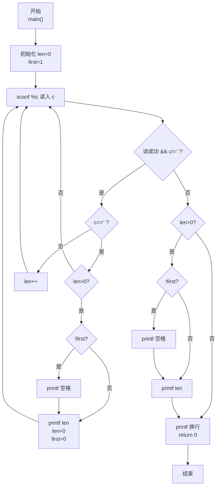
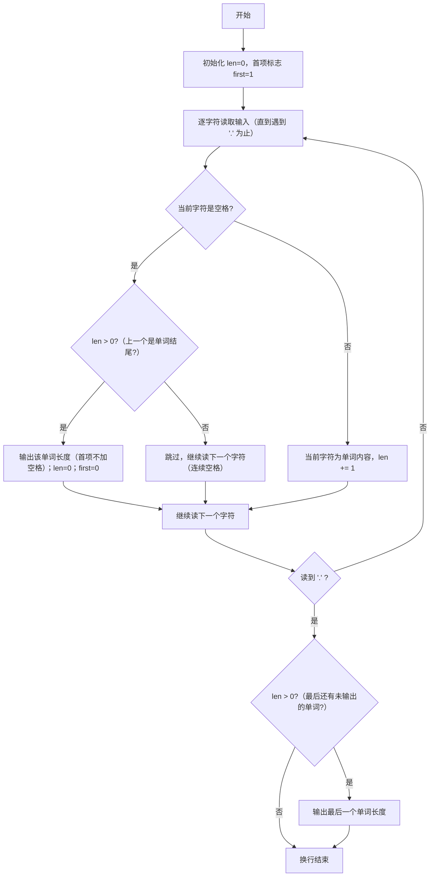

> **摘要**：本文是 PTA 编程题"7-26 单词长度"的题解，涵盖题目描述、输入输出格式及 C 语言实现，展示使用 `scanf("%c")` 逐字符读取直到遇到 `.` 为止，并通过长度计数器 `len` 和首项标志 `first` 实现：按空格切分单词、跳过连续空格、输出每个单词长度且行末无多余空格的方法。

## 题目描述
你的程序要读入一行文本，其中以空格分隔为若干个单词，以.结束。你要输出每个单词的长度。这里的单词与语言无关，可以包括各种符号，比如it's算一个单词，长度为4。注意，行中可能出现连续的空格；最后的.不计算在内。

### 输入格式：

输入在一行中给出一行文本，以.结束

提示：用scanf("%c",...);来读入一个字符，直到读到.为止。

### 输出格式：

在一行中输出这行文本对应的单词的长度，每个长度之间以空格隔开，行末没有最后的空格。

### 输入样例：

```in
It's great to see you here.
```

### 输出样例：

```out
4 5 2 3 3 4
```

## 解题思路

这道题的核心是**逐字符状态机（读字符 → 空格/非空格切换计数） + 切分条件 + 空格分隔格式控制**：用 `scanf("%c")` 循环读直到读到 `.`；非空格字符 `len++` 累加当前单词长度；遇到空格时若 `len>0` 则"输出 len 并清零"（跳过连续空格由 `len>0` 保证）；循环结束后还要处理最后一个单词（避免 `.` 前无空格导致最后一个单词没输出）。

### 核心问题分析

1. **结束条件**：遇到字符 `'.'` 立即停止读取。`scanf("%c", &c)` 每次只读一个字符（含空格、标点、换行等），配合判断 `c != '.'` 正好满足要求。
2. **单词切分规则**：
   - 一个"单词"是连续非空格、非 `.` 的字符序列。
   - 连续空格不产生空单词：当遇到空格时，只有 `len > 0`（即前一个字符属于某个单词）才输出当前长度并重置 len=0。连续空格会使 len 已经为 0，于是跳过输出，避免多余的 0 长度。
3. **末尾单词处理**：输入以 `.` 结束，而最后一个单词与 `.` 之间没有空格（如样例 `here.`），因此当循环退出时，若 `len > 0` 还需再输出一次最后那个单词的长度。
4. **格式控制（行末无多余空格）**：使用首项标志 `first`：
   - 第一个长度输出前不加空格，然后置 `first=0`
   - 从第二个长度起，先输出空格再输出数字
   - 行末自然无多余空格

### 算法原理说明

变量：`char c`（当前字符）、`int len = 0`（当前单词长度）、`int first = 1`（是否第一个输出项）
- 循环 `while (scanf("%c",&c) && c != '.')`：
  - 若 `c == ' '` 且 `len > 0` → 按 first 控制格式输出 len → len=0 → first=0
  - 若 `c != ' '`（非空格）→ `len++`
- 循环结束（读到 `.`）后：若 `len > 0` → 再输出一次最后那个单词长度
- 换行返回

以输入 `It's great to see you here.` 为例：
- 读到空格分隔符时依次输出 4, 5, 2, 3, 3
- 读到 `.` 退出循环，此时 len=4(`here`)，补充输出最后一个 4
- 最终：`4 5 2 3 3 4`

### 具体计算步骤

1. 初始化 `len = 0; first = 1;`
2. 逐字符读：
   - 读 `I` `t` `'` `s` → len 累加到 4
   - 读空格 → len=4>0 → 输出 4，len=0，first=0
   - 读 `g r e a t` → len=5，空格时输出 5，len=0
   - 读 `t o` → len=2，空格时输出 2，len=0
   - 读 `s e e` → len=3，空格时输出 3，len=0
   - 读 `y o u` → len=3，空格时输出 3，len=0
   - 读 `h e r e` → len=4，然后读到 `.` → 退出循环
3. 循环结束 len=4>0 → 最后输出 4
4. 换行

## 代码部分实现
```c
#include <stdio.h>  // 引入标准输入输出头文件，提供 scanf、printf

int main() {
    char c;          // 字符变量 c：每次读入的一个字符
    int len = 0;     // len：当前正在累加的单词长度计数器，初始 0
    int first = 1;   // first：首项输出标志，1 表示下一个长度是第一个（前面不加空格）
    
    // 逐字符读入，直到读到 '.' 为止
    while (scanf("%c", &c) == 1 && c != '.') {
        if (c == ' ') {           // 当前字符是空格（可能的单词分隔点）
            if (len > 0) {        // 只有当前长度>0才说明是"刚结束一个单词"（过滤连续空格）
                if (!first) {     // 若不是第一个输出项 → 先打印空格分隔
                    printf(" ");
                }
                printf("%d", len); // 输出刚结束的这个单词长度
                len = 0;           // 重置长度计数器，准备下一个单词
                first = 0;         // 之后再有长度输出就不是第一个了
            }
        } else {                  // 当前字符非空格（属于某个单词的一部分）
            len++;                // 单词长度 +1（含符号，如 it's 的撇号也算长度）
        }
    }
    // 循环结束（读到 '.'）：若最后一个字符到 '.' 之间没有空格，
    // 则最后一个单词还未输出，需要补输出一次
    if (len > 0) {
        if (!first) {             // 如果之前已有输出项 → 先空格
            printf(" ");
        }
        printf("%d", len);        // 输出最后一个单词的长度
    }
    printf("\n"); // 所有长度输出完毕，换行
    
    return 0;  // 程序正常退出，返回 0
}
```

## 代码流程说明

### 1. 变量初始化
- `char c`：保存每次读入的一个字符
- `int len = 0`：当前单词的长度计数器
- `int first = 1`：首项标志（1 表示下一次输出是第 1 项，无需前置空格）

### 2. 主循环逐字符处理
- `while (scanf("%c", &c) == 1 && c != '.')`：成功读入 1 个字符且不是 `.` 就继续
  - **遇空格**：`c == ' '` 且 `len > 0` → 按 first 规则输出 len，清零 len，置 first=0
    - `len == 0` 表示连续空格，什么都不做
  - **遇非空格**：`len++`，该字符计入当前单词长度

### 3. 处理最后一个单词（循环结束后）
- 若 `len > 0` → 说明 `.` 前还有一个单词未输出，按格式输出
- 若 `len == 0`（如 `hello .`）→ 无需额外输出

### 4. 换行返回
- `printf("\n"); return 0;`

## 代码流程图



## 解题流程图


