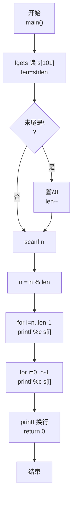
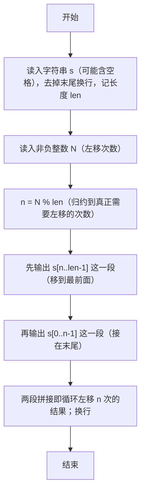

> **摘要**：本文是 PTA 编程题"7-31 字符串循环左移"的题解，涵盖题目描述、输入输出格式及 C 语言实现，展示使用 `fgets` 读取含空格字符串并去除换行、对左移位数 `N %= len` 处理 N≥长度的情况，最终通过"先打印 [n, len) 再打印 [0, n)"两段直接拼接输出循环左移结果的巧妙方法。

## 题目描述
输入一个字符串和一个非负整数N，要求将字符串循环左移N次。

### 输入格式：

输入在第1行中给出一个不超过100个字符长度的、以回车结束的非空字符串；第2行给出非负整数N。

### 输出格式：

在一行中输出循环左移N次后的字符串。

### 输入样例：

```in
Hello World!
2
```

### 输出样例：

```out
llo World!He
```

## 解题思路

这道题的核心是**"取模等效 + 两段输出拼接"**避免实际搬移字符：循环左移 N 次等价于左移 `N % len` 次（长度 len 次左移刚好回到原样）；结果字符串可以看作"原字符串的下标 N 到末尾"拼接"原字符串下标 0 到 N-1"。直接按这两段 `printf("%c", ...)` 逐字符输出即可，无需真正修改数组。

### 核心问题分析

1. **读含空格的字符串**：样例输入 `"Hello World!"` 有空格，不能用 `%s`（到空格就停），要用 `fgets(s, 101, stdin)` 读一行（最多 100 字符+结束符）。`fgets` 会把末尾的 `\n` 也读入，所以长度减 1 后手动把 `\n` 改成 `\0`。
2. **左移位数取模**：循环左移 len 次（len 是字符串长度）等于没移。令 `n = n % len`，无论 N 多大都归一化到 [0, len-1]，避免越界和无意义的重复。
   - 例：len=12、N=2 → n=2
   - 若 N=14 → n=14%12=2，结果与 N=2 相同
3. **循环左移的数学等价**：原字符串 s[0..len-1]，左移 n 位后，第 k 个字符变为原字符串中第 (k+n) mod len 个字符。换一种输出方式：
   - 先输出 s[n], s[n+1], ..., s[len-1]（后半段，即被移出后从最前绕到后面的那些字符之前的部分）
   - 再输出 s[0], s[1], ..., s[n-1]（前 n 个字符，它们被左移"挤出"左端后绕回到右端）
   - 例：`"Hello World!"` len=12, n=2
     - 先输出 s[2..11]：`llo World!`
     - 再输出 s[0..1]：`He`
     - 拼接：`llo World!He` ✓
4. **特殊情况 n=0**（N 是 len 的倍数或 N=0）：两段就是"全部 + 空串"，输出即原字符串，代码无需特判即可正确。

### 算法原理说明

1. `fgets` 读字符串 → 去 `\n` → len=strlen(s)
2. `scanf("%d", &n); n = n % len;` 归一化左移位数
3. 两段输出：
   - `for (i=n; i<len; i++) printf("%c", s[i]);`
   - `for (i=0; i<n; i++) printf("%c", s[i]);`
4. 输出换行

### 具体计算步骤

1. 第 1 行 `fgets(s, 101, stdin)` 读字符串；去掉末尾换行
2. 第 2 行 `scanf("%d", &n)` 读左移位数
3. `n %= len`（把大数归约到 0 ≤ n < len）
4. 输出后半段 s[n..len-1]
5. 输出前半段 s[0..n-1]
6. 换行

## 代码部分实现
```c
#include <stdio.h>   // 引入标准输入输出头文件，提供 fgets、scanf、printf
#include <string.h>  // 引入字符串处理头文件，提供 strlen

int main() {
    char s[101];       // 字符数组：最多 100 个有效字符 + 1 个 '\0'（共 101）
    fgets(s, 101, stdin);  // 读入第 1 行字符串（含空格，最多 100 字符）
    int len = strlen(s);   // 计算当前长度（含 fgets 读入的换行符）
    // fgets 会把行尾的 '\n' 也读入，去掉该换行并更新 len
    if (s[len - 1] == '\n') { s[len - 1] = '\0'; len--; }
    
    int n;             // n：循环左移的次数
    scanf("%d", &n);   // 读入第 2 行的非负整数 n
    n = n % len;       // 对 len 取模，n≥len 时等效于 n%len（左移 len 次回到原样）
    
    // 输出循环左移 n 位后的字符串：
    // 第 1 段：原串从下标 n 到末尾（被整体搬到新串最前）
    for (int i = n; i < len; i++) {
        printf("%c", s[i]);
    }
    // 第 2 段：原串从 0 到 n-1（左端被挤出的部分被接到末尾）
    for (int i = 0; i < n; i++) {
        printf("%c", s[i]);
    }
    printf("\n");      // 输出结束换行
    
    return 0;  // 程序正常退出，返回 0
}
```

## 代码流程说明

### 1. 读取并清理字符串
- `char s[101]` 存字符串
- `fgets(s, 101, stdin)` 读整行
- `len = strlen(s)`；若末尾是 `\n` 改为 `\0`，len--

### 2. 读 n 并归一化
- `scanf("%d", &n)`；`n = n % len`（避免越界，减少循环次数）

### 3. 两段拼接输出
- 段 1：`i = n; i < len` → 打印 s[n..len-1]
- 段 2：`i = 0; i < n` → 打印 s[0..n-1]
- 两段拼接即为"循环左移 n 位"的结果

### 4. 换行返回
- `printf("\n"); return 0;`

## 代码流程图



## 解题流程图


