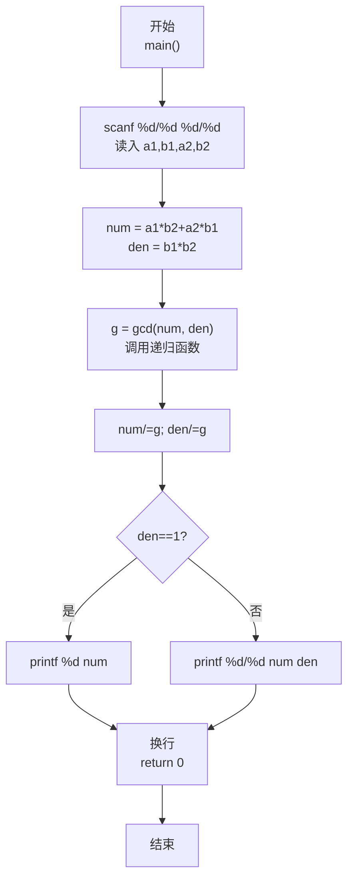
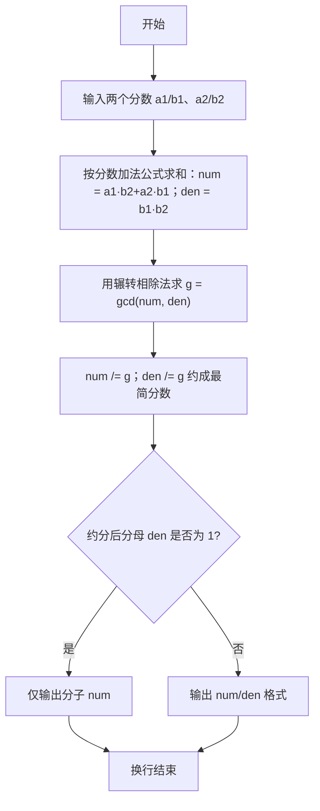

> **摘要**：本文是 PTA 编程题"7-33 有理数加法"的题解，涵盖题目描述、输入输出格式及 C 语言实现，展示用 `scanf("%d/%d %d/%d")` 解析两个分数输入、通分相加 `(a1*b2+a2*b1) / (b1*b2)`，再通过辗转相除法 gcd 约分为最简分数，最后根据分母是否为 1 决定是否省略分母的格式控制方法。

## 题目描述
本题要求编写程序，计算两个有理数的和。

### 输入格式：

输入在一行中按照a1/b1 a2/b2的格式给出两个分数形式的有理数，其中分子和分母全是整形范围内的正整数。

### 输出格式：

在一行中按照a/b的格式输出两个有理数的和。注意必须是该有理数的最简分数形式，若分母为1，则只输出分子。

### 输入样例：

```in
1/3 1/6
```

```in
4/3 2/3
```

### 输出样例：

```out
1/2
```

```out
2
```

## 解题思路

这道题的核心是**分数加法公式 + gcd 约分 + 输出格式判断**：输入按 `"a1/b1 a2/b2"` 格式读（scanf 格式串 `/` 和空格会被匹配）；通分求和得分子 `a1*b2 + a2*b1`，分母 `b1*b2`；再用 gcd 把分子分母同时除以最大公约数得到最简式；若分母是 1 只打印分子，否则按 `"%d/%d"` 打印。

### 核心问题分析

1. **分数输入解析**：使用 `scanf("%d/%d %d/%d", &a1, &b1, &a2, &b2)`，其中格式串中的 `/` 和空格严格与输入中的 `/` 和空格匹配，直接得到 4 个整数 a1,b1,a2,b2。
2. **分数加法公式**：
   - a1/b1 + a2/b2 = (a1·b2 + a2·b1) / (b1·b2)
   - 分子 `numerator = a1*b2 + a2*b1`
   - 分母 `denominator = b1 * b2`
3. **约分用 gcd**：求分子分母的最大公约数 g，再 `numerator /= g; denominator /= g;`
   - 辗转相除法求 gcd（递归或循环均可，这里用三元递归写法非常简洁）
4. **输出格式**：
   - 若约分后 `denominator == 1`（如样例 2 的 6/3 → 2/1）→ 只打印分子 `2`
   - 否则打印 `"%d/%d"`（如样例 1 的 3/6 → 1/2）
5. **样例验证**：
   - 样例 1：1/3 + 1/6 = (1·6 + 1·3)/(3·6) = 9/18 → gcd(9,18)=9 → 1/2 ✓
   - 样例 2：4/3 + 2/3 = (4·3+2·3)/(3·3) = 18/9 → gcd(18,9)=9 → 2/1 → 输出 2 ✓

### 算法原理说明

1. 输入 a1/b1 与 a2/b2
2. 分子 = a1·b2 + a2·b1，分母 = b1·b2
3. g = gcd(分子, 分母)
4. 分子 /= g，分母 /= g
5. 若分母 == 1 → printf("%d", 分子) 否则 printf("%d/%d", 分子, 分母)

### 具体计算步骤

1. 读入 a1,b1,a2,b2
2. 计算 numerator、denominator
3. 求 g = gcd(numerator, denominator)
4. 约分
5. 根据分母是否为 1 选择输出格式
6. 换行

## 代码部分实现
```c
#include <stdio.h>       // 引入标准输入输出头文件，提供 scanf、printf

// 辗转相除法求最大公约数 gcd（递归写法）
// 原理：gcd(a,b) = gcd(b, a % b)，当 b==0 时 a 就是最大公约数
int gcd(int a, int b) {
    return b == 0 ? a : gcd(b, a % b);  // 三元表达式：若 b==0 返回 a，否则递归 gcd(b, a%b)
}

int main() {
    int a1, b1, a2, b2;   // a1/b1 与 a2/b2：两个有理数的分子、分母（全为正整数）
    // 按照 a1/b1 a2/b2 的格式精确读取 4 个整数，格式串中的 '/' 与空格会匹配输入中对应字符
    scanf("%d/%d %d/%d", &a1, &b1, &a2, &b2);

    // 分数加法：a1/b1 + a2/b2 = (a1*b2 + a2*b1) / (b1*b2)
    int numerator = a1 * b2 + a2 * b1;  // 通分后分子：交叉相乘再相加
    int denominator = b1 * b2;          // 通分后分母：两个分母乘积

    // 求分子和分母的最大公约数，用于约分
    int g = gcd(numerator, denominator);
    numerator /= g;          // 分子除以最大公约数约分
    denominator /= g;        // 分母除以最大公约数约分

    if (denominator == 1) {  // 约分后分母为 1，如 2/1 → 只输出分子
        printf("%d\n", numerator);
    } else {                 // 否则按"分子/分母"格式输出
        printf("%d/%d\n", numerator, denominator);
    }

    return 0;                // 程序正常结束
}
```

## 代码流程说明

### 1. 自定义 gcd 函数（递归辗转相除）
- 入口：`int gcd(int a, int b)`
- `b == 0` → 返回 a
- 否则递归调用 `gcd(b, a % b)`

### 2. 主函数输入
- `int a1, b1, a2, b2`
- `scanf("%d/%d %d/%d", &a1, &b1, &a2, &b2)` 匹配 4 个数字

### 3. 计算相加分子分母
- numerator = a1·b2 + a2·b1
- denominator = b1·b2

### 4. 约分
- `g = gcd(numerator, denominator)`
- 分子分母分别整除 g

### 5. 按格式输出
- `denominator == 1` → `printf("%d", numerator)`
- 否则 → `printf("%d/%d", numerator, denominator)`

### 6. 返回
- `return 0`

## 代码流程图



## 解题流程图


