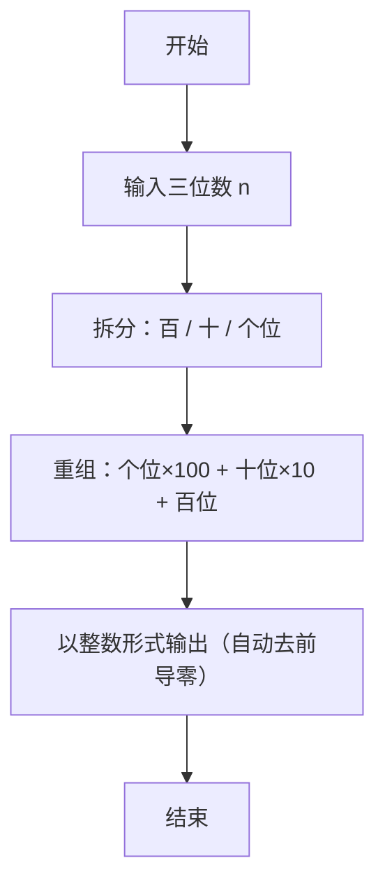

> **摘要**：本文是 PTA 编程题“7-3 逆序的三位数”的题解，涵盖题目描述、输入输出格式及 C 语言实现，展示百位/十位/个位数字拆分与逆序重组，并自然消除前导零的方法。

## 题目描述
程序每次读入一个正3位数，然后输出按位逆序的数字。注意：当输入的数字含有结尾的0时，输出不应带有前导的0。比如输入700，输出应该是7。

### 输入格式：

每个测试是一个3位的正整数。

### 输出格式：

输出按位逆序的数。

### 输入样例：

```in
123
```

### 输出样例：

```out
321
```

## 解题思路

这道题的核心是**三位数的数位拆分 + 按位倒序重组**。

### 核心问题分析

1. **数位拆分**：一个 3 位整数 n：
   - 百位 = n / 100（整数除法）
   - 十位 = (n / 10) % 10
   - 个位 = n % 10
2. **逆序重组**：新数 = 个位×100 + 十位×10 + 百位。因为结果直接存为 int 再用 %d 输出，C 会自动丢弃前导零——完美符合"输出不应有前导 0"的要求。

### 算法原理说明

直接按公式拆分重组：
- hundreds = n / 100
- tens = (n / 10) % 10
- units = n % 10
- reversed = units*100 + tens*10 + hundreds
- printf("%d", reversed)

### 具体计算步骤

1. 读入 int n（保证 3 位正整数）
2. hundreds = n / 100
3. tens = (n / 10) % 10
4. units = n % 10
5. reversed = units*100 + tens*10 + hundreds
6. printf("%d", reversed)

## 代码部分实现
```c
#include <stdio.h>  // 引入标准输入输出头文件

int main()  // 主函数
{
    int n;  // 定义输入的三位数变量
    scanf("%d", &n);  // 读入一个三位数
    
    int hundreds = n / 100;  // 提取百位数字
    int tens = (n / 10) % 10;  // 提取十位数字
    int units = n % 10;  // 提取个位数字
    int reversed = units * 100 + tens * 10 + hundreds;  // 按位逆序组成新数
    
    printf("%d", reversed);  // 输出逆序后的结果
}
```

## 代码流程说明

### 1. 变量声明 & 读取输入
- `int n` 接收 3 位整数；scanf 读入

### 2. 数位拆分
- hundreds = n / 100：仅保留百位
- tens = (n / 10) % 10：去掉个位后再取模得到十位
- units = n % 10：直接取个位

### 3. 逆序重组
- reversed = units*100 + tens*10 + hundreds：把"原个位"放到新百位，"原十位"保持十位，"原百位"放到新个位

### 4. 输出
- printf("%d", reversed)：整型输出自动去掉前导零，完美处理如 700→7 的情形

## 代码流程图

```mermaid
flowchart TD
  A["开始\nmain()"] --> B["读入 3 位数 n"]
  B --> C["hundreds = n/100"]
  C --> D["tens = (n/10) % 10"]
  D --> E["units = n % 10"]
  E --> F["reversed = units*100 + tens*10 + hundreds"]
  F --> G["printf(\"%d\", reversed)"]
  G --> H["return 0"]
  H --> I["结束"]
```

## 解题流程图


