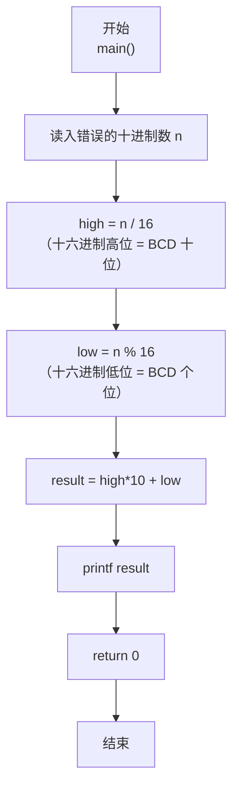
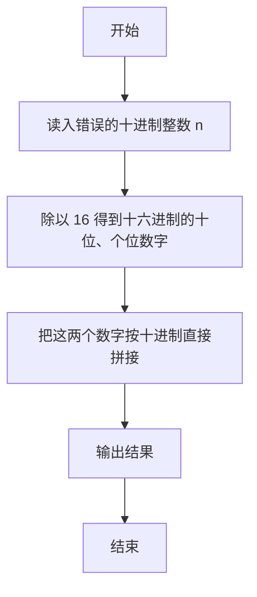

> **摘要**：本文是 PTA 编程题“7-4 BCD 解密”的题解，涵盖题目描述、输入输出格式及 C 语言实现，展示把"被误当成二进制解析的十进制整数"还原回正确 BCD 表示的思路。

## 题目描述
BCD数是用一个字节来表达两位十进制的数，每四个比特表示一位。所以如果一个BCD数的十六进制是0x12，它表达的就是十进制的12。但是小明没学过BCD，把所有的BCD数都当作二进制数转换成十进制输出了。于是BCD的0x12被输出成了十进制的18了！

现在，你的程序要读入这个错误的十进制数，然后输出正确的十进制数。提示：你可以把18转换回0x12，然后再转换回12。

### 输入格式：

输入在一行中给出一个[0, 153]范围内的正整数，保证能转换回有效的BCD数，也就是说这个整数转换成十六进制时不会出现A-F的数字。

### 输出格式：

输出对应的十进制数。

### 输入样例：

```in
18
```

### 输出样例：

```out
12
```

## 解题思路

这道题的核心是**把"错误的十进制结果"重新当成"十六进制表示"去解析**，再把得到的两位（十位数、个位数）按十进制规则组合。

### 核心问题分析

以样例来说：
- 正确的 BCD 字节是 0x12（十六进制），它的含义是"十进制 12"
- 小明把 0x12 当成普通二进制整数解析：1×16+2 = 18，这就是输入值
- 解密操作反过来：输入 18（十进制）就是 0x12，把"十六进制的十位（高4位）=1，十六进制的个位（低4位）=2"直接当成十进制的十位数和个位数 → 12。

### 算法原理说明

利用 16 进制和 10 进制的类比：
- high_digit = n / 16：得到十六进制的高位（等价于 BCD 高 4 位）
- low_digit = n % 16：得到十六进制的低位（等价于 BCD 低 4 位）
- result = high_digit × 10 + low_digit（题目保证 high、low 都在 0~9）

### 具体计算步骤

1. 读入整数 n
2. high_digit = n / 16（取"十六进制的十位"）
3. low_digit = n % 16（取"十六进制的个位"）
4. result = high_digit * 10 + low_digit
5. 输出 result

## 代码部分实现
```c
#include <stdio.h>

int main() {
    int n;
    scanf("%d", &n);
    
    // 分离十六进制的高4位（十位）和低4位（个位）
    int high_digit = n / 16;  // 获取十六进制高位（0-9）
    int low_digit = n % 16;   // 获取十六进制低位（0-9）
    
    // 组合成正确的十进制数
    int result = high_digit * 10 + low_digit;
    
    printf("%d\n", result);
    return 0;
}
```

## 代码流程说明

### 1. 变量与输入
- `int n`：存读入的"错误十进制数"；scanf 读入

### 2. 拆分"十六进制的两位"
- high_digit = n / 16：除以 16 的商 = 十六进制高位数字（等价 BCD 的十位部分）
- low_digit = n % 16：除以 16 的余数 = 十六进制低位数字（等价 BCD 的个位部分）

### 3. 组合为正确十进制
- result = high_digit × 10 + low_digit：把十六进制的两位直接当成十进制的两位读取

### 4. 输出
- printf("%d\n", result)

## 代码流程图



## 解题流程图


