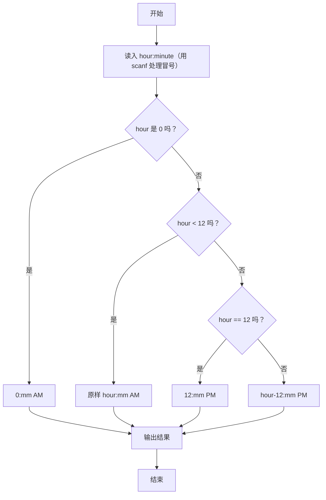

> **摘要**：本文是 PTA 编程题“7-7 12-24 小时制”的题解，涵盖题目描述、输入输出格式及 C 语言实现，展示带冒号分隔的时间读取与 24 小时制到 12 小时制加 AM/PM 的分支转换。

## 题目描述
编写一个程序，要求用户输入24小时制的时间，然后显示12小时制的时间。

### 输入格式：

输入在一行中给出带有中间的:符号（半角的冒号）的24小时制的时间，如12:34表示12点34分。当小时或分钟数小于10时，均没有前导的零，如5:6表示5点零6分。

提示：在scanf的格式字符串中加入:，让scanf来处理这个冒号。

### 输出格式：

在一行中输出这个时间对应的12小时制的时间，数字部分格式与输入的相同，然后跟上空格，再跟上表示上午的字符串AM或表示下午的字符串PM。如5:6 PM表示下午5点零6分。注意，在英文的习惯中，中午12点被认为是下午，所以24小时制的12:00就是12小时制的12:0 PM；而0点被认为是第二天的时间，所以是0:0 AM。

### 输入样例：

```in
21:11
```

### 输出样例：

```out
9:11 PM
```

## 解题思路

这道题的核心是**按冒号拆分 24 小时制时间，并按小时范围分情况转换为 12 小时制 + AM/PM**。

### 核心问题分析

对应关系（按 24 制小时范围）：
- hour == 0 → 0:mm AM（如 0:30 AM）
- 1 <= hour <= 11 → hour:mm AM（如 5:6 AM）
- hour == 12 → 12:mm PM（中午 12 点归下午）
- 13 <= hour <= 23 → (hour-12):mm PM（如 21:11 → 9:11 PM）

### 算法原理说明

scanf("%d:%d", &hour, &minute) 让 scanf 自动跳过输入里的冒号，直接把两个数字读入 hour/minute。然后按上面的 4 条分支分别 printf 对应结果。

### 具体计算步骤

1. scanf("%d:%d", &hour, &minute)
2. 按 hour 分支：
   - hour==0 → "0:%d AM"
   - hour<12 → "%d:%d AM"
   - hour==12 → "12:%d PM"
   - 其它 → "%d:%d PM" 并输出 hour-12

## 代码部分实现
```c
#include <stdio.h>

int main() {
    int hour, minute;
    
    // 使用scanf直接处理冒号分隔的输入
    scanf("%d:%d", &hour, &minute);
    
    // 处理时间转换逻辑
    if (hour == 0) {
        printf("0:%d AM", minute);
    } else if (hour < 12) {
        printf("%d:%d AM", hour, minute);
    } else if (hour == 12) {
        printf("12:%d PM", minute);
    } else { // hour 13-23
        printf("%d:%d PM", hour - 12, minute);
    }
    
    return 0;
}
```

## 代码流程说明

### 1. 读取输入（含冒号）
- scanf("%d:%d", &hour, &minute)：格式串里直接写 `:`，scanf 会自动匹配并吞掉输入中的冒号。

### 2. 按 hour 值分 4 支输出
- **分支 1 hour==0** → 0:mm AM（凌晨零点）
- **分支 2 1≤hour≤11** → 原样 hour:mm AM（上午）
- **分支 3 hour==12** → 12:mm PM（正午归下午）
- **分支 4 13≤hour≤23** → (hour-12):mm PM（下午小时减 12）

## 代码流程图

```mermaid
flowchart TD
  A["开始\nmain()"] --> B["scanf(\"%d:%d\", &hour, &minute)"]
  B --> C{"hour == 0 ?"}
  C -- "是" --> D["printf \"0:mm AM\""]
  C -- "否" --> E{"hour < 12 ?"}
  E -- "是" --> F["printf \"hour:mm AM\""]
  E -- "否" --> G{"hour == 12 ?"}
  G -- "是" --> H["printf \"12:mm PM\""]
  G -- "否" --> I["printf \"(hour-12):mm PM\""]
  D --> J["return 0"]
  F --> J
  H --> J
  I --> J
  J --> K["结束"]
```

## 解题流程图


